# Threads Clone Android

**Built by Harsh**

As the name says this project is an clone of the popular application Threads. Made in android studio with JDK 17, Used Firebase for Database and Storage with basic plan.

## Screenshots

<div style="display:flex; gap:80; flex-wrap:wrap;">
    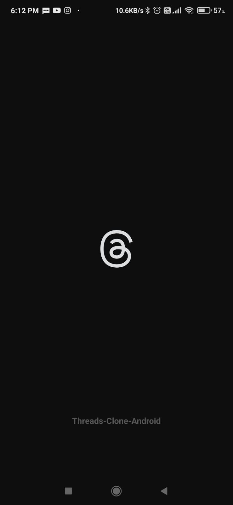
    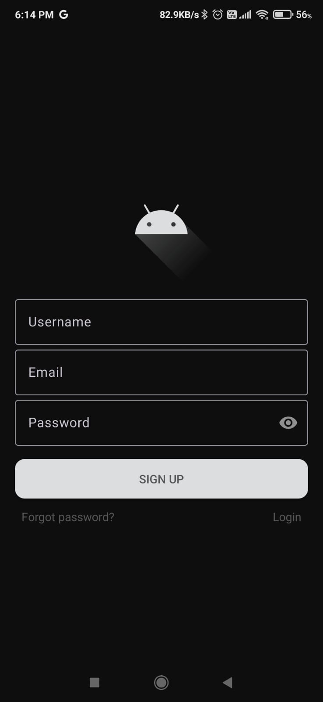
    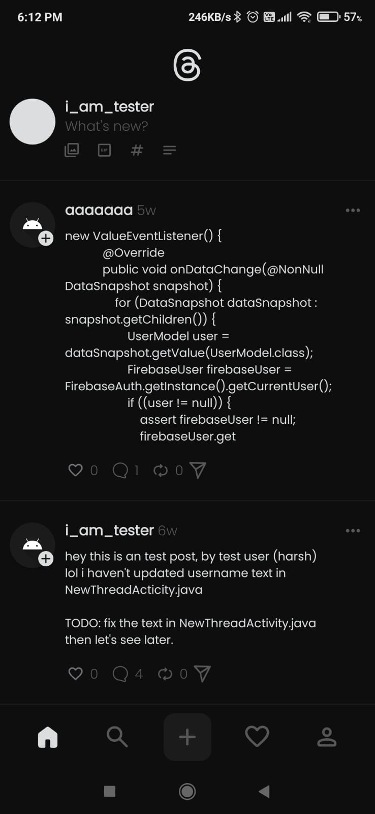
    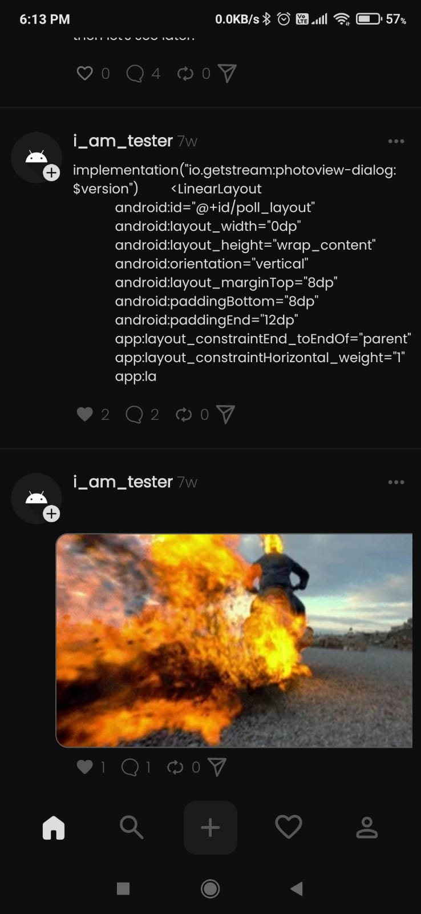
    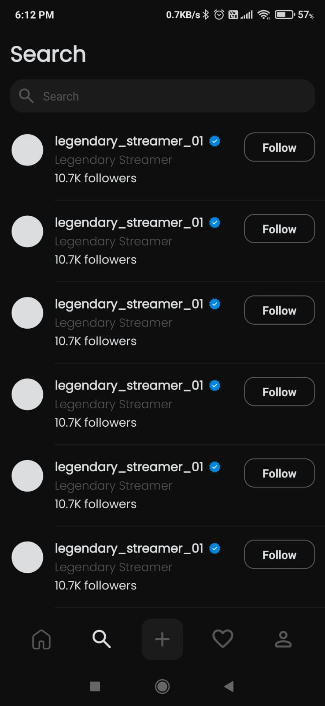
    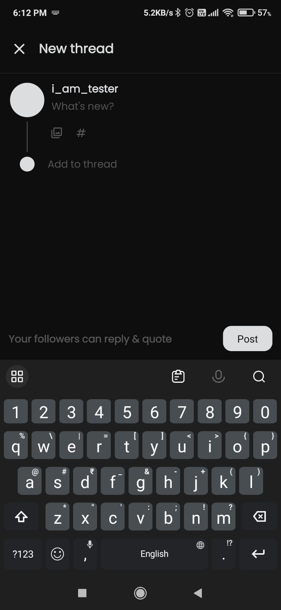
    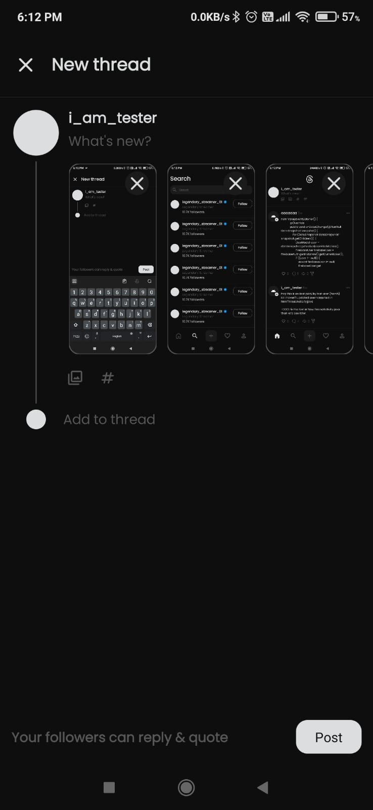
    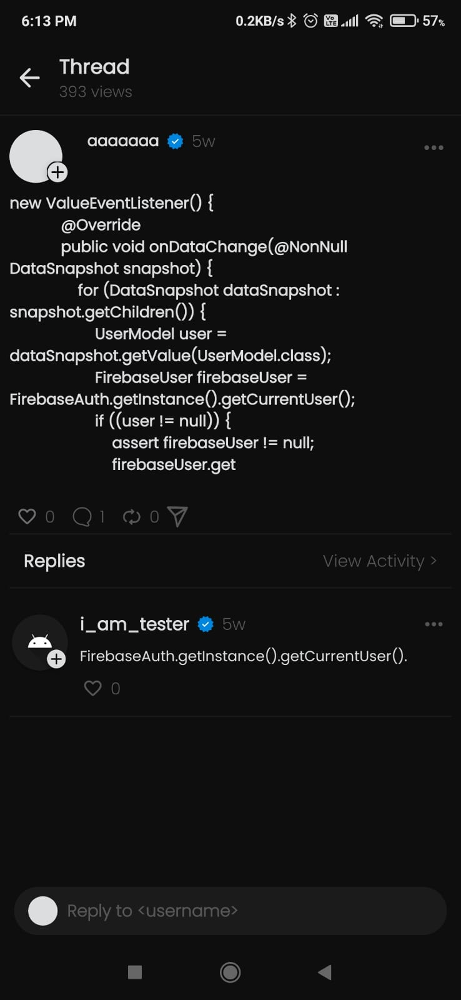
    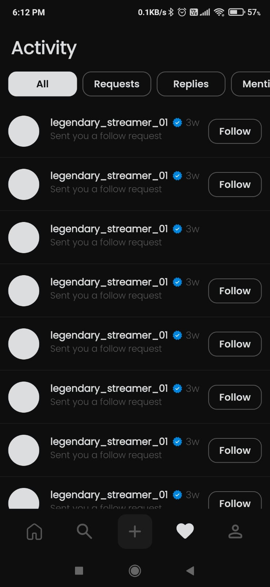
    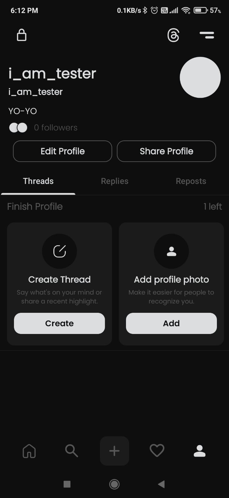
    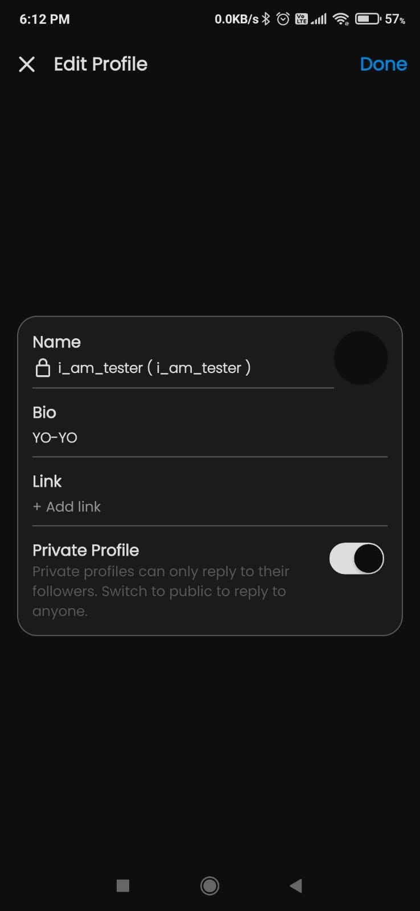
    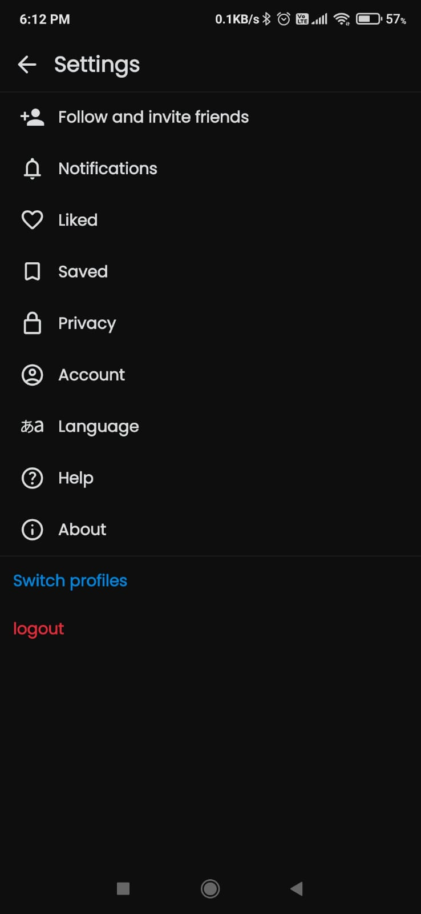
    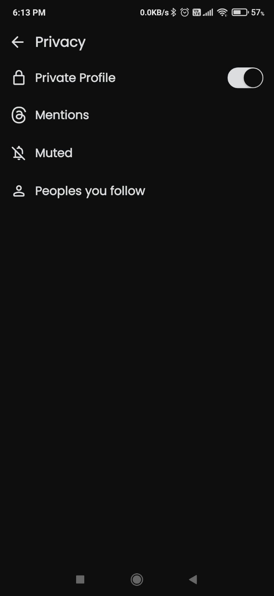
    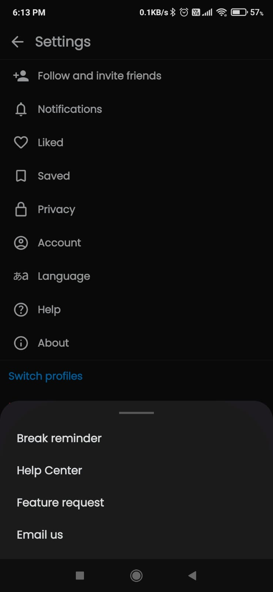
</div>

## Features

- Firebase capability
  - Database
  - Storage
  - Auth
- Posts Pagination
- Login / Signup
- Upload posts
  - With or Without GIF / IMAGE
- Posts
  - Create
  - Update
  - Delete
- Update Profile
- Clean settings UI
- Materialistic BottomSheetDrawer
- Custom Made Switch UI
- Comments
  - Create
  - Update
  - Delete
- Full screen IMAGE / GIF preview
- Likes on posts system

### Prerequisites

- Android Studio (latest version recommended)
- Java 8+
- An android device or emulator

### Installation

1. Clone the repository:

   ```bash
   git clone https://github.com/15110423037/android-Project-1.0.git
   ```

2. Open the project in android studio
3. Build and run the app on your device or emualtor

## Built with

- [Java 8](https://openjdk.org/projects/jdk/8/) - The programming language used.
- [Glide](https://github.com/bumptech/glide) - Image library used to load the images from URL.
- [Picasso](https://github.com/square/picasso) - Image library used to load the images from URL.
- [Gson](https://github.com/google/gson) - Gson library to parse the json response from API.
- [OkHttp](https://github.com/square/okhttp) - Library to send requests to the APIs and receive the data.
- [SwiperefreshLayout](https://developer.android.com/jetpack/androidx/releases/swiperefreshlayout) - Library to add feature of pull to refresh list.
- [PhotoViewDialog](https://github.com/GetStream/photoview-android) - Dialog Modle Library to show full screen images/gif preview.
- [IVCompressor](https://github.com/techgnious/IVCompressor) - To compress the images while uploading in posts to save storage.

- [Firebase](https://firebase.google.com) - For Database, Auth, Storage.
