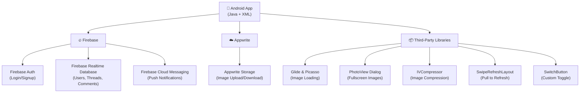
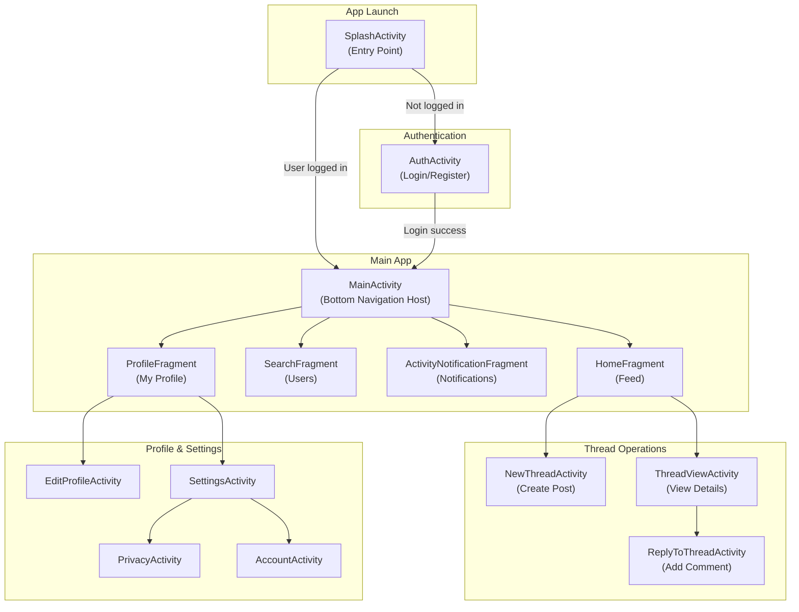
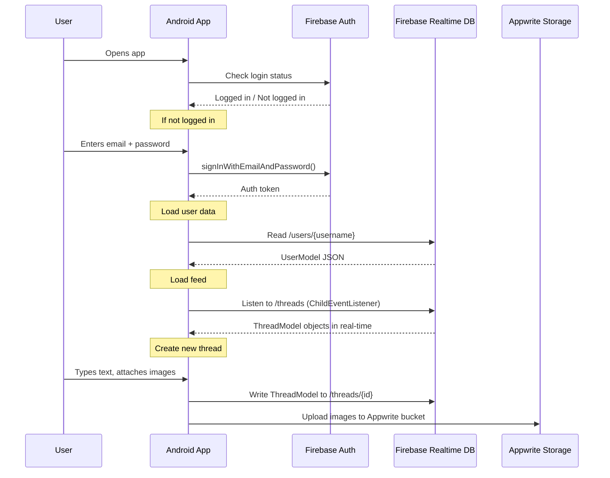

# Chapter 1: Project Overview & Architecture

## 1.1 What is This Project?

**Threads Clone Android** is a mobile application that replicates the core functionality of Meta's **Threads** app — a social media platform for sharing short text posts (called "threads"), images, and having conversations. This app is built using:

- **Java** as the programming language
- **Android Studio** as the IDE (Integrated Development Environment)
- **Firebase** as the backend (database, authentication, cloud messaging)
- **Appwrite** as the file/image storage service

> **In simple terms:** Think of it as building your own version of Twitter/Threads, where users can sign up, post messages, like/comment on posts, follow other users, and receive notifications.

---

## 1.2 Key Features

| Feature                  | Description                                            |
| ------------------------ | ------------------------------------------------------ |
| 🔐 **Authentication**    | Login/Register with Email+Password or Google Sign-In   |
| 📝 **Create Threads**    | Post text with optional images (up to 5)               |
| 💬 **Comments**          | Reply to any thread with text and images               |
| ❤️ **Likes**             | Like/unlike threads in real-time                       |
| 👤 **User Profile**      | View profile, bio, followers count, edit profile       |
| ⚙️ **Settings**          | Privacy, account, help, logout                         |
| 🔔 **Notifications**     | FCM push notifications + in-app activity feed          |
| 📊 **Polls**             | Thread polls (UI built, feature partially implemented) |
| 🔄 **Pull-to-Refresh**   | Swipe down to reload the feed                          |
| 🖼️ **Full-Screen Image** | Tap images for fullscreen preview with PhotoViewDialog |

---

## 1.3 Technology Stack



---

## 1.4 High-Level Architecture

The app follows an **Activity-Fragment** architecture, which is one of the common patterns in Android development.



---

## 1.5 Architecture Pattern Explanation

### What is an Activity?

An **Activity** in Android represents a single screen with a user interface. For example, the login screen is one Activity, and the settings screen is another.

### What is a Fragment?

A **Fragment** is a reusable portion of UI that lives inside an Activity. The `MainActivity` holds multiple fragments (Home, Search, Notifications, Profile) and swaps between them using a bottom navigation bar — this avoids creating separate activities for each tab.

### What is `BaseActivity`?

`BaseActivity` is a **parent class** that all activities in this app extend. It contains shared logic like:

- Firebase initialization
- Google Sign-In setup
- Progress dialog management
- Keyboard handling
- Push notification sending

> **Analogy:** Think of `BaseActivity` like a template. Instead of writing Firebase login code in every screen, you write it once in `BaseActivity`, and every screen automatically gets it.

---

## 1.6 Data Flow Overview



---

## 1.7 Firebase Database Structure

The Firebase Realtime Database stores data in a JSON tree structure:

```
root/
├── users/                          ← Constants.USERS_DB_REF
│   ├── {username}/                 ← Each user is keyed by username
│   │   ├── uid: "firebase-uid"
│   │   ├── email: "user@email.com"
│   │   ├── name: "Display Name"
│   │   ├── username: "johndoe"
│   │   ├── bio: "Hello world"
│   │   ├── profileImage: "url"
│   │   ├── infoLink: "example.com"
│   │   ├── publicAccount: true
│   │   ├── notificationsEnabled: true
│   │   ├── followers: ["uid1", "uid2"]
│   │   ├── following: ["uid3"]
│   │   ├── blockedUsers: []
│   │   ├── likedPosts: ["postId1"]
│   │   ├── savedThreads: []
│   │   ├── fcmToken: "device-token"
│   │   ├── threadsPosted: [...]
│   │   └── notifications: [...]
│   └── ...
│
├── threads/                        ← Constants.THREADS_DB_REF
│   ├── {threadId}/
│   │   ├── iD: "thread-id"
│   │   ├── uID: "author-uid"
│   │   ├── username: "johndoe"
│   │   ├── profileImage: "url"
│   │   ├── text: "Post content"
│   │   ├── time: "1709856000000"
│   │   ├── images: ["url1", "url2"]
│   │   ├── likes: ["uid1", "uid2"]
│   │   ├── comments: [{CommentsModel}]
│   │   ├── reposts: []
│   │   ├── shares: []
│   │   ├── isPoll: false
│   │   ├── isGif: false
│   │   ├── allowedComments: true
│   │   └── pollOptions: {PollOptions}
│   └── ...
│
└── gusernames/                     ← Constants.USERNAMES_DB_REF
    └── (reserved for username lookup)
```
