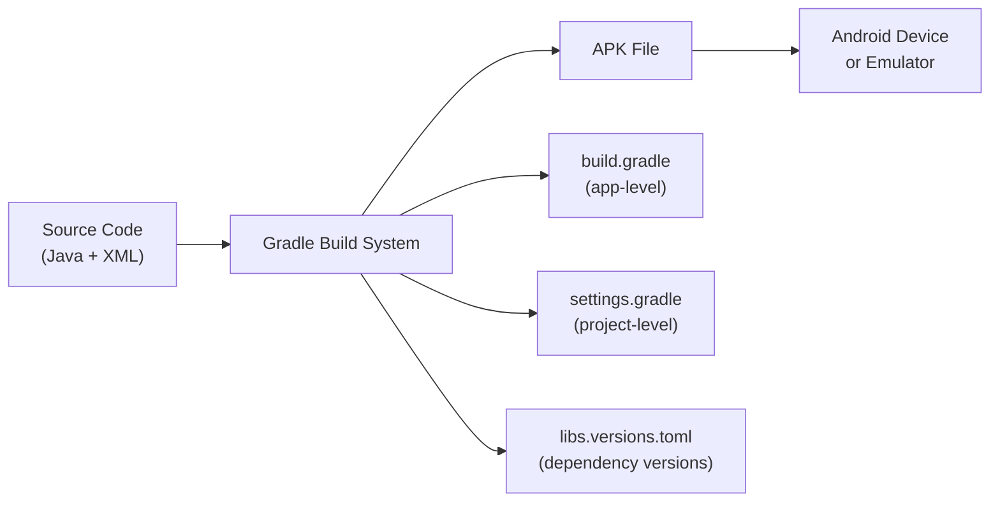

# Chapter 2: Project Setup Guide

## 2.1 Prerequisites

Before you begin, make sure you have the following installed on your computer:

| Tool                           | Version                   | Purpose                                   |
| ------------------------------ | ------------------------- | ----------------------------------------- |
| **Android Studio**             | Latest (Ladybug or later) | IDE for Android development               |
| **JDK**                        | 8+ (recommended 17)       | Java Development Kit — compiles Java code |
| **Git**                        | Any recent version        | To clone the repository                   |
| **Android Device or Emulator** | API 24+ (Android 7.0+)    | To run and test the app                   |
| **Firebase Account**           | Free tier works           | Backend services                          |

---

## 2.2 Step-by-Step Setup

### Step 1: Clone the Repository

Open a terminal and run:

```bash
git clone https://github.com/15110423037/Threads-Clone-Android.git
```

Or download the ZIP from GitHub and extract it.

### Step 2: Open in Android Studio

1. Launch **Android Studio**
2. Click **"Open"** (or File → Open)
3. Navigate to the cloned folder and select it
4. Wait for Gradle to sync (this may take a few minutes on first run)

### Step 3: Set Up Firebase

This is the most critical step. The app needs **Firebase** to work.

#### 3a. Create a Firebase Project

1. Go to [Firebase Console](https://console.firebase.google.com/)
2. Click **"Add Project"**
3. Name it (e.g., "Threads Clone")
4. Disable Google Analytics (optional)
5. Click **Create Project**

#### 3b. Add Android App to Firebase

1. In your Firebase project, click **"Add App"** → **Android**
2. Enter package name: `com.harsh.threads.clone`
3. Download the `google-services.json` file
4. Place it in: `app/google-services.json`

```
Threads-Clone-Android-master/
├── app/
│   ├── google-services.json    ← Place it HERE
│   ├── build.gradle
│   └── src/
```

#### 3c. Enable Firebase Services

In the Firebase Console, enable:

1. **Authentication** → Sign-in Method → Enable **Email/Password** and **Google**
2. **Realtime Database** → Create Database → Start in **test mode**
3. **Cloud Messaging** → Enabled by default

### Step 4: Configure Google Sign-In

1. In Firebase Console → Authentication → Sign-in Method → Google
2. Copy the **Web Client ID** (not Android Client ID!)
3. Open `Constants.java` and update:

```java
public static final String webApplicationID = "YOUR_WEB_CLIENT_ID_HERE";
```

### Step 5: (Optional) Set Up Appwrite

The app uses **Appwrite** for image storage. To use it:

1. Create an account on [Appwrite Cloud](https://cloud.appwrite.io/)
2. Create a project
3. Create a **Storage Bucket**
4. Update `Constants.java` with your IDs:

```java
public static final String APPWRITE_STORAGE_BUCKET_ID = "your-bucket-id";
public static final String APPWRITE_PROJECT_ID = "your-project-id";
```

> **Note:** The app will work without Appwrite, but image uploads in posts won't function.

### Step 6: Build and Run

1. Connect your Android device (USB debugging enabled) or start an emulator
2. In Android Studio, click the green **Run** button (▶️)
3. Select your device
4. Wait for the app to install and launch

---

## 2.3 Troubleshooting Common Issues

| Issue                               | Solution                                                          |
| ----------------------------------- | ----------------------------------------------------------------- |
| Gradle sync fails                   | File → Invalidate Caches → Restart                                |
| `google-services.json` not found    | Ensure it's in the `app/` folder, not root                        |
| Google Sign-In fails                | Verify the Web Client ID in `Constants.java`                      |
| Firebase database permission denied | Set database rules to `".read": true, ".write": true` for testing |
| App crashes on launch               | Check if Firebase is properly initialized (see Logcat)            |
| Build error: "META-INF" conflict    | Already handled in `build.gradle` via `packagingOptions`          |

---

## 2.4 Build Configuration Summary

The project uses **Gradle Version Catalog** (`gradle/libs.versions.toml`) for dependency management:

- **Min SDK:** 24 (Android 7.0 Nougat)
- **Target SDK:** 34 (Android 14)
- **Java Version:** 1.8 (Java 8)
- **Gradle Plugin:** 8.5.2
- **View Binding:** Enabled (no `findViewById()` needed)


