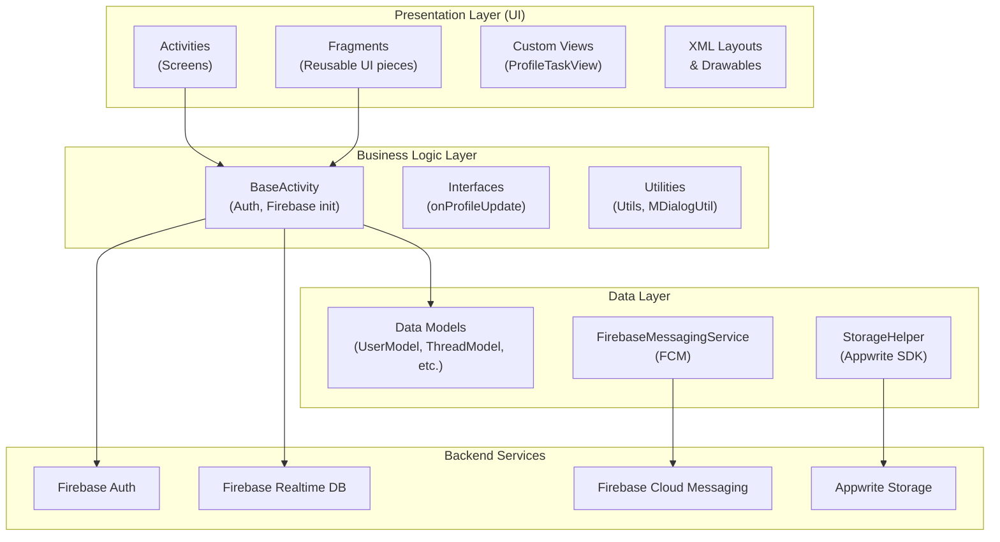

# Chapter 3: Project File Structure

## 3.1 Complete Directory Tree

Below is the complete file structure of the project with explanations for each folder and file.

```
Threads-Clone-Android-master/
│
├── 📄 build.gradle                  ← Root-level Gradle config (plugins)
├── 📄 settings.gradle               ← Project settings (module includes)
├── 📄 gradle.properties             ← Gradle JVM and Android settings
├── 📄 local.properties              ← Local SDK path (auto-generated)
├── 📄 gradlew / gradlew.bat         ← Gradle wrapper scripts
├── 📄 README.md                     ← Project readme
├── 📄 .gitignore                    ← Git ignore rules
│
├── 📁 gradle/
│   ├── 📁 wrapper/
│   │   ├── gradle-wrapper.jar
│   │   └── gradle-wrapper.properties
│   └── 📄 libs.versions.toml        ← 🔑 Dependency version catalog
│
├── 📁 docs/                         ← Screenshots & documentation
│
└── 📁 app/                          ← 🔑 MAIN APPLICATION MODULE
    ├── 📄 build.gradle              ← App-level dependencies & SDK config
    ├── 📄 proguard-rules.pro        ← Code obfuscation rules
    │
    └── 📁 src/
        ├── 📁 main/
        │   ├── 📄 AndroidManifest.xml  ← 🔑 App manifest (activities, services, permissions)
        │   │
        │   ├── 📁 java/com/harsh/shah/threads/clone/
        │   │   │
        │   │   ├── 📄 BaseActivity.java        ← Parent activity (Firebase, auth, utils)
        │   │   ├── 📄 BaseApplication.java     ← Application class (global context)
        │   │   ├── 📄 Constants.java           ← Config constants (API keys, DB refs)
        │   │   │
        │   │   ├── 📁 activities/              ← All Activity classes
        │   │   │   ├── 📄 AuthActivity.java            ← Login / Register
        │   │   │   ├── 📄 MainActivity.java            ← Main screen (bottom nav)
        │   │   │   ├── 📄 SplashActivity.java          ← Splash screen
        │   │   │   ├── 📄 ProfileActivity.java         ← Profile redirect
        │   │   │   ├── 📄 EditProfileActivity.java     ← Edit bio, link, privacy
        │   │   │   ├── 📄 NewThreadActivity.java       ← Create a new thread
        │   │   │   ├── 📄 ThreadViewActivity.java      ← View thread details
        │   │   │   ├── 📄 ReplyToThreadActivity.java   ← Reply to a thread
        │   │   │   ├── 📄 SettingsActivity.java        ← Settings menu
        │   │   │   ├── 📄 UnknownErrorActivity.java    ← Placeholder/error screen
        │   │   │   │
        │   │   │   └── 📁 settings/            ← Settings sub-activities
        │   │   │       ├── 📄 AccountActivity.java
        │   │   │       ├── 📄 PrivacyActivity.java
        │   │   │       ├── 📄 FollowAndInviteFriendsActivity.java
        │   │   │       └── 📄 FollowingFollowersProfilesActivity.java
        │   │   │
        │   │   ├── 📁 fragments/               ← All Fragment classes
        │   │   │   ├── 📄 HomeFragment.java             ← Home feed (thread list)
        │   │   │   ├── 📄 SearchFragment.java           ← User search
        │   │   │   ├── 📄 ProfileFragment.java          ← User profile tab
        │   │   │   ├── 📄 ActivityNotificationFragment.java ← Notifications tab
        │   │   │   └── 📄 AddThreadFragment.java        ← (Unused placeholder)
        │   │   │
        │   │   ├── 📁 model/                   ← Data model classes
        │   │   │   ├── 📄 UserModel.java               ← User profile data
        │   │   │   ├── 📄 ThreadModel.java             ← Thread/post data
        │   │   │   ├── 📄 CommentsModel.java           ← Comment data
        │   │   │   ├── 📄 PollOptions.java             ← Poll options data
        │   │   │   └── 📄 NotificationItemModel.java   ← Notification data
        │   │   │
        │   │   ├── 📁 utils/                   ← Utility/helper classes
        │   │   │   ├── 📄 Utils.java                   ← Time, keyboard, bitmap helpers
        │   │   │   ├── 📄 MDialogUtil.java             ← Custom Material dialog builder
        │   │   │   └── 📄 AccessToken.java             ← FCM access token helper
        │   │   │
        │   │   ├── 📁 database/                ← Storage helper
        │   │   │   └── 📄 StorageHelper.java           ← Appwrite file upload/download
        │   │   │
        │   │   ├── 📁 services/                ← Background services
        │   │   │   └── 📄 FirebaseMessagingService.java← FCM push notifications
        │   │   │
        │   │   ├── 📁 interfaces/              ← Java interfaces
        │   │   │   └── 📁 profile/
        │   │   │       ├── 📄 onProfileUpdate.java     ← Profile update interface
        │   │   │       └── 📄 onProfileUpdateImpl.java ← Default implementation
        │   │   │
        │   │   └── 📁 views/                   ← Custom Android views
        │   │       └── 📄 ProfileTaskView.java         ← Custom compound view
        │   │
        │   └── 📁 res/                         ← Android resources
        │       ├── 📁 layout/          ← XML layout files for each screen
        │       ├── 📁 drawable/        ← Icons, shapes, backgrounds
        │       ├── 📁 anim/            ← Animation files (fadein, fadeout)
        │       ├── 📁 values/          ← Colors, strings, themes, styles
        │       ├── 📁 mipmap/          ← App launcher icons
        │       └── 📁 xml/             ← Backup/data extraction rules
        │
        ├── 📁 test/                    ← Unit tests
        └── 📁 androidTest/             ← Instrumented (device) tests
```

---

## 3.2 Package Organization Diagram

```mermaid
graph TD
    ROOT["com.harsh.threads.clone"]

    ROOT --> BA["BaseActivity.java<br/><i>Foundation for all Activities</i>"]
    ROOT --> BAP["BaseApplication.java<br/><i>App-level context</i>"]
    ROOT --> CON["Constants.java<br/><i>Config values</i>"]

    ROOT --> ACT["activities/"]
    ACT --> A1["AuthActivity"]
    ACT --> A2["MainActivity"]
    ACT --> A3["SplashActivity"]
    ACT --> A4["NewThreadActivity"]
    ACT --> A5["ThreadViewActivity"]
    ACT --> A6["ReplyToThreadActivity"]
    ACT --> A7["EditProfileActivity"]
    ACT --> A8["SettingsActivity"]
    ACT --> A9["ProfileActivity"]
    ACT --> A10["UnknownErrorActivity"]
    ACT --> SETT["settings/"]
    SETT --> S1["AccountActivity"]
    SETT --> S2["PrivacyActivity"]
    SETT --> S3["FollowAndInviteFriendsActivity"]
    SETT --> S4["FollowingFollowersProfilesActivity"]

    ROOT --> FRAG["fragments/"]
    FRAG --> F1["HomeFragment"]
    FRAG --> F2["SearchFragment"]
    FRAG --> F3["ProfileFragment"]
    FRAG --> F4["ActivityNotificationFragment"]
    FRAG --> F5["AddThreadFragment"]

    ROOT --> MOD["model/"]
    MOD --> M1["UserModel"]
    MOD --> M2["ThreadModel"]
    MOD --> M3["CommentsModel"]
    MOD --> M4["PollOptions"]
    MOD --> M5["NotificationItemModel"]

    ROOT --> UTL["utils/"]
    UTL --> U1["Utils"]
    UTL --> U2["MDialogUtil"]
    UTL --> U3["AccessToken"]

    ROOT --> DB["database/"]
    DB --> D1["StorageHelper"]

    ROOT --> SVC["services/"]
    SVC --> SV1["FirebaseMessagingService"]

    ROOT --> INT["interfaces/profile/"]
    INT --> I1["onProfileUpdate"]
    INT --> I2["onProfileUpdateImpl"]

    ROOT --> VW["views/"]
    VW --> V1["ProfileTaskView"]
```



---

## 3.3 Layered Architecture View


