# Chapter 4: Dependencies Explained

## 4.1 What are Dependencies?

In Android development, **dependencies** are external libraries (pre-built code packages) that your project uses instead of writing everything from scratch. They are declared in `app/build.gradle` and their versions are managed in `gradle/libs.versions.toml`.

---

## 4.2 Complete Dependency Table

| Library                 | Version       | What It Does                              | Why It's Needed                                                      |
| ----------------------- | ------------- | ----------------------------------------- | -------------------------------------------------------------------- |
| **AppCompat**           | 1.7.0         | Backward-compatible Android UI components | Ensures the app looks consistent across old and new Android versions |
| **Material Design**     | 1.12.0        | Google's Material Design components       | Provides buttons, text fields, bottom sheets, dialogs, snackbars     |
| **Activity**            | 1.9.3         | AndroidX Activity library                 | Modern activity result APIs, edge-to-edge support                    |
| **ConstraintLayout**    | 2.2.0         | Flexible layout manager                   | Lets you build complex UIs with flat (non-nested) view hierarchies   |
| **Firebase Auth**       | 23.1.0        | Firebase Authentication SDK               | Login/Signup with Email+Password and Google Sign-In                  |
| **Firebase Database**   | 21.0.0        | Firebase Realtime Database SDK            | Store and sync user data, threads, comments in real-time             |
| **Firebase Messaging**  | 24.0.3        | Firebase Cloud Messaging SDK              | Push notifications                                                   |
| **Firebase BOM**        | 33.5.1        | Bill of Materials                         | Manages compatible versions of all Firebase libraries                |
| **Play Services Auth**  | 21.2.0        | Google Sign-In API                        | Enables "Sign in with Google" button functionality                   |
| **Google Auth Library** | 1.29.0        | OAuth2 HTTP client                        | Generates access tokens for FCM server-side auth                     |
| **Glide**               | 4.16.0        | Image loading library                     | Loads images from URLs, handles caching, GIF support                 |
| **Picasso**             | 2.71828       | Image loading library                     | Alternative image loader (used for profile images)                   |
| **SwipeRefreshLayout**  | 1.2.0-alpha01 | Pull-to-refresh widget                    | Adds swipe-down-to-refresh to the home feed                          |
| **SwitchButton**        | 0.0.3         | Custom toggle switch                      | iOS-style switch for privacy settings                                |
| **PhotoView Dialog**    | 1.0.2         | Fullscreen image viewer                   | Tap-to-zoom fullscreen image/GIF preview dialog                      |
| **Appwrite SDK**        | 6.0.0         | Appwrite SDK for Android                  | File upload, download, and deletion on Appwrite cloud                |
| **IVCompressor**        | 2.0.2         | Image compression library                 | Compresses images before upload to save storage/bandwidth            |
| **JUnit**               | 4.13.2        | Unit testing framework                    | Write and run unit tests                                             |
| **Espresso**            | 3.6.1         | UI testing framework                      | Automated UI testing on devices                                      |

---

## 4.3 Dependency Architecture Diagram

```mermaid
graph TD
    APP["App Module<br/>(build.gradle)"]

    subgraph "AndroidX Core"
        AX1["appcompat 1.7.0"]
        AX2["material 1.12.0"]
        AX3["activity 1.9.3"]
        AX4["constraintlayout 2.2.0"]
        AX5["swiperefreshlayout 1.2.0"]
    end

    subgraph "Firebase Suite"
        FB["firebase-bom 33.5.1<br/>(Version Manager)"]
        FB1["firebase-auth 23.1.0"]
        FB2["firebase-database 21.0.0"]
        FB3["firebase-messaging 24.0.3"]
        FB4["play-services-auth 21.2.0"]
        FB5["google-auth-library 1.29.0"]
    end

    subgraph "Image Libraries"
        IM1["Glide 4.16.0"]
        IM2["Picasso 2.71828"]
        IM3["PhotoView Dialog 1.0.2"]
        IM4["IVCompressor 2.0.2"]
    end

    subgraph "Cloud Storage"
        CL1["Appwrite SDK 6.0.0"]
    end

    subgraph "UI Components"
        UI1["SwitchButton 0.0.3"]
    end

    APP --> AX1 & AX2 & AX3 & AX4 & AX5
    APP --> FB
    FB --> FB1 & FB2 & FB3
    APP --> FB4 & FB5
    APP --> IM1 & IM2 & IM3 & IM4
    APP --> CL1
    APP --> UI1
```



---

## 4.4 How Dependencies Are Declared

### Version Catalog (`gradle/libs.versions.toml`)

This file defines all library versions in one place:

```toml
[versions]
glide = "4.16.0"
firebaseAuth = "23.1.0"

[libraries]
glide = { module = "com.github.bumptech.glide:glide", version.ref = "glide" }
firebase-auth = { group = "com.google.firebase", name = "firebase-auth", version.ref = "firebaseAuth" }

[plugins]
android-application = { id = "com.android.application", version.ref = "agp" }
```

### App-level `build.gradle`

References the version catalog using `libs.` prefix:

```groovy
dependencies {
    implementation libs.glide
    implementation libs.firebase.auth
    implementation platform(libs.firebase.bom)  // BOM for Firebase versioning
}
```

> **Why use a Version Catalog?** It keeps all version numbers in one file. When you update a library, you change it in one place instead of searching through multiple files.

---

## 4.5 What is Firebase BOM?

**BOM** stands for **Bill of Materials**. When you add:

```groovy
implementation platform(libs.firebase.bom)
```

It automatically ensures all Firebase libraries use compatible versions. You don't need to specify individual Firebase library versions — the BOM handles it.

---

## 4.6 Glide vs Picasso — Why Both?

The project uses **both** Glide and Picasso:

| Feature          | Glide                         | Picasso        |
| ---------------- | ----------------------------- | -------------- |
| **Used for**     | Post images + GIF loading     | Profile images |
| **GIF support**  | ✅ Native                     | ❌ No          |
| **Memory usage** | More efficient (auto-resizes) | Simpler API    |
| **Cache**        | Memory + Disk                 | Memory + Disk  |

> **In this project:** Glide is used in `HomeFragment.PostImagesListAdapter` for post images (especially GIFs), while Picasso is used in the home feed for loading profile pictures.
