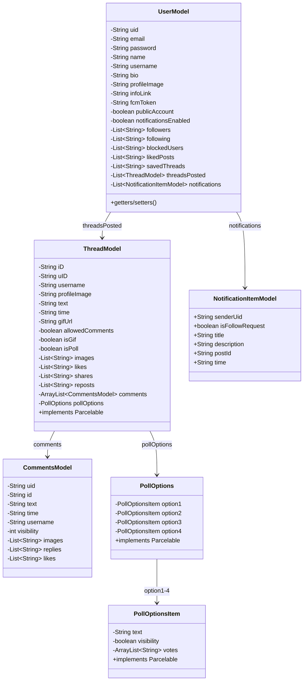
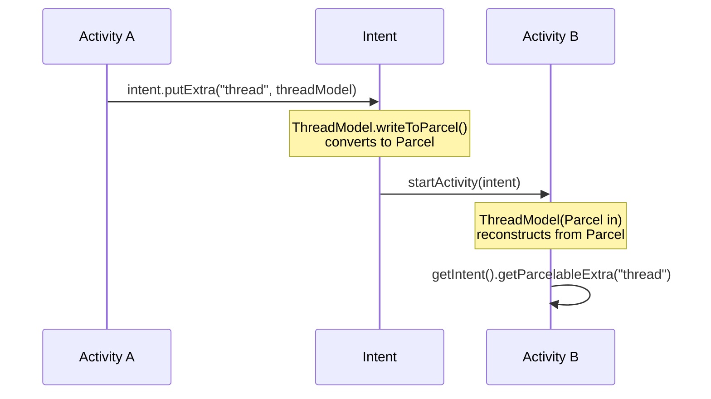

# Chapter 5: Data Models

Data models are Java classes that represent the structure of data stored in Firebase Realtime Database. Each model class maps to a JSON node in the database.

---

## 5.1 Model Class Relationship Diagram

---

## 5.2 UserModel

**File:** `model/UserModel.java` — Represents a user in the system.

| Field                  | Type                          | Description                                                     |
| ---------------------- | ----------------------------- | --------------------------------------------------------------- |
| `uid`                  | `String`                      | Unique Firebase Auth user ID                                    |
| `email`                | `String`                      | User's email address                                            |
| `password`             | `String`                      | User's password (stored in DB — not recommended for production) |
| `name`                 | `String`                      | Display name                                                    |
| `username`             | `String`                      | Unique username (also used as DB key)                           |
| `bio`                  | `String`                      | Profile biography text                                          |
| `profileImage`         | `String`                      | URL of profile picture                                          |
| `infoLink`             | `String`                      | Website/link shown on profile                                   |
| `fcmToken`             | `String`                      | Firebase Cloud Messaging token for push notifications           |
| `publicAccount`        | `boolean`                     | Whether the account is public or private                        |
| `notificationsEnabled` | `boolean`                     | Whether notifications are enabled                               |
| `followers`            | `List<String>`                | List of follower UIDs                                           |
| `following`            | `List<String>`                | List of following UIDs                                          |
| `blockedUsers`         | `List<String>`                | List of blocked user UIDs                                       |
| `likedPosts`           | `List<String>`                | List of liked post IDs                                          |
| `savedThreads`         | `List<String>`                | List of saved thread IDs                                        |
| `threadsPosted`        | `List<ThreadModel>`           | User's posted threads                                           |
| `notifications`        | `List<NotificationItemModel>` | User's notification items                                       |

**Key points:**

- Has a **no-argument constructor** (required by Firebase for deserialization)
- The full constructor initializes all fields with null-safe defaults
- Stored under `/users/{username}` in Firebase

---

## 5.3 ThreadModel

**File:** `model/ThreadModel.java` — Represents a single thread (post).

| Field             | Type                       | Description                           |
| ----------------- | -------------------------- | ------------------------------------- |
| `iD`              | `String`                   | Unique thread ID (Firebase push key)  |
| `uID`             | `String`                   | Author's Firebase UID                 |
| `username`        | `String`                   | Author's username                     |
| `profileImage`    | `String`                   | Author's profile image URL            |
| `text`            | `String`                   | Thread text content                   |
| `time`            | `String`                   | Timestamp in milliseconds (as string) |
| `gifUrl`          | `String`                   | URL of GIF (if attached)              |
| `images`          | `List<String>`             | URLs of attached images               |
| `likes`           | `List<String>`             | UIDs of users who liked               |
| `shares`          | `List<String>`             | UIDs of users who shared              |
| `reposts`         | `List<String>`             | UIDs of users who reposted            |
| `comments`        | `ArrayList<CommentsModel>` | List of comments on this thread       |
| `allowedComments` | `boolean`                  | Whether comments are allowed          |
| `isGif`           | `boolean`                  | Whether the thread has a GIF          |
| `isPoll`          | `boolean`                  | Whether the thread is a poll          |
| `pollOptions`     | `PollOptions`              | Poll options (if isPoll = true)       |

**Key points:**

- Implements **`Parcelable`** — allows passing between Activities via `Intent`
- Has a `CREATOR` static field for Parcelable deserialization
- The `profileImage()` method is named differently (not `getProfileImage()`) — this is a minor inconsistency

---

## 5.4 CommentsModel

**File:** `model/CommentsModel.java` — Represents a comment on a thread.

| Field        | Type           | Description                   |
| ------------ | -------------- | ----------------------------- |
| `uid`        | `String`       | Comment author's UID          |
| `id`         | `String`       | Comment ID                    |
| `text`       | `String`       | Comment text                  |
| `time`       | `String`       | Timestamp in milliseconds     |
| `username`   | `String`       | Author's username             |
| `visibility` | `int`          | Visibility flag (1 = visible) |
| `images`     | `List<String>` | Attached image URLs           |
| `replies`    | `List<String>` | Reply IDs                     |
| `likes`      | `List<String>` | UIDs of users who liked       |

---

## 5.5 PollOptions

**File:** `model/PollOptions.java` — Contains up to 4 poll options.

| Field     | Type              | Description                   |
| --------- | ----------------- | ----------------------------- |
| `option1` | `PollOptionsItem` | First poll option (required)  |
| `option2` | `PollOptionsItem` | Second poll option (required) |
| `option3` | `PollOptionsItem` | Third poll option (optional)  |
| `option4` | `PollOptionsItem` | Fourth poll option (optional) |

### PollOptionsItem (Inner Class)

| Field        | Type                | Description                             |
| ------------ | ------------------- | --------------------------------------- |
| `text`       | `String`            | Option text displayed to users          |
| `visibility` | `boolean`           | Whether this option is shown            |
| `votes`      | `ArrayList<String>` | UIDs of users who voted for this option |

Both `PollOptions` and `PollOptionsItem` implement **`Parcelable`**.

---

## 5.6 NotificationItemModel

**File:** `model/NotificationItemModel.java` — Represents a notification.

| Field             | Type      | Description                                    |
| ----------------- | --------- | ---------------------------------------------- |
| `senderUid`       | `String`  | UID of the user who triggered the notification |
| `isFollowRequest` | `boolean` | Whether this is a follow request               |
| `title`           | `String`  | Notification title                             |
| `description`     | `String`  | Notification description                       |
| `postId`          | `String`  | Related thread ID (if applicable)              |
| `time`            | `String`  | Timestamp of the notification                  |

> **Note:** Unlike other models, this class has `public` fields instead of `private` — this is a simpler pattern that also works with Firebase deserialization.

---

## 5.7 What is Parcelable?

**Parcelable** is an Android interface that allows objects to be passed between Activities through `Intent.putExtra()`. Think of it as "serializing" an object into a format Android can efficiently transfer between screens.

