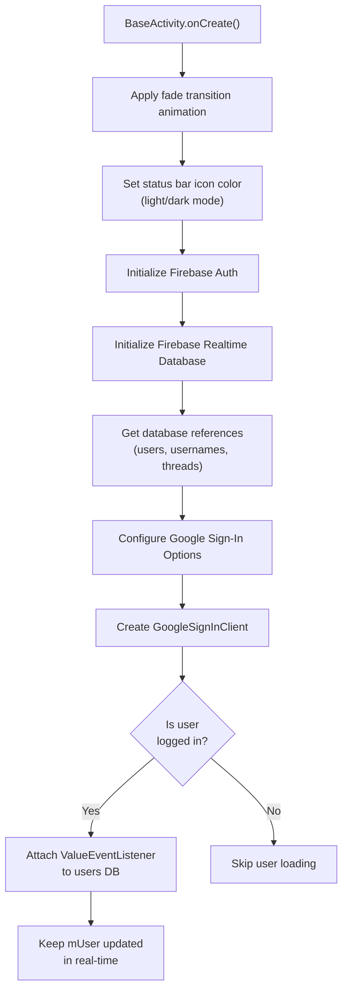
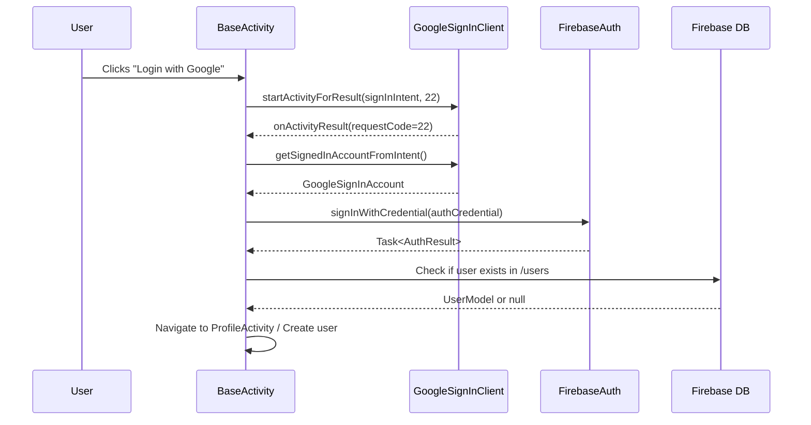

# Chapter 6: Base Classes

## 6.1 BaseActivity — The Foundation of Every Screen

**File:** `BaseActivity.java` (417 lines)

`BaseActivity` extends `AppCompatActivity` and serves as the **parent class** for every activity in the app. It centralizes shared functionality so that each screen doesn't need to repeat common setup code.

### What Gets Initialized in `onCreate()`



### Key Static Fields

| Field                       | Type                | Description                                                                    |
| --------------------------- | ------------------- | ------------------------------------------------------------------------------ |
| `mUser`                     | `UserModel`         | **Current logged-in user** — accessible from anywhere via `BaseActivity.mUser` |
| `mUsersDatabaseReference`   | `DatabaseReference` | Points to `/users` in Firebase                                                 |
| `mThreadsDatabaseReference` | `DatabaseReference` | Points to `/threads` in Firebase                                               |

> **Why static?** These are declared `public static` so any Activity or Fragment can access the current user and database references without passing them around.

### Key Methods

| Method                                         | Return    | Description                                           |
| ---------------------------------------------- | --------- | ----------------------------------------------------- |
| `isUserLoggedIn()`                             | `boolean` | Checks if `mAuth.getCurrentUser()` is not null        |
| `logoutUser()`                                 | `void`    | Signs out from Firebase + Google, redirects to Splash |
| `getUsersDatabase(AuthListener)`               | `void`    | Reads all users from `/users` with callback           |
| `getDatabase(String path, AuthListener)`       | `void`    | Reads any path from Firebase with callback            |
| `loginTask(Task<AuthResult>)`                  | `void`    | Called after successful login, navigates to Profile   |
| `updateUserProfile()`                          | `void`    | Saves `mUser` back to Firebase (static)               |
| `updateProfileInfo(UserModel, AuthListener)`   | `void`    | Saves any user model to Firebase                      |
| `showProgressDialog()`                         | `void`    | Shows a circular loading indicator                    |
| `hideProgressDialog()`                         | `void`    | Dismisses the loading indicator                       |
| `showToast(String)`                            | `void`    | Displays a short toast message                        |
| `hideKeyboard(View)`                           | `void`    | Hides the soft keyboard                               |
| `isNightMode()`                                | `boolean` | Checks if device is in dark mode                      |
| `pressBack(View)`                              | `void`    | Finishes the activity with fade animation             |
| `sendPushNotificationInThread(String, String)` | `void`    | Sends FCM push notification in a background thread    |
| `dispatchTouchEvent(MotionEvent)`              | `boolean` | Auto-clears EditText focus when tapping outside       |

### AuthListener Interface

Defined inside `BaseActivity`, this is a **callback pattern** used for async Firebase operations:

```java
public interface AuthListener {
    void onAuthTaskStart();             // Called before the operation
    void onAuthSuccess(DataSnapshot snapshot);  // Called on success
    void onAuthFail(DatabaseError error);       // Called on failure
}
```

Usage example:

```java
getUsersDatabase(new AuthListener() {
    @Override
    public void onAuthTaskStart() { showProgressDialog(); }

    @Override
    public void onAuthSuccess(DataSnapshot snapshot) {
        // Process data
        hideProgressDialog();
    }

    @Override
    public void onAuthFail(DatabaseError error) {
        hideProgressDialog();
    }
});
```

### Google Sign-In Flow



---

## 6.2 BaseApplication — Global Application Context

**File:** `BaseApplication.java` (30 lines)

This class extends `Application` and provides a **global application context** accessible from anywhere.

### What It Does

```java
public class BaseApplication extends Application {
    private static Context mApplicationContext;

    public static Context getContext() {
        return mApplicationContext;  // Access context anywhere
    }

    @Override
    public void onCreate() {
        mApplicationContext = getApplicationContext();
        super.onCreate();
    }
}
```

### Why Is It Needed?

- Some operations (like initializing libraries) need a `Context` but don't have access to an Activity
- `BaseApplication.getContext()` provides a global context
- Registered in `AndroidManifest.xml` via `android:name=".BaseApplication"`

### Commented-Out Crash Handler

The file contains a commented-out `UncaughtExceptionHandler` that would silently kill the app on crashes instead of showing the default crash dialog. It's disabled for debugging purposes.

---

## 6.3 Constants — Configuration Values

**File:** `Constants.java` (11 lines)

This class stores all configuration constants:

| Constant                     | Value                  | Usage                               |
| ---------------------------- | ---------------------- | ----------------------------------- |
| `webApplicationID`           | Google OAuth Client ID | Google Sign-In configuration        |
| `FCM_AUTH_KEY`               | `""` (empty)           | Firebase Cloud Messaging server key |
| `USERS_DB_REF`               | `"users"`              | Firebase path for user data         |
| `USERNAMES_DB_REF`           | `"gusernames"`         | Firebase path for username lookup   |
| `THREADS_DB_REF`             | `"threads"`            | Firebase path for thread data       |
| `APPWRITE_STORAGE_BUCKET_ID` | Bucket ID string       | Appwrite storage bucket identifier  |
| `APPWRITE_PROJECT_ID`        | Project ID string      | Appwrite project identifier         |

> **Best Practice Note:** In production apps, sensitive keys like `webApplicationID` should be stored in `local.properties` or environment variables, not in source code.
