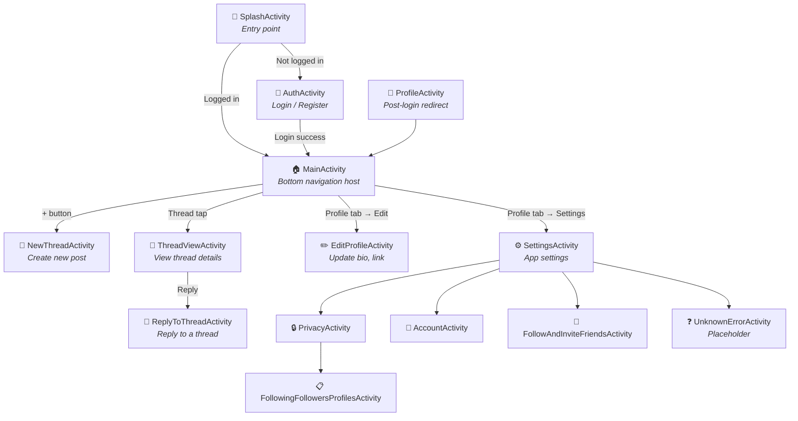
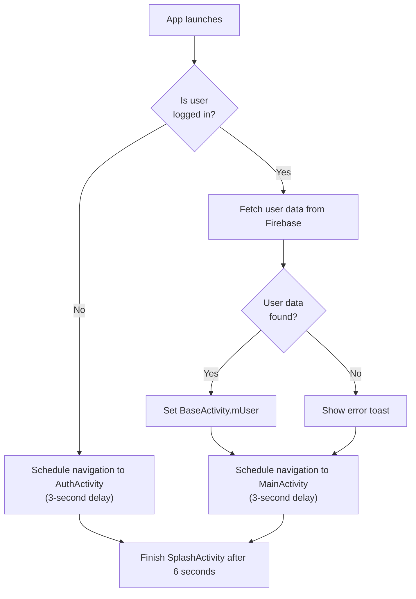
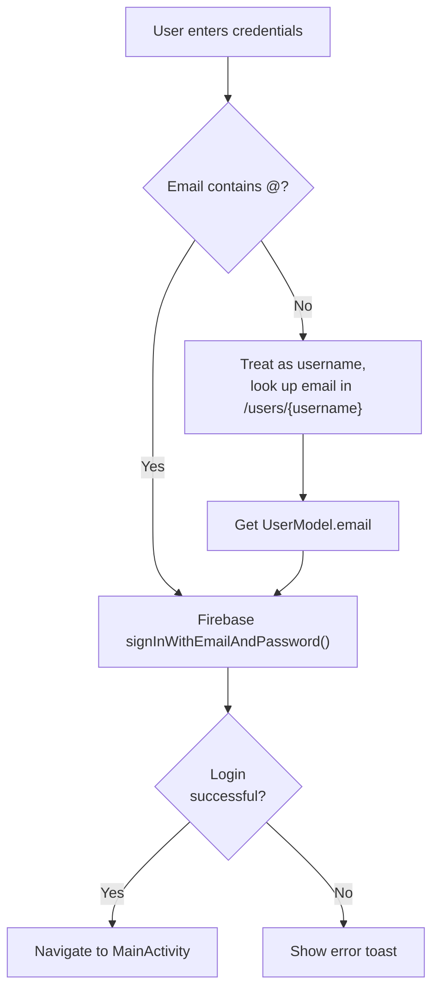
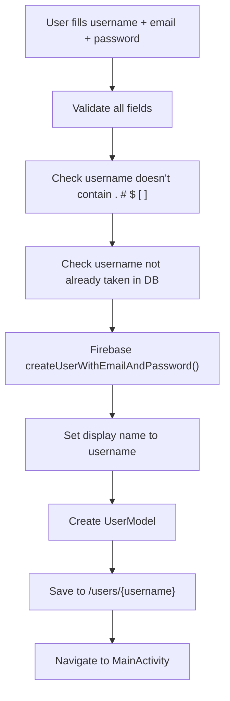
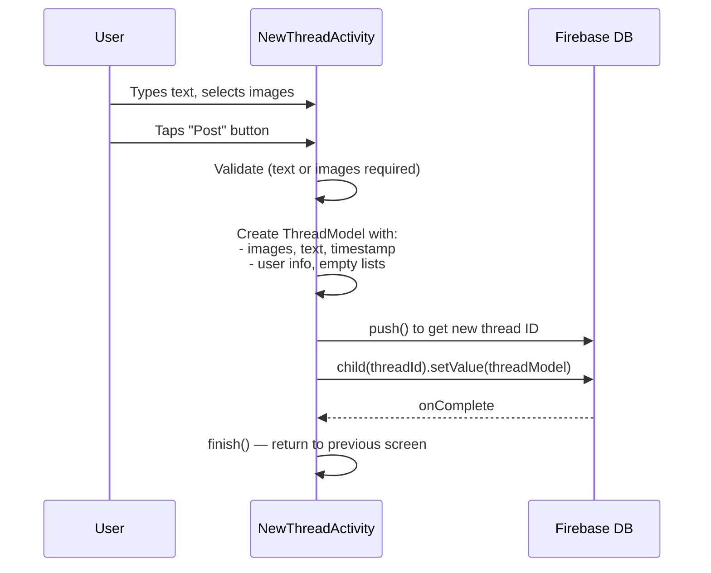

# Chapter 7: Activities Deep Dive

Every screen in this app is an **Activity**. All activities extend `BaseActivity`, which means they all inherit Firebase, authentication, and utility methods automatically.

---

## 7.1 Activity Navigation Flow



---

## 7.2 SplashActivity

**File:** `activities/SplashActivity.java` (82 lines)  
**Purpose:** App entry point — shows the Threads logo while checking authentication status.

### Flow



### Key Methods

| Method         | Description                                                                             |
| -------------- | --------------------------------------------------------------------------------------- |
| `onCreate()`   | Checks login state, fetches user if logged in                                           |
| `nextScreen()` | Uses `Handler.postDelayed()` to navigate after 3 seconds with shared element transition |

### Shared Element Transition

The splash logo animates smoothly to the next screen using:

```java
Pair<View, String> p1 = Pair.create(imageView, "splash_image");
ActivityOptions options = ActivityOptions.makeSceneTransitionAnimation(this, p1);
startActivity(intent, options.toBundle());
```

---

## 7.3 AuthActivity

**File:** `activities/AuthActivity.java` (309 lines)  
**Purpose:** Login and Registration screen with email/password and Google Sign-In.

### Two Modes

The screen toggles between **Login** and **Register** mode:

| Mode         | Fields Shown                | Button Text |
| ------------ | --------------------------- | ----------- |
| **Login**    | Email/Username + Password   | "Log in"    |
| **Register** | Username + Email + Password | "Sign up"   |

### Login Flow



### Registration Flow



### Username Validation

```java
String usernameRegex = "^[a-z0-9._]{6,20}$";
```

- Must be 6–20 characters
- Only lowercase letters, numbers, dots, and underscores
- No spaces or uppercase

### Input Text Watchers

`TextWatcher` is attached to each field to validate in real-time:

- **Username:** 6–20 chars, lowercase only, no special chars
- **Password:** Minimum 6 characters
- **Email:** Error cleared on change

---

## 7.4 MainActivity

**File:** `activities/MainActivity.java` (159 lines)  
**Purpose:** Main screen with bottom navigation bar hosting 4 fragments + a create button.

### Bottom Navigation

| Position   | Icon        | Fragment / Action              |
| ---------- | ----------- | ------------------------------ |
| 0          | 🏠 Home     | `HomeFragment`                 |
| 1          | 🔍 Search   | `SearchFragment`               |
| 2 (center) | ➕ Add      | Opens `NewThreadActivity`      |
| 3          | ❤️ Activity | `ActivityNotificationFragment` |
| 4          | 👤 Profile  | `ProfileFragment`              |

### Fragment Management

```java
public void setFragment(int position) {
    FragmentManager fm = getSupportFragmentManager();
    FragmentTransaction ft = fm.beginTransaction()
            .setTransition(FragmentTransaction.TRANSIT_FRAGMENT_FADE);

    if (position == 0) {
        fm.popBackStack("root", FragmentManager.POP_BACK_STACK_INCLUSIVE);
        ft.addToBackStack("root");
        ft.add(R.id.fragmentContainerView, HomeFragment.getInstance());
    } else if (position == 1) {
        ft.replace(R.id.fragmentContainerView, SearchFragment.getInstance())
          .addToBackStack(null);
    }
    // ... etc
    ft.commit();
    setFragmentIcon(position);  // Update icon colors
}
```

### Back Press Handling

When the user presses Back at the root fragment:

```java
new MaterialAlertDialogBuilder(this)
    .setTitle("Are you sure?")
    .setMessage("Do you want to exit?")
    .setPositiveButton("Yes", ...)
    .setNegativeButton("No", null)
    .show();
```

---

## 7.5 NewThreadActivity

**File:** `activities/NewThreadActivity.java` (297 lines)  
**Purpose:** Screen to create a new thread (post) with text and optionally up to 5 images.

### Key Components

| Component                | Description                                                 |
| ------------------------ | ----------------------------------------------------------- |
| `EditText`               | For typing the thread text                                  |
| `RecyclerView`           | Horizontal list of selected images                          |
| `ImagesListAdapter`      | Inner adapter class for image list                          |
| `ActivityResultLauncher` | Modern photo picker (replaces old `startActivityForResult`) |
| Poll UI                  | Partially implemented (poll options layout disabled)        |

### Post Thread Flow



### ImagesListAdapter (Inner Class)

A `RecyclerView.Adapter` that shows selected images horizontally:

- Shows up to 5 images
- Each image has a delete button
- First image has extra left margin (to offset from profile picture)
- Uses `dataChangeListener` callback to notify parent of changes

---

## 7.6 ThreadViewActivity

**File:** `activities/ThreadViewActivity.java` (276 lines)  
**Purpose:** View a thread's full content, images, poll, comments, and interact (like/comment).

### How It Gets the Thread Data

```java
// Receives thread ID via Intent
String threadId = getIntent().getExtras().getString("thread");

// Listens for real-time updates
mThreadsDatabaseReference.child(threadId)
    .addValueEventListener(new ValueEventListener() {
        public void onDataChange(DataSnapshot snapshot) {
            ThreadModel threadModel = snapshot.getValue(ThreadModel.class);
            setUpThreadView(threadModel);
        }
    });
```

### Like Toggle Logic

```java
if (threadModel.getLikes().contains(BaseActivity.mUser.getUid())) {
    threadModel.getLikes().remove(BaseActivity.mUser.getUid());  // Unlike
} else {
    threadModel.getLikes().add(BaseActivity.mUser.getUid());     // Like
}
// Save back to Firebase
BaseActivity.mThreadsDatabaseReference.child(threadModel.getID())
    .setValue(threadModel);
```

### Public Profile Check for Commenting

```java
if (!mUser.isPublicAccount()) {
    showNeedPublicProfileDialog();  // Shows BottomSheet asking to switch
    return;
}
addNewComment();  // Navigates to ReplyToThreadActivity
```

---

## 7.7 ReplyToThreadActivity

**File:** `activities/ReplyToThreadActivity.java` (167 lines)  
**Purpose:** Add a comment/reply to a thread. Shows the original thread at the top and a text input below.

### Comment Submission Flow

```java
ArrayList<CommentsModel> comments = threadModel.getComments();
comments.add(new CommentsModel(
    mUser.getUid(), data, new ArrayList<>(), 1,
    (comments.size()) + "",    // ID = position index
    edittext.getText(),        // Comment text
    Utils.getNowInMillis()+"", // Current timestamp
    mUser.getUsername(),
    new ArrayList<>()          // Empty likes list
));
threadModel.setComments(comments);
mThreadsDatabaseReference.child(threadModel.getID()).setValue(threadModel);
```

---

## 7.8 EditProfileActivity

**File:** `activities/EditProfileActivity.java` (88 lines)  
**Purpose:** Edit bio, website link, and privacy toggle.

### Fields

| UI Element      | Maps To               | Action                 |
| --------------- | --------------------- | ---------------------- |
| Name + Username | Display only          | Cannot be changed here |
| Bio             | `mUser.bio`           | Editable text field    |
| Link            | `mUser.infoLink`      | Editable text field    |
| Switch          | `mUser.publicAccount` | Toggle public/private  |

### Save Logic

Only saves if something actually changed:

```java
if (bio.equals(originalBio) && link.equals(originalLink)
    && switchButton.isChecked() == wasPublic) {
    return;  // No changes — skip Firebase write
}
```

---

## 7.9 SettingsActivity

**File:** `activities/SettingsActivity.java` (57 lines)  
**Purpose:** Settings menu with navigation to sub-settings.

### Menu Items

| Menu Item                 | Opens                                |
| ------------------------- | ------------------------------------ |
| Follow and Invite Friends | `FollowAndInviteFriendsActivity`     |
| Notifications             | `UnknownErrorActivity` (coming soon) |
| Privacy                   | `PrivacyActivity`                    |
| Account                   | `AccountActivity`                    |
| Language                  | `UnknownErrorActivity` (coming soon) |
| Help                      | Bottom sheet dialog                  |
| Logout                    | Custom dialog → `logoutUser()`       |

### Logout Dialog

Uses the custom `MDialogUtil`:

```java
new MDialogUtil(this)
    .setTitle("Log out Threads?")
    .setMessage("are you sure you want to logout?", false)
    .setB1("Logout", view -> logoutUser());
```

---

## 7.10 Settings Sub-Activities

| Activity                             | File                                               | Purpose                                           |
| ------------------------------------ | -------------------------------------------------- | ------------------------------------------------- |
| `AccountActivity`                    | `settings/AccountActivity.java`                    | Account settings (placeholder — UI only)          |
| `PrivacyActivity`                    | `settings/PrivacyActivity.java`                    | Private profile toggle + "People you follow" link |
| `FollowAndInviteFriendsActivity`     | `settings/FollowAndInviteFriendsActivity.java`     | Invite friends (placeholder — UI only)            |
| `FollowingFollowersProfilesActivity` | `settings/FollowingFollowersProfilesActivity.java` | List followers/following (placeholder — UI only)  |

---

## 7.11 UnknownErrorActivity

**File:** `activities/UnknownErrorActivity.java` (32 lines)  
**Purpose:** A generic placeholder screen for unimplemented features.

Accepts optional extras:

```java
getIntent().getStringExtra("title")   // e.g., "Language"
getIntent().getStringExtra("desc")    // e.g., "Coming soon!"
```
