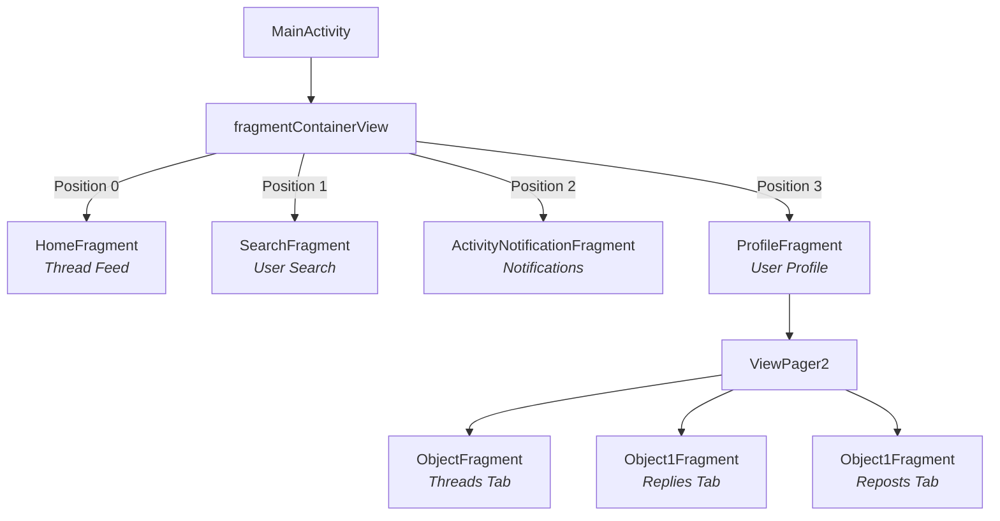
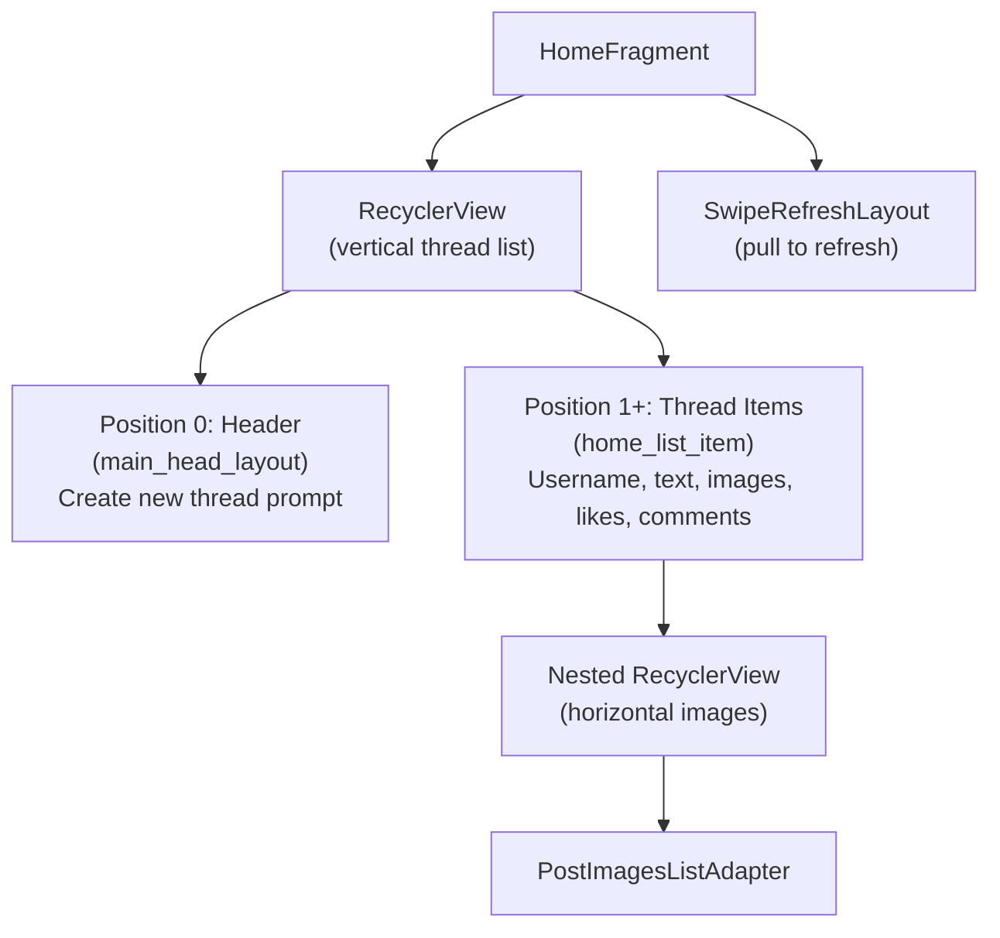
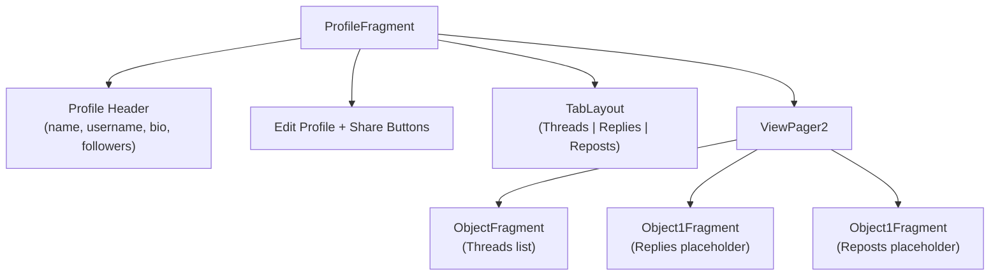

# Chapter 8: Fragments Deep Dive

**Fragments** are reusable UI components that live inside an Activity. In this app, `MainActivity` hosts four main fragments via a custom bottom navigation bar.

---

## 8.1 Fragment Architecture



All fragments use the **Singleton Pattern** (`getInstance()`) to avoid creating multiple instances.

---

## 8.2 HomeFragment — The Main Feed

**File:** `fragments/HomeFragment.java` (505 lines) — The largest fragment, responsible for displaying the thread feed.

### Structure



### Data Loading — Real-Time with ChildEventListener

Instead of reading all threads at once, the app uses `ChildEventListener` for **real-time updates**:

```java
BaseActivity.mThreadsDatabaseReference.addChildEventListener(new ChildEventListener() {
    @Override
    public void onChildAdded(DataSnapshot snapshot, String previousChildName) {
        // New thread posted → add to list
        dataAdapter.addData(snapshot.getValue(ThreadModel.class));
    }

    @Override
    public void onChildChanged(DataSnapshot snapshot, String previousChildName) {
        // Thread updated (e.g., new like) → update in list
        ThreadModel model = snapshot.getValue(ThreadModel.class);
        for (int i = 0; i < data.size(); i++) {
            if (data.get(i).getID().equals(model.getID())) {
                dataAdapter.updateData(i, model);
                break;
            }
        }
    }

    @Override
    public void onChildRemoved(DataSnapshot snapshot) {
        // Thread deleted → remove from list
        dataAdapter.removeData(snapshot.getValue(ThreadModel.class));
    }
});
```

### Inner Class: Adapter (Thread List)

| Method                 | Description                                                                |
| ---------------------- | -------------------------------------------------------------------------- |
| `onCreateViewHolder()` | Inflates `main_head_layout` for position 0, `home_list_item` for others    |
| `onBindViewHolder()`   | Binds thread data: username, text, time, likes count, images, poll options |
| `getItemViewType()`    | Returns 1 for header (position 0), 0 for thread items                      |
| `getItemCount()`       | Returns `data.size() + 1` (extra 1 for header)                             |
| `addData()`            | Adds thread to position 0 (newest first)                                   |
| `updateData()`         | Updates existing thread at position                                        |
| `removeData()`         | Removes thread from list                                                   |

### Like Toggle in Feed

```java
holder.itemView.findViewById(R.id.likeThreadLayout).setOnClickListener(view -> {
    if (data.get(pos).getLikes().contains(BaseActivity.mUser.getUid())) {
        data.get(pos).getLikes().remove(BaseActivity.mUser.getUid());
    } else {
        data.get(pos).getLikes().add(BaseActivity.mUser.getUid());
    }
    // Save to Firebase
    BaseActivity.mThreadsDatabaseReference.child(data.get(pos).getID())
        .setValue(data.get(pos));
});
```

### Inner Class: PostImagesListAdapter

A **static** adapter for displaying post images horizontally:

| Constructor                                                     | Use                          |
| --------------------------------------------------------------- | ---------------------------- |
| `PostImagesListAdapter()`                                       | Empty (no images)            |
| `PostImagesListAdapter(List<String> data)`                      | With images and left padding |
| `PostImagesListAdapter(List<String> data, boolean leftPadding)` | With optional left padding   |
| `PostImagesListAdapter(boolean leftPadding)`                    | No images, custom padding    |

**Image loading logic:**

```java
if (data.get(position).contains("gif"))
    Glide.with(context).asGif().load(url).into(imageView);
else
    Glide.with(context).load(url).into(imageView);
```

**Fullscreen preview on tap:**

```java
imageView.setOnClickListener(view -> {
    new PhotoViewDialog.Builder(context, data, (imageView1, url) ->
        Glide.with(context).load(url).into(imageView1))
        .withStartPosition(position).build().show(true);
});
```

### Poll Voting

Each poll option has a click listener that:

1. Checks if user hasn't already voted on any option
2. Adds current user's UID to the selected option's votes
3. Saves updated thread to Firebase

---

## 8.3 SearchFragment — User Search

**File:** `fragments/SearchFragment.java` (118 lines) — Placeholder with a static list.

### Current State

The search functionality shows **20 static placeholder items** (hardcoded in adapter):

```java
@Override
public int getItemCount() {
    return 20;  // Static placeholder count
}
```

The adapter inflates `search_frag_list_item` but doesn't bind any dynamic data. This is a **UI stub** ready for future implementation.

---

## 8.4 ActivityNotificationFragment — Notifications

**File:** `fragments/ActivityNotificationFragment.java` (185 lines) — Notification/activity feed with chip-based filtering.

### Chip Filters

| Chip     | Position | Shows Data?                            |
| -------- | -------- | -------------------------------------- |
| All      | 0        | ✅ Yes (mixed follow request / follow) |
| Requests | 1        | ✅ Yes (follow requests only)          |
| Replies  | 2        | ❌ Shows "No data" text                |
| Mentions | 3        | ❌ Shows "No data" text                |
| Quotes   | 4        | ❌ Shows "No data" text                |
| Reposts  | 5        | ❌ Shows "No data" text                |

### Chip Styling Toggle

```java
private void setHeaderPos(TextView view, boolean isActivated) {
    if (isActivated) {
        TextViewCompat.setTextAppearance(view, R.style.ButtonFilled);
        view.setBackgroundResource(R.drawable.button_background_filled);
    } else {
        TextViewCompat.setTextAppearance(view, R.style.ButtonOutlined);
        view.setBackgroundResource(R.drawable.button_background_outlined);
    }
}
```

### DataAdapter (Inner Class)

Shows **100 static placeholder items** with random follow button visibility:

```java
if (rand) {
    if (Utils.getRandomNumber(0, 1) == 0) {
        holder.itemView.findViewById(R.id.follow_button).setVisibility(View.GONE);
    }
}
```

---

## 8.5 ProfileFragment — User Profile

**File:** `fragments/ProfileFragment.java` (311 lines) — Shows user profile with tabs.

### Layout Structure



### Profile Data Loading

Displays `BaseActivity.mUser` fields and attaches a real-time listener:

```java
BaseActivity.mUsersDatabaseReference.child(mUser.getUsername())
    .addValueEventListener(new ValueEventListener() {
        @Override
        public void onDataChange(DataSnapshot snapshot) {
            UserModel user = snapshot.getValue(UserModel.class);
            if (user != null) mUser = user;
            // Update UI: name, username, bio, link, followers
        }
    });
```

### Null Safety

If `mUser` is null, shows empty fields and schedules a logout after 3 seconds:

```java
if (mUser == null) {
    new Handler().postDelayed(() -> {
        if (mUser == null && getActivity() != null) {
            ((BaseActivity) getActivity()).logoutUser();
        }
    }, 3000);
    return;
}
```

### TabLayout + ViewPager2

Uses `FragmentStateAdapter` to create 3 tab pages:

```java
static class PageAdapter extends FragmentStateAdapter {
    @Override
    public Fragment createFragment(int position) {
        return position == 0 ? ObjectFragment.newInstance()
             : position == 1 ? Object1Fragment.newInstance(null)
             : Object1Fragment.newInstance("You haven't reposted any threads yet.");
    }

    @Override
    public int getItemCount() { return 3; }
}
```

---

## 8.6 AddThreadFragment

**File:** `fragments/AddThreadFragment.java` (74 lines) — **Currently unused**. Thread creation is handled by `NewThreadActivity` instead.
