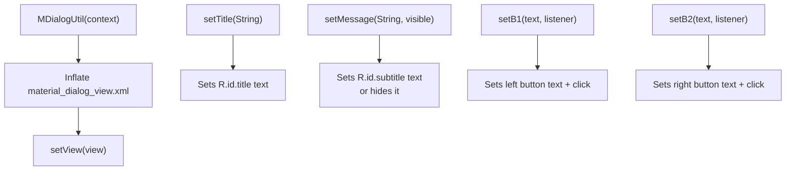
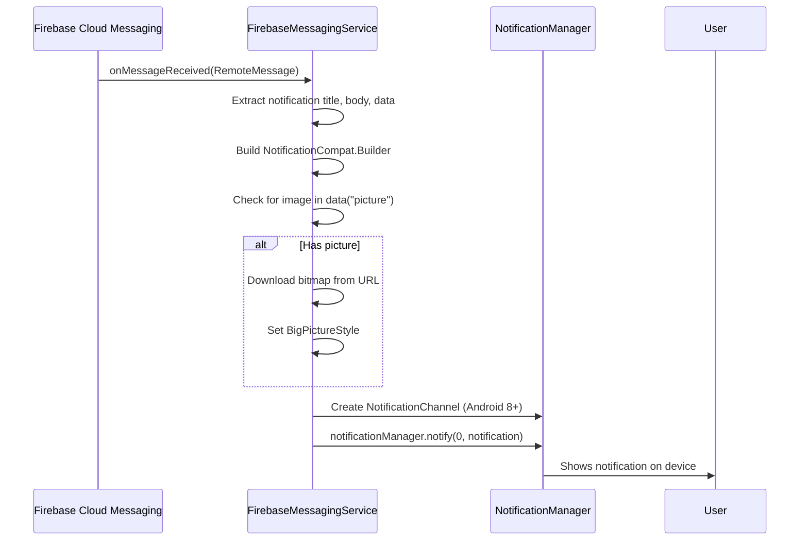

# Chapter 9: Utilities, Services & Database

---

## 9.1 Utils.java — Helper Methods

**File:** `utils/Utils.java` (74 lines)

A collection of **static utility methods** used throughout the app.

### Methods

| Method                              | Parameters          | Returns  | Description                                        |
| ----------------------------------- | ------------------- | -------- | -------------------------------------------------- |
| `getRandomNumber(int min, int max)` | Min and Max values  | `int`    | Generates a random integer in range [min, max]     |
| `hideKeyboard(Activity activity)`   | Current Activity    | `void`   | Hides the soft (on-screen) keyboard                |
| `getNowInMillis()`                  | None                | `long`   | Returns current time in milliseconds (epoch)       |
| `calculateTimeDiff(long createdAt)` | Timestamp in millis | `String` | Converts timestamp to human-readable relative time |
| `calculateLikes(int likes)`         | Like count          | `String` | Formats likes (e.g., 1500 → "1k")                  |
| `getBitmapFromURL(String s)`        | Image URL           | `Bitmap` | Downloads image from URL and returns as Bitmap     |

### Time Difference Logic

```java
public static String calculateTimeDiff(long createdAt) {
    long diffInMillis = now - createdAt;
    long weeks = days / 7;

    if (weeks > 0)     return weeks + "w";     // e.g., "2w"
    else if (days > 0) return days + "d";      // e.g., "3d"
    else if (hours > 0) return hours + "h";    // e.g., "5h"
    else if (minutes > 0) return minutes + "m"; // e.g., "30m"
    else return seconds + "s";                  // e.g., "15s"
}
```

---

## 9.2 MDialogUtil.java — Custom Dialog Builder

**File:** `utils/MDialogUtil.java` (67 lines)

Extends `MaterialAlertDialogBuilder` to create a **custom-styled material dialog** used for confirmations (logout, exit, etc.).

### How It Works



### Usage Example

```java
MDialogUtil dialog = new MDialogUtil(context)
    .setTitle("Log out Threads?")
    .setMessage("Are you sure?", false);  // false = hide subtitle

AlertDialog alertDialog = dialog.create();
dialog.setB1("Logout", v -> logoutUser());
dialog.setB2("Cancel", v -> alertDialog.dismiss());
alertDialog.show();
```

---

## 9.3 AccessToken.java — FCM Token Helper

**File:** `utils/AccessToken.java` (28 lines)

Uses **Google Auth Library** to generate OAuth2 access tokens for Firebase Cloud Messaging server-side API calls.

```java
private static String getAccessToken() throws IOException {
    InputStream inputStream = new ByteArrayInputStream("".getBytes(UTF_8));
    GoogleCredentials credentials = GoogleCredentials
        .fromStream(inputStream)
        .createScoped(Arrays.asList(SCOPES));
    credentials.refresh();
    return credentials.getAccessToken().getTokenValue();
}
```

> **Note:** The input stream is currently empty (`""`), meaning this method isn't fully configured. In production, it would read a service account JSON key file.

---

## 9.4 StorageHelper.java — Appwrite File Storage

**File:** `database/StorageHelper.java` (84 lines)

A **Singleton** class that handles file upload, download, and deletion using the **Appwrite SDK**.

### Singleton Pattern

```java
private static StorageHelper instance;

public static StorageHelper getInstance(Context context) {
    if (instance == null) {
        instance = new StorageHelper(context);
    }
    return instance;
}
```

### Initialization

```java
Client client = new Client(context, "https://cloud.appwrite.io/v1");
client.setProject(Constants.APPWRITE_PROJECT_ID);
storage = new Storage(client);
```

### Methods

| Method                        | Parameters            | Description                               |
| ----------------------------- | --------------------- | ----------------------------------------- |
| `uploadFile(File, String id)` | File object + file ID | Uploads a file to Appwrite storage bucket |
| `deleteFile(String id)`       | File ID               | Deletes a file from storage               |
| `downloadFile(String id)`     | File ID               | Downloads a file from storage             |

**Async Callbacks:**

```java
storage.createFile(
    Constants.APPWRITE_STORAGE_BUCKET_ID,
    id,
    InputFile.Companion.fromPath(file.getPath()),
    new CoroutineCallback<>((result, error) -> {
        if (error != null) {
            Log.e(TAG, "Upload error: ", error);
            return;
        }
        Log.d(TAG, result.toString());
    })
);
```

---

## 9.5 FirebaseMessagingService.java — Push Notifications

**File:** `services/FirebaseMessagingService.java` (118 lines)

Extends `com.google.firebase.messaging.FirebaseMessagingService` to handle incoming **push notifications**.

### Notification Flow



### Key Methods

| Method                                | Description                                                                    |
| ------------------------------------- | ------------------------------------------------------------------------------ |
| `onMessageReceived(RemoteMessage)`    | Called when FCM message arrives — extracts data and calls `sendNotification()` |
| `sendNotification(Notification, Map)` | Builds and shows the Android notification with sound, vibration, lights        |
| `onNewToken(String)`                  | Called when FCM device token changes — updates user's token in Firebase        |

### Notification Features

- **Sound:** Default notification ringtone
- **Vibration:** Pattern `{100, 200, 300, 400, 500}` ms
- **LED lights:** Red color, 1000ms on / 300ms off
- **Big Picture:** Shows image if `picture` is in data payload
- **Auto-cancel:** Dismissed when tapped
- **Opens:** `SplashActivity` when tapped

### Token Refresh

```java
@Override
public void onNewToken(String token) {
    if (BaseActivity.mUser != null) {
        BaseActivity.mUser.setFcmToken(token);
        BaseActivity.updateUserProfile();  // Saves to Firebase
    }
}
```

---

## 9.6 Interfaces — onProfileUpdate

### onProfileUpdate.java (Interface)

```java
public interface onProfileUpdate {
    void setup();
    void onProfileUpdate(UserModel userModel);
}
```

Activities that implement this interface can receive real-time profile updates.

### onProfileUpdateImpl.java (Default Implementation)

Listens to `/users` in Firebase and calls `onProfileUpdate()` when the current user's data changes:

```java
mUsersDatabaseReference.addChildEventListener(new ChildEventListener() {
    @Override
    public void onChildAdded(DataSnapshot snapshot, String previousChildName) {
        for (DataSnapshot ds : snapshot.getChildren()) {
            UserModel user = ds.getValue(UserModel.class);
            if (user.getUid().equals(currentUser.getUid())) {
                onProfileUpdate(user);
            }
        }
    }
});
```

---

## 9.7 ProfileTaskView — Custom Compound View

**File:** `views/ProfileTaskView.java` (58 lines)

A **custom compound view** that displays a profile setup task card (image + title + description + button).

### XML Attributes (Custom Styleable)

| Attribute     | Type       | Description           |
| ------------- | ---------- | --------------------- |
| `imageSrc`    | `Drawable` | Left-side image       |
| `title`       | `String`   | Task title text       |
| `description` | `String`   | Task description text |
| `buttonTitle` | `String`   | Button label text     |

The view inflates `profile_setup_task_view.xml` and binds custom attributes in `init()`.
