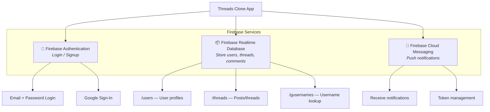
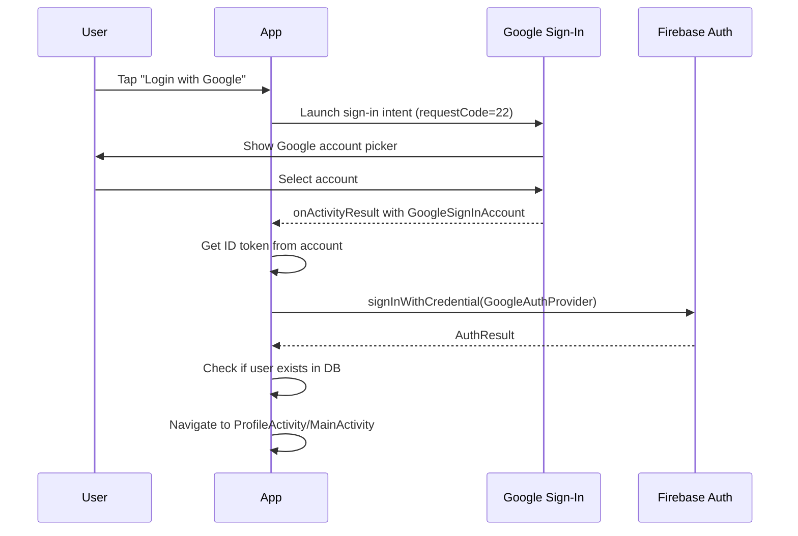
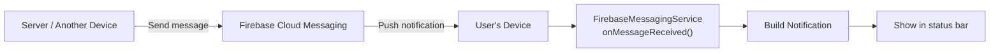

# Chapter 10: Firebase Integration

Firebase provides the backend for this app — handling authentication, database, and push notifications. This chapter explains how each Firebase service is used.

---

## 10.1 Firebase Services Overview



---

## 10.2 Firebase Authentication

### Initialization (in BaseActivity.onCreate)

```java
mAuth = FirebaseAuth.getInstance();
```

### Sign-Up (Email + Password)

```java
mAuth.createUserWithEmailAndPassword(email, password)
    .addOnCompleteListener(task -> {
        if (task.isSuccessful()) {
            // Set display name
            UserProfileChangeRequest request = new UserProfileChangeRequest.Builder()
                .setDisplayName(username).build();
            task.getResult().getUser().updateProfile(request);

            // Save user to database
            mUsersDatabaseReference.child(username).setValue(new UserModel(...));
        }
    });
```

### Login (Email + Password)

```java
mAuth.signInWithEmailAndPassword(email, password)
    .addOnCompleteListener(task -> {
        if (task.isSuccessful()) {
            startActivity(new Intent(this, MainActivity.class));
        }
    });
```

### Login via Username

If the user enters text without `@`, it's treated as a username:

```java
// Look up email from /users/{username}
mUsersDatabaseReference.child(username).addValueEventListener(new ValueEventListener() {
    public void onDataChange(DataSnapshot snapshot) {
        UserModel user = snapshot.getValue(UserModel.class);
        mAuth.signInWithEmailAndPassword(user.getEmail(), password);
    }
});
```

### Google Sign-In



### Logout

```java
public void logoutUser() {
    mAuth.signOut();                        // Firebase Auth sign-out
    googleSignInClient.signOut();           // Google sign-out
    startActivity(new Intent(this, SplashActivity.class));
    finishAffinity();                       // Close all activities
}
```

### Check Login Status

```java
public boolean isUserLoggedIn() {
    return mAuth != null && mAuth.getCurrentUser() != null;
}
```

---

## 10.3 Firebase Realtime Database

### What is Firebase Realtime Database?

A cloud-hosted **JSON database** where data is stored as JSON and synced in **real-time** to all connected clients. When data changes, all listeners are notified instantly.

### Database References

```java
mDatabase = FirebaseDatabase.getInstance();
mUsersDatabaseReference = mDatabase.getReference("users");      // /users
mThreadsDatabaseReference = mDatabase.getReference("threads");  // /threads
gUsernamesDatabaseReference = mDatabase.getReference("gusernames"); // /gusernames
```

### Reading Data — Two Patterns

#### 1. Single Read (addListenerForSingleValueEvent)

Reads data once, then stops listening:

```java
mUsersDatabaseReference.addListenerForSingleValueEvent(new ValueEventListener() {
    public void onDataChange(DataSnapshot snapshot) {
        // Process data once
    }
});
```

**Used in:** `SplashActivity`, `AuthActivity`

#### 2. Real-Time Listener (addValueEventListener / addChildEventListener)

Continuously listens for changes:

```java
mUsersDatabaseReference.addValueEventListener(new ValueEventListener() {
    public void onDataChange(DataSnapshot snapshot) {
        // Called every time data changes
    }
});
```

**Used in:** `BaseActivity` (user sync), `ProfileFragment` (profile updates)

#### 3. Child Event Listener

Listens for individual child additions, changes, and removals:

```java
mThreadsDatabaseReference.addChildEventListener(new ChildEventListener() {
    public void onChildAdded(DataSnapshot snapshot, String previous) { /* new thread */ }
    public void onChildChanged(DataSnapshot snapshot, String previous) { /* thread updated */ }
    public void onChildRemoved(DataSnapshot snapshot) { /* thread deleted */ }
});
```

**Used in:** `HomeFragment` (real-time feed)

### Writing Data

#### Create (setValue)

```java
mUsersDatabaseReference.child(username).setValue(userModel);
mThreadsDatabaseReference.child(threadId).setValue(threadModel);
```

#### Generate Unique ID (push)

```java
String pid = mThreadsDatabaseReference.push().getKey();
// Creates a unique ID like "-NxxxxxxxxxxxxR"
```

### Data Conversion

Firebase automatically converts between `DataSnapshot` and Java objects:

```java
UserModel user = snapshot.getValue(UserModel.class);    // JSON → Java object
mUsersDatabaseReference.child("id").setValue(user);      // Java object → JSON
```

> **Requirement:** Model classes must have a no-argument constructor and getter/setter pairs matching the JSON field names.

---

## 10.4 Firebase Cloud Messaging (FCM)

### How FCM Works



### Sending Notifications (from BaseActivity)

```java
public void sendPushNotificationInThread(String type, String token) {
    new Thread(() -> pushNotification(type, token)).start();
}

private void pushNotification(String type, String token) {
    // Build JSON payload
    JSONObject payload = new JSONObject();
    payload.put("to", token);
    payload.put("notification", notificationData);

    // Send HTTP POST to FCM endpoint
    URL url = new URL("https://fcm.googleapis.com/fcm/send");
    HttpURLConnection conn = (HttpURLConnection) url.openConnection();
    conn.setRequestMethod("POST");
    conn.setRequestProperty("Authorization", Constants.FCM_AUTH_KEY);
    conn.setRequestProperty("Content-Type", "application/json");
    conn.getOutputStream().write(payload.toString().getBytes());
}
```

### Receiving Notifications (in FirebaseMessagingService)

```java
@Override
public void onMessageReceived(RemoteMessage remoteMessage) {
    RemoteMessage.Notification notification = remoteMessage.getNotification();
    Map<String, String> data = remoteMessage.getData();
    sendNotification(notification, data);
}
```

### Token Management

Each device has a unique FCM token. When it changes:

```java
@Override
public void onNewToken(String token) {
    BaseActivity.mUser.setFcmToken(token);
    BaseActivity.updateUserProfile();  // Save new token to Firebase DB
}
```

---

## 10.5 AndroidManifest.xml — Firebase Registration

```xml
<!-- Firebase Messaging Service -->
<service
    android:name=".services.FirebaseMessagingService"
    android:exported="false">
    <intent-filter>
        <action android:name="com.google.firebase.MESSAGING_EVENT" />
    </intent-filter>
</service>
```

---

## 10.6 google-services.json

This file (not in source control) connects the app to your specific Firebase project. It contains:

- Project ID
- API keys
- Storage bucket
- OAuth client IDs

**It must be placed in the `app/` directory.**
