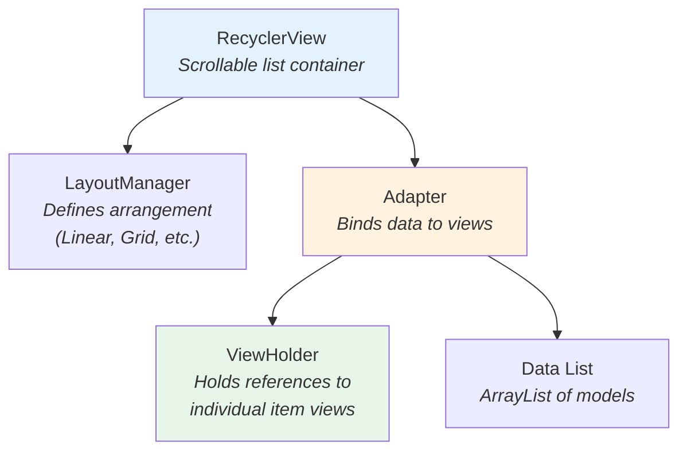

# Chapter 11: UI & Layouts

## 11.1 Android UI Basics

In Android, the UI is defined in two ways:

1. **XML Layout files** — Define the structure (what elements exist, where they are)
2. **Java code** — Controls behavior (what happens when you click, dynamic data)

Layout files are stored in `app/src/main/res/layout/`.

---

## 11.2 AndroidManifest.xml — App Configuration

The `AndroidManifest.xml` is the **identity card** of the app. It tells Android:

| Section             | What It Declares                             |
| ------------------- | -------------------------------------------- |
| `<uses-permission>` | Permissions needed (INTERNET, media access)  |
| `<application>`     | App name, icon, theme, base class            |
| `<activity>`        | Every screen in the app                      |
| `<service>`         | Background services (FCM)                    |
| `<intent-filter>`   | Entry points (launcher activity, deep links) |

### Permissions

```xml
<uses-permission android:name="android.permission.INTERNET" />
<uses-permission android:name="android.permission.READ_MEDIA_VISUAL_USER_SELECTED" />
```

### Launcher Activity

```xml
<activity android:name=".activities.SplashActivity" android:exported="true">
    <intent-filter>
        <action android:name="android.intent.action.MAIN" />
        <category android:name="android.intent.category.LAUNCHER" />
    </intent-filter>
</activity>
```

- `MAIN` + `LAUNCHER` = This is the icon on the home screen
- `exported="true"` = Can be launched from outside the app

### Activity Declarations

Each activity must be declared. Key attributes:

- `exported="false"` — Internal only, not accessible from other apps
- `windowSoftInputMode="stateHidden"` — Hides keyboard on activity open (used for `MainActivity`)

### FCM Service

```xml
<service android:name=".services.FirebaseMessagingService" android:exported="false">
    <intent-filter>
        <action android:name="com.google.firebase.MESSAGING_EVENT" />
    </intent-filter>
</service>
```

### Appwrite Callback

```xml
<activity android:name="io.appwrite.views.CallbackActivity" android:exported="true">
    <intent-filter android:label="android_web_auth">
        <data android:scheme="appwrite-callback-65fad68fc6a18820e902" />
    </intent-filter>
</activity>
```

---

## 11.3 View Binding

This project uses **View Binding** (enabled in `build.gradle`):

```groovy
buildFeatures {
    viewBinding true
}
```

### What is View Binding?

Instead of manually finding each UI element:

```java
// OLD way (without View Binding)
TextView name = findViewById(R.id.name);
```

You get an auto-generated class that provides type-safe access:

```java
// With View Binding
ActivityMainBinding binding = ActivityMainBinding.inflate(getLayoutInflater());
setContentView(binding.getRoot());
binding.name.setText("John");  // Direct access, no casting needed
```

### Naming Convention

The binding class name is derived from the layout file name:
| Layout File | Binding Class |
|-------------|---------------|
| `activity_main.xml` | `ActivityMainBinding` |
| `fragment_home.xml` | `FragmentHomeBinding` |
| `home_list_item.xml` | `HomeListItemBinding` |

---

## 11.4 Key Layout Files

| Layout File                                   | Used By                      | Description                     |
| --------------------------------------------- | ---------------------------- | ------------------------------- |
| `activity_splash.xml`                         | SplashActivity               | Logo centered on screen         |
| `activity_auth.xml`                           | AuthActivity                 | Login/register form             |
| `activity_main.xml`                           | MainActivity                 | Bottom nav + fragment container |
| `activity_new_thread.xml`                     | NewThreadActivity            | Thread composer                 |
| `activity_thread_view.xml`                    | ThreadViewActivity           | Thread detail view              |
| `activity_reply_to_thread.xml`                | ReplyToThreadActivity        | Reply form                      |
| `activity_edit_profile.xml`                   | EditProfileActivity          | Profile editor                  |
| `activity_settings.xml`                       | SettingsActivity             | Settings list                   |
| `fragment_home.xml`                           | HomeFragment                 | RecyclerView + SwipeRefresh     |
| `fragment_search.xml`                         | SearchFragment               | Search bar + list               |
| `fragment_profile.xml`                        | ProfileFragment              | Profile header + tabs           |
| `fragment_activity_notification.xml`          | ActivityNotificationFragment | Chips + list                    |
| `home_list_item.xml`                          | HomeFragment.Adapter         | Single thread card              |
| `main_head_layout.xml`                        | HomeFragment (position 0)    | "What's on your mind?" header   |
| `search_frag_list_item.xml`                   | SearchFragment.Adapter       | Search result item              |
| `notification_activity_follow_req_layout.xml` | DataAdapter                  | Notification item               |
| `material_dialog_view.xml`                    | MDialogUtil                  | Custom dialog layout            |
| `profile_setup_task_view.xml`                 | ProfileTaskView              | Profile task card               |

---

## 11.5 Resource Types

### Drawable (`res/drawable/`)

Custom shapes and backgrounds:

- `button_background_filled.xml` — Filled chip background
- `button_background_outlined.xml` — Outlined chip background
- Various icons and shapes

### Values (`res/values/`)

- `colors.xml` — Color palette
- `strings.xml` — Static text strings
- `themes.xml` — App theme (Material3)
- `attrs.xml` — Custom attributes for `ProfileTaskView`

### Animations (`res/anim/`)

- `fadein.xml` — Fade-in animation
- `fadeout.xml` — Fade-out animation
  Used for activity transitions:

```java
overridePendingTransition(R.anim.fadein, R.anim.fadeout);
```

---

## 11.6 RecyclerView Pattern

RecyclerView is the most-used UI component in this app. Here's how it works:



### 3 Steps to Use RecyclerView:

1. **Create an Adapter** extending `RecyclerView.Adapter<ViewHolder>`
2. **Override 3 methods:**
   - `onCreateViewHolder()` — Inflate the item layout
   - `onBindViewHolder()` — Bind data to views at position
   - `getItemCount()` — Return total items
3. **Set adapter on RecyclerView:**
   ```java
   recyclerView.setLayoutManager(new LinearLayoutManager(getContext()));
   recyclerView.setAdapter(new MyAdapter(dataList));
   ```
