<div style="page-break-after: always;"></div>

# Threads Clone Android — Complete Documentation Guide

> **A comprehensive guide to understand every aspect of the Threads Clone Android application**, from setup to source code — explained for beginners.

| Chapter | Topic |
|---------|-------|
| 01 | Project Overview & Architecture |
| 02 | Project Setup Guide |
| 03 | Project File Structure |
| 04 | Dependencies Explained |
| 05 | Data Models |
| 06 | Base Classes |
| 07 | Activities Deep Dive |
| 08 | Fragments Deep Dive |
| 09 | Utilities, Services & Database |
| 10 | Firebase Integration |
| 11 | UI & Layouts |
| 12 | Viva Q&A Reference (52 Questions) |

<div style="page-break-after: always;"></div>


# Chapter 1: Project Overview & Architecture

## 1.1 What is This Project?

**Threads Clone Android** is a mobile application that replicates the core functionality of Meta's **Threads** app — a social media platform for sharing short text posts (called "threads"), images, and having conversations. This app is built using:

- **Java** as the programming language
- **Android Studio** as the IDE (Integrated Development Environment)
- **Firebase** as the backend (database, authentication, cloud messaging)
- **Appwrite** as the file/image storage service

> **In simple terms:** Think of it as building your own version of Twitter/Threads, where users can sign up, post messages, like/comment on posts, follow other users, and receive notifications.

---

## 1.2 Key Features

| Feature                  | Description                                            |
| ------------------------ | ------------------------------------------------------ |
| 🔐 **Authentication**    | Login/Register with Email+Password or Google Sign-In   |
| 📝 **Create Threads**    | Post text with optional images (up to 5)               |
| 💬 **Comments**          | Reply to any thread with text and images               |
| ❤️ **Likes**             | Like/unlike threads in real-time                       |
| 👤 **User Profile**      | View profile, bio, followers count, edit profile       |
| ⚙️ **Settings**          | Privacy, account, help, logout                         |
| 🔔 **Notifications**     | FCM push notifications + in-app activity feed          |
| 📊 **Polls**             | Thread polls (UI built, feature partially implemented) |
| 🔄 **Pull-to-Refresh**   | Swipe down to reload the feed                          |
| 🖼️ **Full-Screen Image** | Tap images for fullscreen preview with PhotoViewDialog |

---

## 1.3 Technology Stack

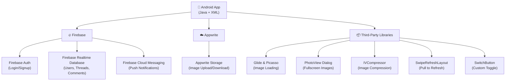

---

## 1.4 High-Level Architecture

The app follows an **Activity-Fragment** architecture, which is one of the common patterns in Android development.

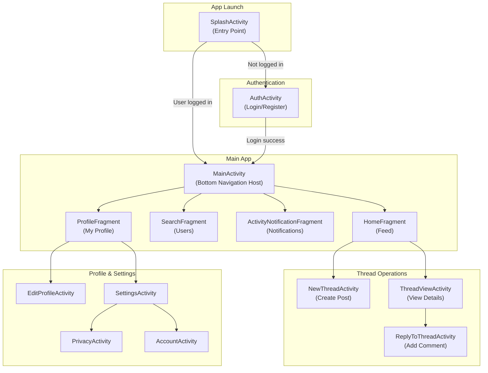

---

## 1.5 Architecture Pattern Explanation

### What is an Activity?

An **Activity** in Android represents a single screen with a user interface. For example, the login screen is one Activity, and the settings screen is another.

### What is a Fragment?

A **Fragment** is a reusable portion of UI that lives inside an Activity. The `MainActivity` holds multiple fragments (Home, Search, Notifications, Profile) and swaps between them using a bottom navigation bar — this avoids creating separate activities for each tab.

### What is `BaseActivity`?

`BaseActivity` is a **parent class** that all activities in this app extend. It contains shared logic like:

- Firebase initialization
- Google Sign-In setup
- Progress dialog management
- Keyboard handling
- Push notification sending

> **Analogy:** Think of `BaseActivity` like a template. Instead of writing Firebase login code in every screen, you write it once in `BaseActivity`, and every screen automatically gets it.

---

## 1.6 Data Flow Overview

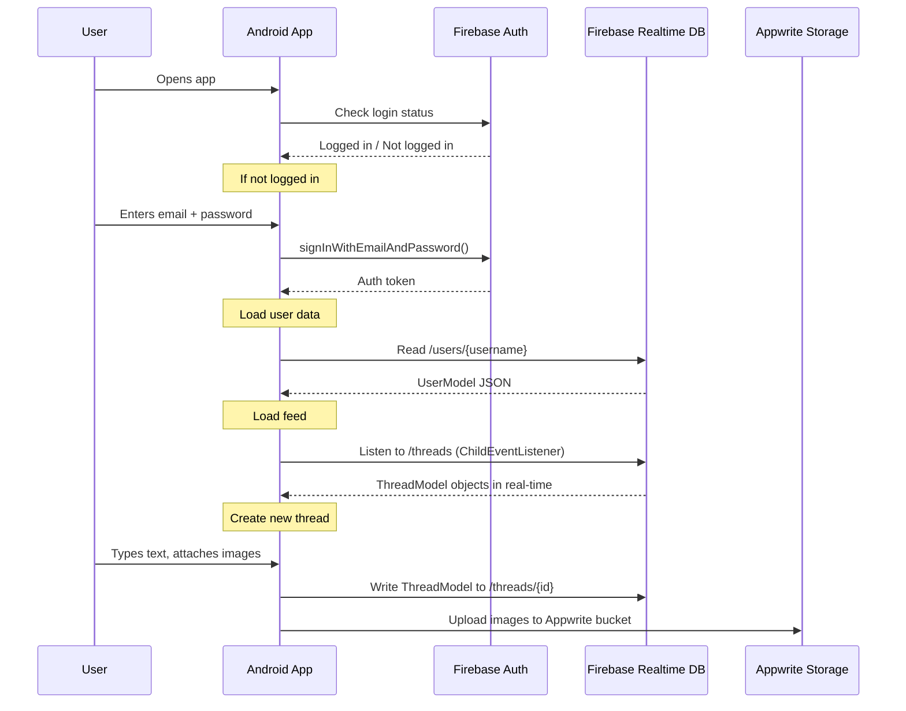

---

## 1.7 Firebase Database Structure

The Firebase Realtime Database stores data in a JSON tree structure:

```
root/
├── users/                          ← Constants.USERS_DB_REF
│   ├── {username}/                 ← Each user is keyed by username
│   │   ├── uid: "firebase-uid"
│   │   ├── email: "user@email.com"
│   │   ├── name: "Display Name"
│   │   ├── username: "johndoe"
│   │   ├── bio: "Hello world"
│   │   ├── profileImage: "url"
│   │   ├── infoLink: "example.com"
│   │   ├── publicAccount: true
│   │   ├── notificationsEnabled: true
│   │   ├── followers: ["uid1", "uid2"]
│   │   ├── following: ["uid3"]
│   │   ├── blockedUsers: []
│   │   ├── likedPosts: ["postId1"]
│   │   ├── savedThreads: []
│   │   ├── fcmToken: "device-token"
│   │   ├── threadsPosted: [...]
│   │   └── notifications: [...]
│   └── ...
│
├── threads/                        ← Constants.THREADS_DB_REF
│   ├── {threadId}/
│   │   ├── iD: "thread-id"
│   │   ├── uID: "author-uid"
│   │   ├── username: "johndoe"
│   │   ├── profileImage: "url"
│   │   ├── text: "Post content"
│   │   ├── time: "1709856000000"
│   │   ├── images: ["url1", "url2"]
│   │   ├── likes: ["uid1", "uid2"]
│   │   ├── comments: [{CommentsModel}]
│   │   ├── reposts: []
│   │   ├── shares: []
│   │   ├── isPoll: false
│   │   ├── isGif: false
│   │   ├── allowedComments: true
│   │   └── pollOptions: {PollOptions}
│   └── ...
│
└── gusernames/                     ← Constants.USERNAMES_DB_REF
    └── (reserved for username lookup)
```


<div style="page-break-after: always;"></div>


# Chapter 2: Project Setup Guide

## 2.1 Prerequisites

Before you begin, make sure you have the following installed on your computer:

| Tool                           | Version                   | Purpose                                   |
| ------------------------------ | ------------------------- | ----------------------------------------- |
| **Android Studio**             | Latest (Ladybug or later) | IDE for Android development               |
| **JDK**                        | 8+ (recommended 17)       | Java Development Kit — compiles Java code |
| **Git**                        | Any recent version        | To clone the repository                   |
| **Android Device or Emulator** | API 24+ (Android 7.0+)    | To run and test the app                   |
| **Firebase Account**           | Free tier works           | Backend services                          |

---

## 2.2 Step-by-Step Setup

### Step 1: Clone the Repository

Open a terminal and run:

```bash
git clone https://github.com/15110423037/Threads-Clone-Android.git
```

Or download the ZIP from GitHub and extract it.

### Step 2: Open in Android Studio

1. Launch **Android Studio**
2. Click **"Open"** (or File → Open)
3. Navigate to the cloned folder and select it
4. Wait for Gradle to sync (this may take a few minutes on first run)

### Step 3: Set Up Firebase

This is the most critical step. The app needs **Firebase** to work.

#### 3a. Create a Firebase Project

1. Go to [Firebase Console](https://console.firebase.google.com/)
2. Click **"Add Project"**
3. Name it (e.g., "Threads Clone")
4. Disable Google Analytics (optional)
5. Click **Create Project**

#### 3b. Add Android App to Firebase

1. In your Firebase project, click **"Add App"** → **Android**
2. Enter package name: `com.harsh.threads.clone`
3. Download the `google-services.json` file
4. Place it in: `app/google-services.json`

```
Threads-Clone-Android-master/
├── app/
│   ├── google-services.json    ← Place it HERE
│   ├── build.gradle
│   └── src/
```

#### 3c. Enable Firebase Services

In the Firebase Console, enable:

1. **Authentication** → Sign-in Method → Enable **Email/Password** and **Google**
2. **Realtime Database** → Create Database → Start in **test mode**
3. **Cloud Messaging** → Enabled by default

### Step 4: Configure Google Sign-In

1. In Firebase Console → Authentication → Sign-in Method → Google
2. Copy the **Web Client ID** (not Android Client ID!)
3. Open `Constants.java` and update:

```java
public static final String webApplicationID = "YOUR_WEB_CLIENT_ID_HERE";
```

### Step 5: (Optional) Set Up Appwrite

The app uses **Appwrite** for image storage. To use it:

1. Create an account on [Appwrite Cloud](https://cloud.appwrite.io/)
2. Create a project
3. Create a **Storage Bucket**
4. Update `Constants.java` with your IDs:

```java
public static final String APPWRITE_STORAGE_BUCKET_ID = "your-bucket-id";
public static final String APPWRITE_PROJECT_ID = "your-project-id";
```

> **Note:** The app will work without Appwrite, but image uploads in posts won't function.

### Step 6: Build and Run

1. Connect your Android device (USB debugging enabled) or start an emulator
2. In Android Studio, click the green **Run** button (▶️)
3. Select your device
4. Wait for the app to install and launch

---

## 2.3 Troubleshooting Common Issues

| Issue                               | Solution                                                          |
| ----------------------------------- | ----------------------------------------------------------------- |
| Gradle sync fails                   | File → Invalidate Caches → Restart                                |
| `google-services.json` not found    | Ensure it's in the `app/` folder, not root                        |
| Google Sign-In fails                | Verify the Web Client ID in `Constants.java`                      |
| Firebase database permission denied | Set database rules to `".read": true, ".write": true` for testing |
| App crashes on launch               | Check if Firebase is properly initialized (see Logcat)            |
| Build error: "META-INF" conflict    | Already handled in `build.gradle` via `packagingOptions`          |

---

## 2.4 Build Configuration Summary

The project uses **Gradle Version Catalog** (`gradle/libs.versions.toml`) for dependency management:

- **Min SDK:** 24 (Android 7.0 Nougat)
- **Target SDK:** 34 (Android 14)
- **Java Version:** 1.8 (Java 8)
- **Gradle Plugin:** 8.5.2
- **View Binding:** Enabled (no `findViewById()` needed)

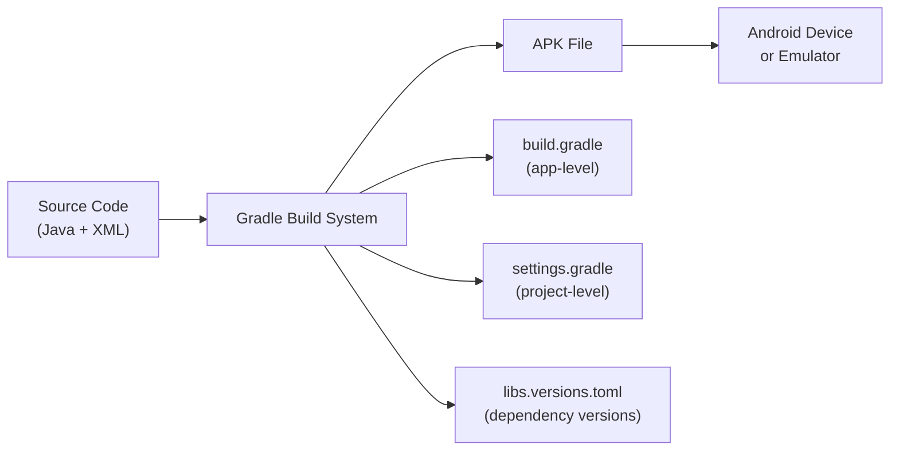


<div style="page-break-after: always;"></div>


# Chapter 3: Project File Structure

## 3.1 Complete Directory Tree

Below is the complete file structure of the project with explanations for each folder and file.

```
Threads-Clone-Android-master/
│
├── 📄 build.gradle                  ← Root-level Gradle config (plugins)
├── 📄 settings.gradle               ← Project settings (module includes)
├── 📄 gradle.properties             ← Gradle JVM and Android settings
├── 📄 local.properties              ← Local SDK path (auto-generated)
├── 📄 gradlew / gradlew.bat         ← Gradle wrapper scripts
├── 📄 README.md                     ← Project readme
├── 📄 .gitignore                    ← Git ignore rules
│
├── 📁 gradle/
│   ├── 📁 wrapper/
│   │   ├── gradle-wrapper.jar
│   │   └── gradle-wrapper.properties
│   └── 📄 libs.versions.toml        ← 🔑 Dependency version catalog
│
├── 📁 docs/                         ← Screenshots & documentation
│
└── 📁 app/                          ← 🔑 MAIN APPLICATION MODULE
    ├── 📄 build.gradle              ← App-level dependencies & SDK config
    ├── 📄 proguard-rules.pro        ← Code obfuscation rules
    │
    └── 📁 src/
        ├── 📁 main/
        │   ├── 📄 AndroidManifest.xml  ← 🔑 App manifest (activities, services, permissions)
        │   │
        │   ├── 📁 java/com/harsh/shah/threads/clone/
        │   │   │
        │   │   ├── 📄 BaseActivity.java        ← Parent activity (Firebase, auth, utils)
        │   │   ├── 📄 BaseApplication.java     ← Application class (global context)
        │   │   ├── 📄 Constants.java           ← Config constants (API keys, DB refs)
        │   │   │
        │   │   ├── 📁 activities/              ← All Activity classes
        │   │   │   ├── 📄 AuthActivity.java            ← Login / Register
        │   │   │   ├── 📄 MainActivity.java            ← Main screen (bottom nav)
        │   │   │   ├── 📄 SplashActivity.java          ← Splash screen
        │   │   │   ├── 📄 ProfileActivity.java         ← Profile redirect
        │   │   │   ├── 📄 EditProfileActivity.java     ← Edit bio, link, privacy
        │   │   │   ├── 📄 NewThreadActivity.java       ← Create a new thread
        │   │   │   ├── 📄 ThreadViewActivity.java      ← View thread details
        │   │   │   ├── 📄 ReplyToThreadActivity.java   ← Reply to a thread
        │   │   │   ├── 📄 SettingsActivity.java        ← Settings menu
        │   │   │   ├── 📄 UnknownErrorActivity.java    ← Placeholder/error screen
        │   │   │   │
        │   │   │   └── 📁 settings/            ← Settings sub-activities
        │   │   │       ├── 📄 AccountActivity.java
        │   │   │       ├── 📄 PrivacyActivity.java
        │   │   │       ├── 📄 FollowAndInviteFriendsActivity.java
        │   │   │       └── 📄 FollowingFollowersProfilesActivity.java
        │   │   │
        │   │   ├── 📁 fragments/               ← All Fragment classes
        │   │   │   ├── 📄 HomeFragment.java             ← Home feed (thread list)
        │   │   │   ├── 📄 SearchFragment.java           ← User search
        │   │   │   ├── 📄 ProfileFragment.java          ← User profile tab
        │   │   │   ├── 📄 ActivityNotificationFragment.java ← Notifications tab
        │   │   │   └── 📄 AddThreadFragment.java        ← (Unused placeholder)
        │   │   │
        │   │   ├── 📁 model/                   ← Data model classes
        │   │   │   ├── 📄 UserModel.java               ← User profile data
        │   │   │   ├── 📄 ThreadModel.java             ← Thread/post data
        │   │   │   ├── 📄 CommentsModel.java           ← Comment data
        │   │   │   ├── 📄 PollOptions.java             ← Poll options data
        │   │   │   └── 📄 NotificationItemModel.java   ← Notification data
        │   │   │
        │   │   ├── 📁 utils/                   ← Utility/helper classes
        │   │   │   ├── 📄 Utils.java                   ← Time, keyboard, bitmap helpers
        │   │   │   ├── 📄 MDialogUtil.java             ← Custom Material dialog builder
        │   │   │   └── 📄 AccessToken.java             ← FCM access token helper
        │   │   │
        │   │   ├── 📁 database/                ← Storage helper
        │   │   │   └── 📄 StorageHelper.java           ← Appwrite file upload/download
        │   │   │
        │   │   ├── 📁 services/                ← Background services
        │   │   │   └── 📄 FirebaseMessagingService.java← FCM push notifications
        │   │   │
        │   │   ├── 📁 interfaces/              ← Java interfaces
        │   │   │   └── 📁 profile/
        │   │   │       ├── 📄 onProfileUpdate.java     ← Profile update interface
        │   │   │       └── 📄 onProfileUpdateImpl.java ← Default implementation
        │   │   │
        │   │   └── 📁 views/                   ← Custom Android views
        │   │       └── 📄 ProfileTaskView.java         ← Custom compound view
        │   │
        │   └── 📁 res/                         ← Android resources
        │       ├── 📁 layout/          ← XML layout files for each screen
        │       ├── 📁 drawable/        ← Icons, shapes, backgrounds
        │       ├── 📁 anim/            ← Animation files (fadein, fadeout)
        │       ├── 📁 values/          ← Colors, strings, themes, styles
        │       ├── 📁 mipmap/          ← App launcher icons
        │       └── 📁 xml/             ← Backup/data extraction rules
        │
        ├── 📁 test/                    ← Unit tests
        └── 📁 androidTest/             ← Instrumented (device) tests
```

---

## 3.2 Package Organization Diagram

```mermaid
graph TD
    ROOT["com.harsh.threads.clone"]

    ROOT --> BA["BaseActivity.java<br/><i>Foundation for all Activities</i>"]
    ROOT --> BAP["BaseApplication.java<br/><i>App-level context</i>"]
    ROOT --> CON["Constants.java<br/><i>Config values</i>"]

    ROOT --> ACT["activities/"]
    ACT --> A1["AuthActivity"]
    ACT --> A2["MainActivity"]
    ACT --> A3["SplashActivity"]
    ACT --> A4["NewThreadActivity"]
    ACT --> A5["ThreadViewActivity"]
    ACT --> A6["ReplyToThreadActivity"]
    ACT --> A7["EditProfileActivity"]
    ACT --> A8["SettingsActivity"]
    ACT --> A9["ProfileActivity"]
    ACT --> A10["UnknownErrorActivity"]
    ACT --> SETT["settings/"]
    SETT --> S1["AccountActivity"]
    SETT --> S2["PrivacyActivity"]
    SETT --> S3["FollowAndInviteFriendsActivity"]
    SETT --> S4["FollowingFollowersProfilesActivity"]

    ROOT --> FRAG["fragments/"]
    FRAG --> F1["HomeFragment"]
    FRAG --> F2["SearchFragment"]
    FRAG --> F3["ProfileFragment"]
    FRAG --> F4["ActivityNotificationFragment"]
    FRAG --> F5["AddThreadFragment"]

    ROOT --> MOD["model/"]
    MOD --> M1["UserModel"]
    MOD --> M2["ThreadModel"]
    MOD --> M3["CommentsModel"]
    MOD --> M4["PollOptions"]
    MOD --> M5["NotificationItemModel"]

    ROOT --> UTL["utils/"]
    UTL --> U1["Utils"]
    UTL --> U2["MDialogUtil"]
    UTL --> U3["AccessToken"]

    ROOT --> DB["database/"]
    DB --> D1["StorageHelper"]

    ROOT --> SVC["services/"]
    SVC --> SV1["FirebaseMessagingService"]

    ROOT --> INT["interfaces/profile/"]
    INT --> I1["onProfileUpdate"]
    INT --> I2["onProfileUpdateImpl"]

    ROOT --> VW["views/"]
    VW --> V1["ProfileTaskView"]
```

---

## 3.3 Layered Architecture View

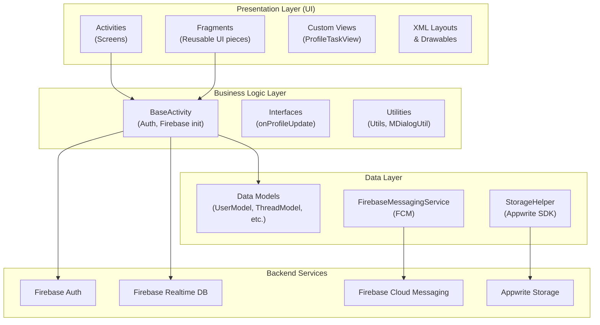


<div style="page-break-after: always;"></div>


# Chapter 4: Dependencies Explained

## 4.1 What are Dependencies?

In Android development, **dependencies** are external libraries (pre-built code packages) that your project uses instead of writing everything from scratch. They are declared in `app/build.gradle` and their versions are managed in `gradle/libs.versions.toml`.

---

## 4.2 Complete Dependency Table

| Library                 | Version       | What It Does                              | Why It's Needed                                                      |
| ----------------------- | ------------- | ----------------------------------------- | -------------------------------------------------------------------- |
| **AppCompat**           | 1.7.0         | Backward-compatible Android UI components | Ensures the app looks consistent across old and new Android versions |
| **Material Design**     | 1.12.0        | Google's Material Design components       | Provides buttons, text fields, bottom sheets, dialogs, snackbars     |
| **Activity**            | 1.9.3         | AndroidX Activity library                 | Modern activity result APIs, edge-to-edge support                    |
| **ConstraintLayout**    | 2.2.0         | Flexible layout manager                   | Lets you build complex UIs with flat (non-nested) view hierarchies   |
| **Firebase Auth**       | 23.1.0        | Firebase Authentication SDK               | Login/Signup with Email+Password and Google Sign-In                  |
| **Firebase Database**   | 21.0.0        | Firebase Realtime Database SDK            | Store and sync user data, threads, comments in real-time             |
| **Firebase Messaging**  | 24.0.3        | Firebase Cloud Messaging SDK              | Push notifications                                                   |
| **Firebase BOM**        | 33.5.1        | Bill of Materials                         | Manages compatible versions of all Firebase libraries                |
| **Play Services Auth**  | 21.2.0        | Google Sign-In API                        | Enables "Sign in with Google" button functionality                   |
| **Google Auth Library** | 1.29.0        | OAuth2 HTTP client                        | Generates access tokens for FCM server-side auth                     |
| **Glide**               | 4.16.0        | Image loading library                     | Loads images from URLs, handles caching, GIF support                 |
| **Picasso**             | 2.71828       | Image loading library                     | Alternative image loader (used for profile images)                   |
| **SwipeRefreshLayout**  | 1.2.0-alpha01 | Pull-to-refresh widget                    | Adds swipe-down-to-refresh to the home feed                          |
| **SwitchButton**        | 0.0.3         | Custom toggle switch                      | iOS-style switch for privacy settings                                |
| **PhotoView Dialog**    | 1.0.2         | Fullscreen image viewer                   | Tap-to-zoom fullscreen image/GIF preview dialog                      |
| **Appwrite SDK**        | 6.0.0         | Appwrite SDK for Android                  | File upload, download, and deletion on Appwrite cloud                |
| **IVCompressor**        | 2.0.2         | Image compression library                 | Compresses images before upload to save storage/bandwidth            |
| **JUnit**               | 4.13.2        | Unit testing framework                    | Write and run unit tests                                             |
| **Espresso**            | 3.6.1         | UI testing framework                      | Automated UI testing on devices                                      |

---

## 4.3 Dependency Architecture Diagram

```mermaid
graph TD
    APP["App Module<br/>(build.gradle)"]

    subgraph "AndroidX Core"
        AX1["appcompat 1.7.0"]
        AX2["material 1.12.0"]
        AX3["activity 1.9.3"]
        AX4["constraintlayout 2.2.0"]
        AX5["swiperefreshlayout 1.2.0"]
    end

    subgraph "Firebase Suite"
        FB["firebase-bom 33.5.1<br/>(Version Manager)"]
        FB1["firebase-auth 23.1.0"]
        FB2["firebase-database 21.0.0"]
        FB3["firebase-messaging 24.0.3"]
        FB4["play-services-auth 21.2.0"]
        FB5["google-auth-library 1.29.0"]
    end

    subgraph "Image Libraries"
        IM1["Glide 4.16.0"]
        IM2["Picasso 2.71828"]
        IM3["PhotoView Dialog 1.0.2"]
        IM4["IVCompressor 2.0.2"]
    end

    subgraph "Cloud Storage"
        CL1["Appwrite SDK 6.0.0"]
    end

    subgraph "UI Components"
        UI1["SwitchButton 0.0.3"]
    end

    APP --> AX1 & AX2 & AX3 & AX4 & AX5
    APP --> FB
    FB --> FB1 & FB2 & FB3
    APP --> FB4 & FB5
    APP --> IM1 & IM2 & IM3 & IM4
    APP --> CL1
    APP --> UI1
```

---

## 4.4 How Dependencies Are Declared

### Version Catalog (`gradle/libs.versions.toml`)

This file defines all library versions in one place:

```toml
[versions]
glide = "4.16.0"
firebaseAuth = "23.1.0"

[libraries]
glide = { module = "com.github.bumptech.glide:glide", version.ref = "glide" }
firebase-auth = { group = "com.google.firebase", name = "firebase-auth", version.ref = "firebaseAuth" }

[plugins]
android-application = { id = "com.android.application", version.ref = "agp" }
```

### App-level `build.gradle`

References the version catalog using `libs.` prefix:

```groovy
dependencies {
    implementation libs.glide
    implementation libs.firebase.auth
    implementation platform(libs.firebase.bom)  // BOM for Firebase versioning
}
```

> **Why use a Version Catalog?** It keeps all version numbers in one file. When you update a library, you change it in one place instead of searching through multiple files.

---

## 4.5 What is Firebase BOM?

**BOM** stands for **Bill of Materials**. When you add:

```groovy
implementation platform(libs.firebase.bom)
```

It automatically ensures all Firebase libraries use compatible versions. You don't need to specify individual Firebase library versions — the BOM handles it.

---

## 4.6 Glide vs Picasso — Why Both?

The project uses **both** Glide and Picasso:

| Feature          | Glide                         | Picasso        |
| ---------------- | ----------------------------- | -------------- |
| **Used for**     | Post images + GIF loading     | Profile images |
| **GIF support**  | ✅ Native                     | ❌ No          |
| **Memory usage** | More efficient (auto-resizes) | Simpler API    |
| **Cache**        | Memory + Disk                 | Memory + Disk  |

> **In this project:** Glide is used in `HomeFragment.PostImagesListAdapter` for post images (especially GIFs), while Picasso is used in the home feed for loading profile pictures.


<div style="page-break-after: always;"></div>


# Chapter 5: Data Models

Data models are Java classes that represent the structure of data stored in Firebase Realtime Database. Each model class maps to a JSON node in the database.

---

## 5.1 Model Class Relationship Diagram

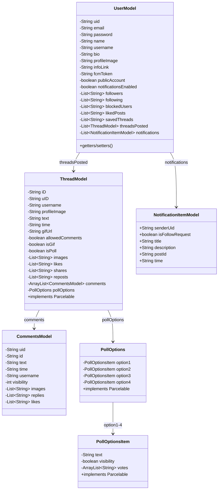

---

## 5.2 UserModel

**File:** `model/UserModel.java` — Represents a user in the system.

| Field                  | Type                          | Description                                                     |
| ---------------------- | ----------------------------- | --------------------------------------------------------------- |
| `uid`                  | `String`                      | Unique Firebase Auth user ID                                    |
| `email`                | `String`                      | User's email address                                            |
| `password`             | `String`                      | User's password (stored in DB — not recommended for production) |
| `name`                 | `String`                      | Display name                                                    |
| `username`             | `String`                      | Unique username (also used as DB key)                           |
| `bio`                  | `String`                      | Profile biography text                                          |
| `profileImage`         | `String`                      | URL of profile picture                                          |
| `infoLink`             | `String`                      | Website/link shown on profile                                   |
| `fcmToken`             | `String`                      | Firebase Cloud Messaging token for push notifications           |
| `publicAccount`        | `boolean`                     | Whether the account is public or private                        |
| `notificationsEnabled` | `boolean`                     | Whether notifications are enabled                               |
| `followers`            | `List<String>`                | List of follower UIDs                                           |
| `following`            | `List<String>`                | List of following UIDs                                          |
| `blockedUsers`         | `List<String>`                | List of blocked user UIDs                                       |
| `likedPosts`           | `List<String>`                | List of liked post IDs                                          |
| `savedThreads`         | `List<String>`                | List of saved thread IDs                                        |
| `threadsPosted`        | `List<ThreadModel>`           | User's posted threads                                           |
| `notifications`        | `List<NotificationItemModel>` | User's notification items                                       |

**Key points:**

- Has a **no-argument constructor** (required by Firebase for deserialization)
- The full constructor initializes all fields with null-safe defaults
- Stored under `/users/{username}` in Firebase

---

## 5.3 ThreadModel

**File:** `model/ThreadModel.java` — Represents a single thread (post).

| Field             | Type                       | Description                           |
| ----------------- | -------------------------- | ------------------------------------- |
| `iD`              | `String`                   | Unique thread ID (Firebase push key)  |
| `uID`             | `String`                   | Author's Firebase UID                 |
| `username`        | `String`                   | Author's username                     |
| `profileImage`    | `String`                   | Author's profile image URL            |
| `text`            | `String`                   | Thread text content                   |
| `time`            | `String`                   | Timestamp in milliseconds (as string) |
| `gifUrl`          | `String`                   | URL of GIF (if attached)              |
| `images`          | `List<String>`             | URLs of attached images               |
| `likes`           | `List<String>`             | UIDs of users who liked               |
| `shares`          | `List<String>`             | UIDs of users who shared              |
| `reposts`         | `List<String>`             | UIDs of users who reposted            |
| `comments`        | `ArrayList<CommentsModel>` | List of comments on this thread       |
| `allowedComments` | `boolean`                  | Whether comments are allowed          |
| `isGif`           | `boolean`                  | Whether the thread has a GIF          |
| `isPoll`          | `boolean`                  | Whether the thread is a poll          |
| `pollOptions`     | `PollOptions`              | Poll options (if isPoll = true)       |

**Key points:**

- Implements **`Parcelable`** — allows passing between Activities via `Intent`
- Has a `CREATOR` static field for Parcelable deserialization
- The `profileImage()` method is named differently (not `getProfileImage()`) — this is a minor inconsistency

---

## 5.4 CommentsModel

**File:** `model/CommentsModel.java` — Represents a comment on a thread.

| Field        | Type           | Description                   |
| ------------ | -------------- | ----------------------------- |
| `uid`        | `String`       | Comment author's UID          |
| `id`         | `String`       | Comment ID                    |
| `text`       | `String`       | Comment text                  |
| `time`       | `String`       | Timestamp in milliseconds     |
| `username`   | `String`       | Author's username             |
| `visibility` | `int`          | Visibility flag (1 = visible) |
| `images`     | `List<String>` | Attached image URLs           |
| `replies`    | `List<String>` | Reply IDs                     |
| `likes`      | `List<String>` | UIDs of users who liked       |

---

## 5.5 PollOptions

**File:** `model/PollOptions.java` — Contains up to 4 poll options.

| Field     | Type              | Description                   |
| --------- | ----------------- | ----------------------------- |
| `option1` | `PollOptionsItem` | First poll option (required)  |
| `option2` | `PollOptionsItem` | Second poll option (required) |
| `option3` | `PollOptionsItem` | Third poll option (optional)  |
| `option4` | `PollOptionsItem` | Fourth poll option (optional) |

### PollOptionsItem (Inner Class)

| Field        | Type                | Description                             |
| ------------ | ------------------- | --------------------------------------- |
| `text`       | `String`            | Option text displayed to users          |
| `visibility` | `boolean`           | Whether this option is shown            |
| `votes`      | `ArrayList<String>` | UIDs of users who voted for this option |

Both `PollOptions` and `PollOptionsItem` implement **`Parcelable`**.

---

## 5.6 NotificationItemModel

**File:** `model/NotificationItemModel.java` — Represents a notification.

| Field             | Type      | Description                                    |
| ----------------- | --------- | ---------------------------------------------- |
| `senderUid`       | `String`  | UID of the user who triggered the notification |
| `isFollowRequest` | `boolean` | Whether this is a follow request               |
| `title`           | `String`  | Notification title                             |
| `description`     | `String`  | Notification description                       |
| `postId`          | `String`  | Related thread ID (if applicable)              |
| `time`            | `String`  | Timestamp of the notification                  |

> **Note:** Unlike other models, this class has `public` fields instead of `private` — this is a simpler pattern that also works with Firebase deserialization.

---

## 5.7 What is Parcelable?

**Parcelable** is an Android interface that allows objects to be passed between Activities through `Intent.putExtra()`. Think of it as "serializing" an object into a format Android can efficiently transfer between screens.

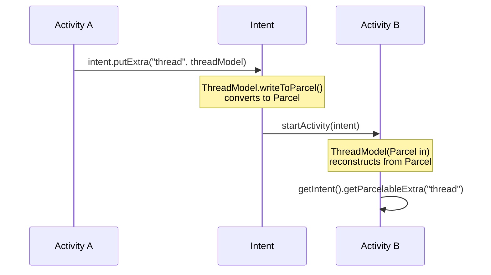


<div style="page-break-after: always;"></div>


# Chapter 6: Base Classes

## 6.1 BaseActivity — The Foundation of Every Screen

**File:** `BaseActivity.java` (417 lines)

`BaseActivity` extends `AppCompatActivity` and serves as the **parent class** for every activity in the app. It centralizes shared functionality so that each screen doesn't need to repeat common setup code.

### What Gets Initialized in `onCreate()`

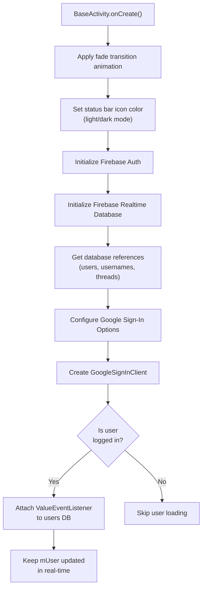

### Key Static Fields

| Field                       | Type                | Description                                                                    |
| --------------------------- | ------------------- | ------------------------------------------------------------------------------ |
| `mUser`                     | `UserModel`         | **Current logged-in user** — accessible from anywhere via `BaseActivity.mUser` |
| `mUsersDatabaseReference`   | `DatabaseReference` | Points to `/users` in Firebase                                                 |
| `mThreadsDatabaseReference` | `DatabaseReference` | Points to `/threads` in Firebase                                               |

> **Why static?** These are declared `public static` so any Activity or Fragment can access the current user and database references without passing them around.

### Key Methods

| Method                                         | Return    | Description                                           |
| ---------------------------------------------- | --------- | ----------------------------------------------------- |
| `isUserLoggedIn()`                             | `boolean` | Checks if `mAuth.getCurrentUser()` is not null        |
| `logoutUser()`                                 | `void`    | Signs out from Firebase + Google, redirects to Splash |
| `getUsersDatabase(AuthListener)`               | `void`    | Reads all users from `/users` with callback           |
| `getDatabase(String path, AuthListener)`       | `void`    | Reads any path from Firebase with callback            |
| `loginTask(Task<AuthResult>)`                  | `void`    | Called after successful login, navigates to Profile   |
| `updateUserProfile()`                          | `void`    | Saves `mUser` back to Firebase (static)               |
| `updateProfileInfo(UserModel, AuthListener)`   | `void`    | Saves any user model to Firebase                      |
| `showProgressDialog()`                         | `void`    | Shows a circular loading indicator                    |
| `hideProgressDialog()`                         | `void`    | Dismisses the loading indicator                       |
| `showToast(String)`                            | `void`    | Displays a short toast message                        |
| `hideKeyboard(View)`                           | `void`    | Hides the soft keyboard                               |
| `isNightMode()`                                | `boolean` | Checks if device is in dark mode                      |
| `pressBack(View)`                              | `void`    | Finishes the activity with fade animation             |
| `sendPushNotificationInThread(String, String)` | `void`    | Sends FCM push notification in a background thread    |
| `dispatchTouchEvent(MotionEvent)`              | `boolean` | Auto-clears EditText focus when tapping outside       |

### AuthListener Interface

Defined inside `BaseActivity`, this is a **callback pattern** used for async Firebase operations:

```java
public interface AuthListener {
    void onAuthTaskStart();             // Called before the operation
    void onAuthSuccess(DataSnapshot snapshot);  // Called on success
    void onAuthFail(DatabaseError error);       // Called on failure
}
```

Usage example:

```java
getUsersDatabase(new AuthListener() {
    @Override
    public void onAuthTaskStart() { showProgressDialog(); }

    @Override
    public void onAuthSuccess(DataSnapshot snapshot) {
        // Process data
        hideProgressDialog();
    }

    @Override
    public void onAuthFail(DatabaseError error) {
        hideProgressDialog();
    }
});
```

### Google Sign-In Flow

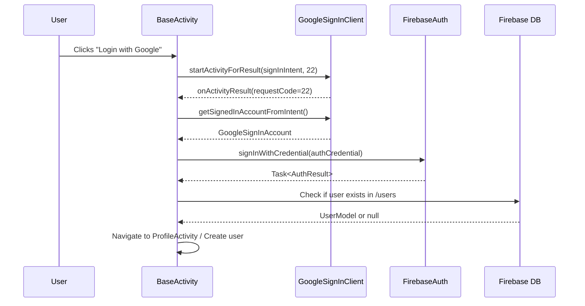

---

## 6.2 BaseApplication — Global Application Context

**File:** `BaseApplication.java` (30 lines)

This class extends `Application` and provides a **global application context** accessible from anywhere.

### What It Does

```java
public class BaseApplication extends Application {
    private static Context mApplicationContext;

    public static Context getContext() {
        return mApplicationContext;  // Access context anywhere
    }

    @Override
    public void onCreate() {
        mApplicationContext = getApplicationContext();
        super.onCreate();
    }
}
```

### Why Is It Needed?

- Some operations (like initializing libraries) need a `Context` but don't have access to an Activity
- `BaseApplication.getContext()` provides a global context
- Registered in `AndroidManifest.xml` via `android:name=".BaseApplication"`

### Commented-Out Crash Handler

The file contains a commented-out `UncaughtExceptionHandler` that would silently kill the app on crashes instead of showing the default crash dialog. It's disabled for debugging purposes.

---

## 6.3 Constants — Configuration Values

**File:** `Constants.java` (11 lines)

This class stores all configuration constants:

| Constant                     | Value                  | Usage                               |
| ---------------------------- | ---------------------- | ----------------------------------- |
| `webApplicationID`           | Google OAuth Client ID | Google Sign-In configuration        |
| `FCM_AUTH_KEY`               | `""` (empty)           | Firebase Cloud Messaging server key |
| `USERS_DB_REF`               | `"users"`              | Firebase path for user data         |
| `USERNAMES_DB_REF`           | `"gusernames"`         | Firebase path for username lookup   |
| `THREADS_DB_REF`             | `"threads"`            | Firebase path for thread data       |
| `APPWRITE_STORAGE_BUCKET_ID` | Bucket ID string       | Appwrite storage bucket identifier  |
| `APPWRITE_PROJECT_ID`        | Project ID string      | Appwrite project identifier         |

> **Best Practice Note:** In production apps, sensitive keys like `webApplicationID` should be stored in `local.properties` or environment variables, not in source code.


<div style="page-break-after: always;"></div>


# Chapter 7: Activities Deep Dive

Every screen in this app is an **Activity**. All activities extend `BaseActivity`, which means they all inherit Firebase, authentication, and utility methods automatically.

---

## 7.1 Activity Navigation Flow

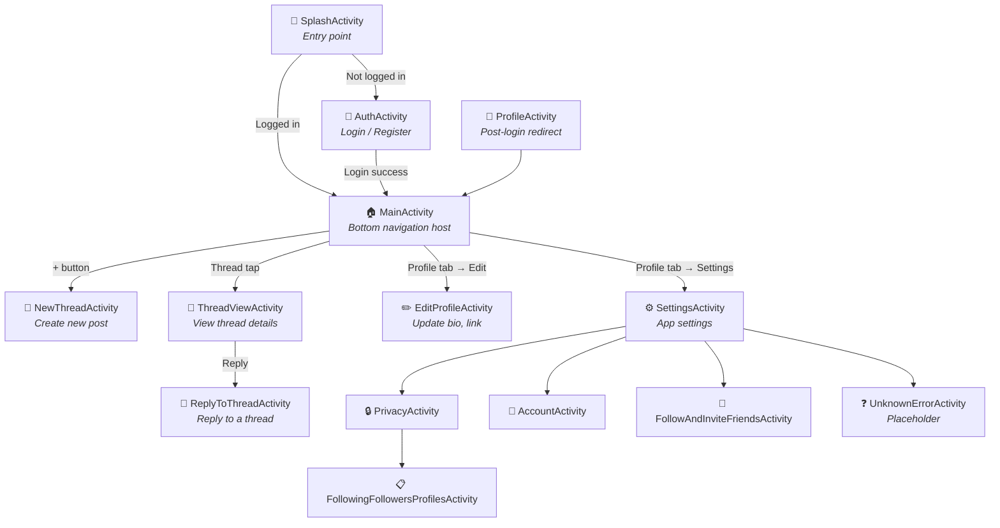

---

## 7.2 SplashActivity

**File:** `activities/SplashActivity.java` (82 lines)  
**Purpose:** App entry point — shows the Threads logo while checking authentication status.

### Flow

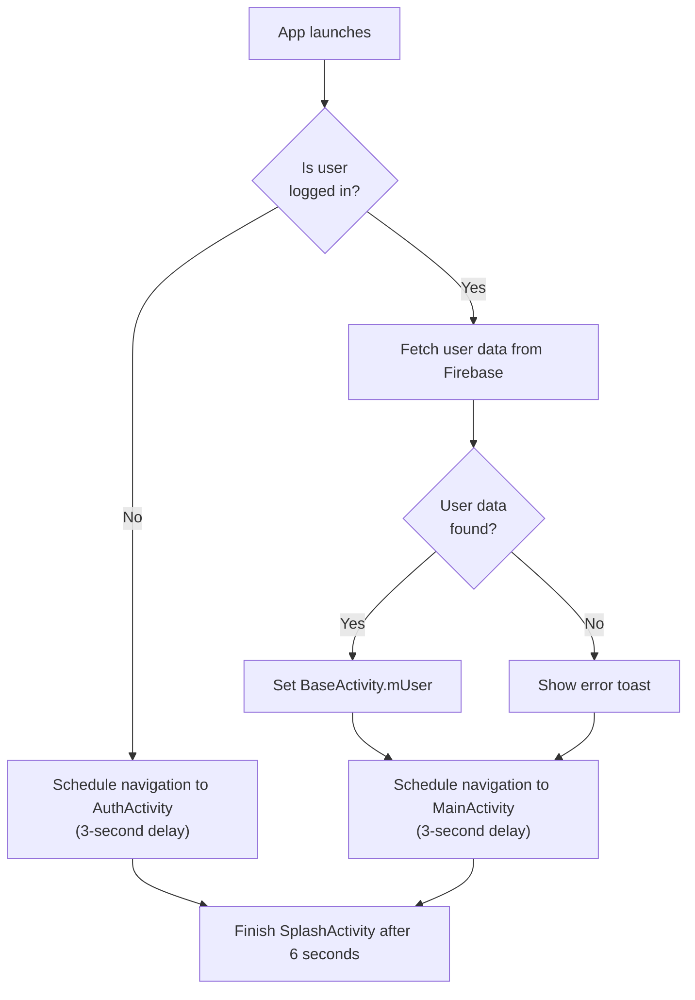

### Key Methods

| Method         | Description                                                                             |
| -------------- | --------------------------------------------------------------------------------------- |
| `onCreate()`   | Checks login state, fetches user if logged in                                           |
| `nextScreen()` | Uses `Handler.postDelayed()` to navigate after 3 seconds with shared element transition |

### Shared Element Transition

The splash logo animates smoothly to the next screen using:

```java
Pair<View, String> p1 = Pair.create(imageView, "splash_image");
ActivityOptions options = ActivityOptions.makeSceneTransitionAnimation(this, p1);
startActivity(intent, options.toBundle());
```

---

## 7.3 AuthActivity

**File:** `activities/AuthActivity.java` (309 lines)  
**Purpose:** Login and Registration screen with email/password and Google Sign-In.

### Two Modes

The screen toggles between **Login** and **Register** mode:

| Mode         | Fields Shown                | Button Text |
| ------------ | --------------------------- | ----------- |
| **Login**    | Email/Username + Password   | "Log in"    |
| **Register** | Username + Email + Password | "Sign up"   |

### Login Flow

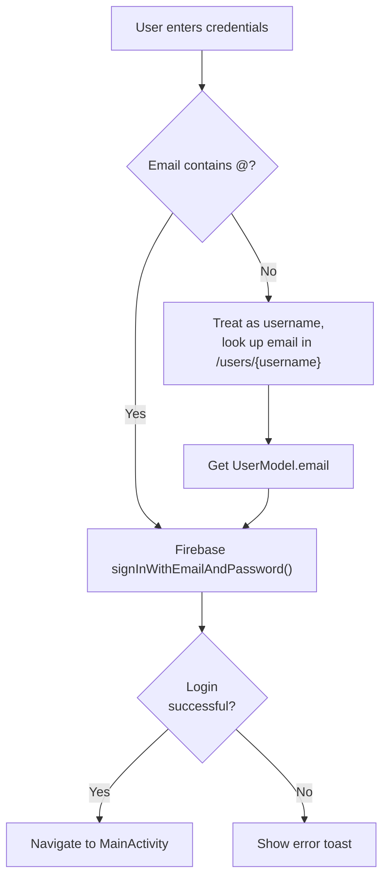

### Registration Flow

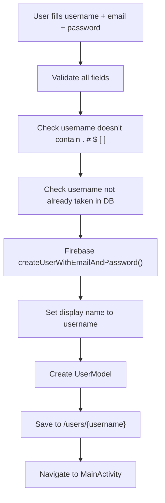

### Username Validation

```java
String usernameRegex = "^[a-z0-9._]{6,20}$";
```

- Must be 6–20 characters
- Only lowercase letters, numbers, dots, and underscores
- No spaces or uppercase

### Input Text Watchers

`TextWatcher` is attached to each field to validate in real-time:

- **Username:** 6–20 chars, lowercase only, no special chars
- **Password:** Minimum 6 characters
- **Email:** Error cleared on change

---

## 7.4 MainActivity

**File:** `activities/MainActivity.java` (159 lines)  
**Purpose:** Main screen with bottom navigation bar hosting 4 fragments + a create button.

### Bottom Navigation

| Position   | Icon        | Fragment / Action              |
| ---------- | ----------- | ------------------------------ |
| 0          | 🏠 Home     | `HomeFragment`                 |
| 1          | 🔍 Search   | `SearchFragment`               |
| 2 (center) | ➕ Add      | Opens `NewThreadActivity`      |
| 3          | ❤️ Activity | `ActivityNotificationFragment` |
| 4          | 👤 Profile  | `ProfileFragment`              |

### Fragment Management

```java
public void setFragment(int position) {
    FragmentManager fm = getSupportFragmentManager();
    FragmentTransaction ft = fm.beginTransaction()
            .setTransition(FragmentTransaction.TRANSIT_FRAGMENT_FADE);

    if (position == 0) {
        fm.popBackStack("root", FragmentManager.POP_BACK_STACK_INCLUSIVE);
        ft.addToBackStack("root");
        ft.add(R.id.fragmentContainerView, HomeFragment.getInstance());
    } else if (position == 1) {
        ft.replace(R.id.fragmentContainerView, SearchFragment.getInstance())
          .addToBackStack(null);
    }
    // ... etc
    ft.commit();
    setFragmentIcon(position);  // Update icon colors
}
```

### Back Press Handling

When the user presses Back at the root fragment:

```java
new MaterialAlertDialogBuilder(this)
    .setTitle("Are you sure?")
    .setMessage("Do you want to exit?")
    .setPositiveButton("Yes", ...)
    .setNegativeButton("No", null)
    .show();
```

---

## 7.5 NewThreadActivity

**File:** `activities/NewThreadActivity.java` (297 lines)  
**Purpose:** Screen to create a new thread (post) with text and optionally up to 5 images.

### Key Components

| Component                | Description                                                 |
| ------------------------ | ----------------------------------------------------------- |
| `EditText`               | For typing the thread text                                  |
| `RecyclerView`           | Horizontal list of selected images                          |
| `ImagesListAdapter`      | Inner adapter class for image list                          |
| `ActivityResultLauncher` | Modern photo picker (replaces old `startActivityForResult`) |
| Poll UI                  | Partially implemented (poll options layout disabled)        |

### Post Thread Flow

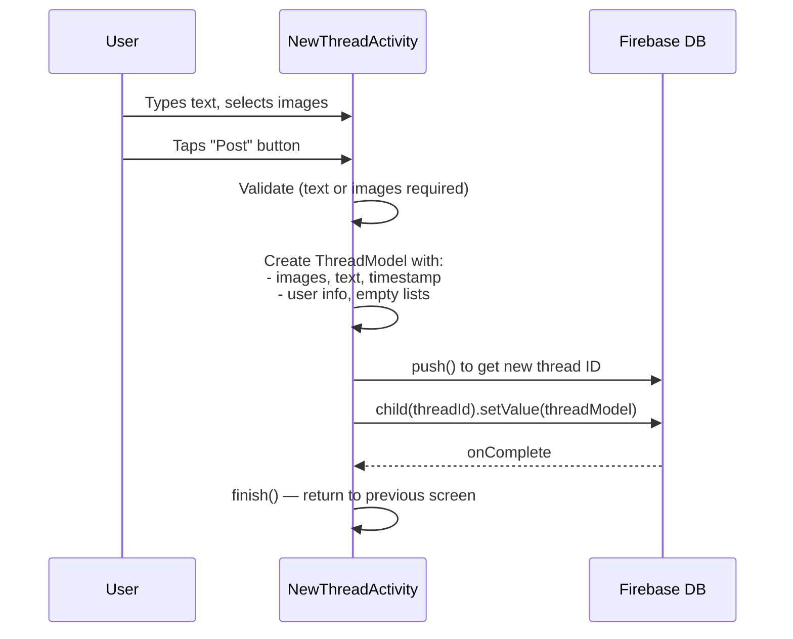

### ImagesListAdapter (Inner Class)

A `RecyclerView.Adapter` that shows selected images horizontally:

- Shows up to 5 images
- Each image has a delete button
- First image has extra left margin (to offset from profile picture)
- Uses `dataChangeListener` callback to notify parent of changes

---

## 7.6 ThreadViewActivity

**File:** `activities/ThreadViewActivity.java` (276 lines)  
**Purpose:** View a thread's full content, images, poll, comments, and interact (like/comment).

### How It Gets the Thread Data

```java
// Receives thread ID via Intent
String threadId = getIntent().getExtras().getString("thread");

// Listens for real-time updates
mThreadsDatabaseReference.child(threadId)
    .addValueEventListener(new ValueEventListener() {
        public void onDataChange(DataSnapshot snapshot) {
            ThreadModel threadModel = snapshot.getValue(ThreadModel.class);
            setUpThreadView(threadModel);
        }
    });
```

### Like Toggle Logic

```java
if (threadModel.getLikes().contains(BaseActivity.mUser.getUid())) {
    threadModel.getLikes().remove(BaseActivity.mUser.getUid());  // Unlike
} else {
    threadModel.getLikes().add(BaseActivity.mUser.getUid());     // Like
}
// Save back to Firebase
BaseActivity.mThreadsDatabaseReference.child(threadModel.getID())
    .setValue(threadModel);
```

### Public Profile Check for Commenting

```java
if (!mUser.isPublicAccount()) {
    showNeedPublicProfileDialog();  // Shows BottomSheet asking to switch
    return;
}
addNewComment();  // Navigates to ReplyToThreadActivity
```

---

## 7.7 ReplyToThreadActivity

**File:** `activities/ReplyToThreadActivity.java` (167 lines)  
**Purpose:** Add a comment/reply to a thread. Shows the original thread at the top and a text input below.

### Comment Submission Flow

```java
ArrayList<CommentsModel> comments = threadModel.getComments();
comments.add(new CommentsModel(
    mUser.getUid(), data, new ArrayList<>(), 1,
    (comments.size()) + "",    // ID = position index
    edittext.getText(),        // Comment text
    Utils.getNowInMillis()+"", // Current timestamp
    mUser.getUsername(),
    new ArrayList<>()          // Empty likes list
));
threadModel.setComments(comments);
mThreadsDatabaseReference.child(threadModel.getID()).setValue(threadModel);
```

---

## 7.8 EditProfileActivity

**File:** `activities/EditProfileActivity.java` (88 lines)  
**Purpose:** Edit bio, website link, and privacy toggle.

### Fields

| UI Element      | Maps To               | Action                 |
| --------------- | --------------------- | ---------------------- |
| Name + Username | Display only          | Cannot be changed here |
| Bio             | `mUser.bio`           | Editable text field    |
| Link            | `mUser.infoLink`      | Editable text field    |
| Switch          | `mUser.publicAccount` | Toggle public/private  |

### Save Logic

Only saves if something actually changed:

```java
if (bio.equals(originalBio) && link.equals(originalLink)
    && switchButton.isChecked() == wasPublic) {
    return;  // No changes — skip Firebase write
}
```

---

## 7.9 SettingsActivity

**File:** `activities/SettingsActivity.java` (57 lines)  
**Purpose:** Settings menu with navigation to sub-settings.

### Menu Items

| Menu Item                 | Opens                                |
| ------------------------- | ------------------------------------ |
| Follow and Invite Friends | `FollowAndInviteFriendsActivity`     |
| Notifications             | `UnknownErrorActivity` (coming soon) |
| Privacy                   | `PrivacyActivity`                    |
| Account                   | `AccountActivity`                    |
| Language                  | `UnknownErrorActivity` (coming soon) |
| Help                      | Bottom sheet dialog                  |
| Logout                    | Custom dialog → `logoutUser()`       |

### Logout Dialog

Uses the custom `MDialogUtil`:

```java
new MDialogUtil(this)
    .setTitle("Log out Threads?")
    .setMessage("are you sure you want to logout?", false)
    .setB1("Logout", view -> logoutUser());
```

---

## 7.10 Settings Sub-Activities

| Activity                             | File                                               | Purpose                                           |
| ------------------------------------ | -------------------------------------------------- | ------------------------------------------------- |
| `AccountActivity`                    | `settings/AccountActivity.java`                    | Account settings (placeholder — UI only)          |
| `PrivacyActivity`                    | `settings/PrivacyActivity.java`                    | Private profile toggle + "People you follow" link |
| `FollowAndInviteFriendsActivity`     | `settings/FollowAndInviteFriendsActivity.java`     | Invite friends (placeholder — UI only)            |
| `FollowingFollowersProfilesActivity` | `settings/FollowingFollowersProfilesActivity.java` | List followers/following (placeholder — UI only)  |

---

## 7.11 UnknownErrorActivity

**File:** `activities/UnknownErrorActivity.java` (32 lines)  
**Purpose:** A generic placeholder screen for unimplemented features.

Accepts optional extras:

```java
getIntent().getStringExtra("title")   // e.g., "Language"
getIntent().getStringExtra("desc")    // e.g., "Coming soon!"
```


<div style="page-break-after: always;"></div>


# Chapter 8: Fragments Deep Dive

**Fragments** are reusable UI components that live inside an Activity. In this app, `MainActivity` hosts four main fragments via a custom bottom navigation bar.

---

## 8.1 Fragment Architecture

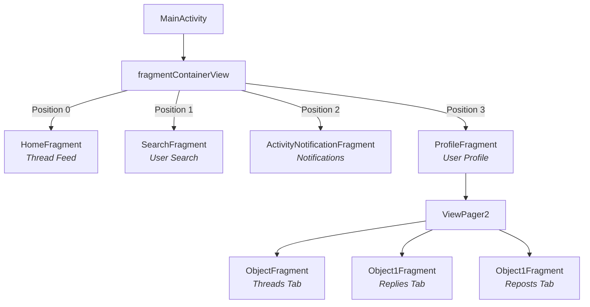

All fragments use the **Singleton Pattern** (`getInstance()`) to avoid creating multiple instances.

---

## 8.2 HomeFragment — The Main Feed

**File:** `fragments/HomeFragment.java` (505 lines) — The largest fragment, responsible for displaying the thread feed.

### Structure

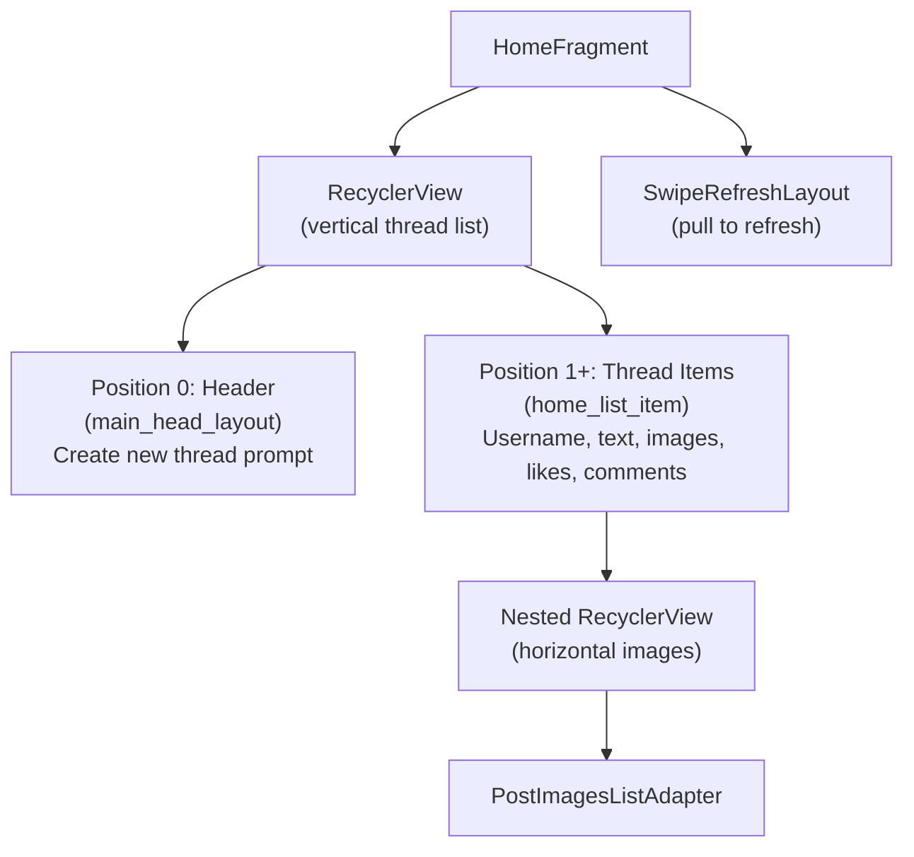

### Data Loading — Real-Time with ChildEventListener

Instead of reading all threads at once, the app uses `ChildEventListener` for **real-time updates**:

```java
BaseActivity.mThreadsDatabaseReference.addChildEventListener(new ChildEventListener() {
    @Override
    public void onChildAdded(DataSnapshot snapshot, String previousChildName) {
        // New thread posted → add to list
        dataAdapter.addData(snapshot.getValue(ThreadModel.class));
    }

    @Override
    public void onChildChanged(DataSnapshot snapshot, String previousChildName) {
        // Thread updated (e.g., new like) → update in list
        ThreadModel model = snapshot.getValue(ThreadModel.class);
        for (int i = 0; i < data.size(); i++) {
            if (data.get(i).getID().equals(model.getID())) {
                dataAdapter.updateData(i, model);
                break;
            }
        }
    }

    @Override
    public void onChildRemoved(DataSnapshot snapshot) {
        // Thread deleted → remove from list
        dataAdapter.removeData(snapshot.getValue(ThreadModel.class));
    }
});
```

### Inner Class: Adapter (Thread List)

| Method                 | Description                                                                |
| ---------------------- | -------------------------------------------------------------------------- |
| `onCreateViewHolder()` | Inflates `main_head_layout` for position 0, `home_list_item` for others    |
| `onBindViewHolder()`   | Binds thread data: username, text, time, likes count, images, poll options |
| `getItemViewType()`    | Returns 1 for header (position 0), 0 for thread items                      |
| `getItemCount()`       | Returns `data.size() + 1` (extra 1 for header)                             |
| `addData()`            | Adds thread to position 0 (newest first)                                   |
| `updateData()`         | Updates existing thread at position                                        |
| `removeData()`         | Removes thread from list                                                   |

### Like Toggle in Feed

```java
holder.itemView.findViewById(R.id.likeThreadLayout).setOnClickListener(view -> {
    if (data.get(pos).getLikes().contains(BaseActivity.mUser.getUid())) {
        data.get(pos).getLikes().remove(BaseActivity.mUser.getUid());
    } else {
        data.get(pos).getLikes().add(BaseActivity.mUser.getUid());
    }
    // Save to Firebase
    BaseActivity.mThreadsDatabaseReference.child(data.get(pos).getID())
        .setValue(data.get(pos));
});
```

### Inner Class: PostImagesListAdapter

A **static** adapter for displaying post images horizontally:

| Constructor                                                     | Use                          |
| --------------------------------------------------------------- | ---------------------------- |
| `PostImagesListAdapter()`                                       | Empty (no images)            |
| `PostImagesListAdapter(List<String> data)`                      | With images and left padding |
| `PostImagesListAdapter(List<String> data, boolean leftPadding)` | With optional left padding   |
| `PostImagesListAdapter(boolean leftPadding)`                    | No images, custom padding    |

**Image loading logic:**

```java
if (data.get(position).contains("gif"))
    Glide.with(context).asGif().load(url).into(imageView);
else
    Glide.with(context).load(url).into(imageView);
```

**Fullscreen preview on tap:**

```java
imageView.setOnClickListener(view -> {
    new PhotoViewDialog.Builder(context, data, (imageView1, url) ->
        Glide.with(context).load(url).into(imageView1))
        .withStartPosition(position).build().show(true);
});
```

### Poll Voting

Each poll option has a click listener that:

1. Checks if user hasn't already voted on any option
2. Adds current user's UID to the selected option's votes
3. Saves updated thread to Firebase

---

## 8.3 SearchFragment — User Search

**File:** `fragments/SearchFragment.java` (118 lines) — Placeholder with a static list.

### Current State

The search functionality shows **20 static placeholder items** (hardcoded in adapter):

```java
@Override
public int getItemCount() {
    return 20;  // Static placeholder count
}
```

The adapter inflates `search_frag_list_item` but doesn't bind any dynamic data. This is a **UI stub** ready for future implementation.

---

## 8.4 ActivityNotificationFragment — Notifications

**File:** `fragments/ActivityNotificationFragment.java` (185 lines) — Notification/activity feed with chip-based filtering.

### Chip Filters

| Chip     | Position | Shows Data?                            |
| -------- | -------- | -------------------------------------- |
| All      | 0        | ✅ Yes (mixed follow request / follow) |
| Requests | 1        | ✅ Yes (follow requests only)          |
| Replies  | 2        | ❌ Shows "No data" text                |
| Mentions | 3        | ❌ Shows "No data" text                |
| Quotes   | 4        | ❌ Shows "No data" text                |
| Reposts  | 5        | ❌ Shows "No data" text                |

### Chip Styling Toggle

```java
private void setHeaderPos(TextView view, boolean isActivated) {
    if (isActivated) {
        TextViewCompat.setTextAppearance(view, R.style.ButtonFilled);
        view.setBackgroundResource(R.drawable.button_background_filled);
    } else {
        TextViewCompat.setTextAppearance(view, R.style.ButtonOutlined);
        view.setBackgroundResource(R.drawable.button_background_outlined);
    }
}
```

### DataAdapter (Inner Class)

Shows **100 static placeholder items** with random follow button visibility:

```java
if (rand) {
    if (Utils.getRandomNumber(0, 1) == 0) {
        holder.itemView.findViewById(R.id.follow_button).setVisibility(View.GONE);
    }
}
```

---

## 8.5 ProfileFragment — User Profile

**File:** `fragments/ProfileFragment.java` (311 lines) — Shows user profile with tabs.

### Layout Structure

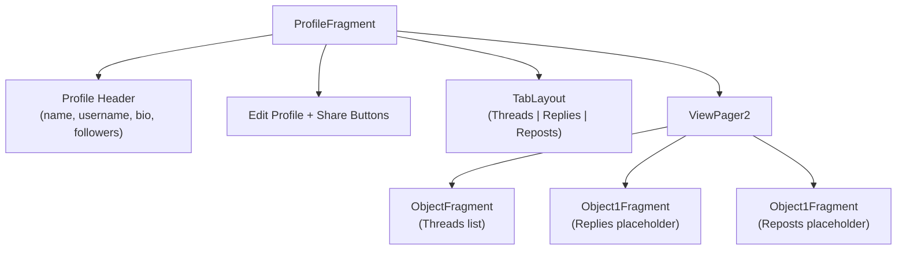

### Profile Data Loading

Displays `BaseActivity.mUser` fields and attaches a real-time listener:

```java
BaseActivity.mUsersDatabaseReference.child(mUser.getUsername())
    .addValueEventListener(new ValueEventListener() {
        @Override
        public void onDataChange(DataSnapshot snapshot) {
            UserModel user = snapshot.getValue(UserModel.class);
            if (user != null) mUser = user;
            // Update UI: name, username, bio, link, followers
        }
    });
```

### Null Safety

If `mUser` is null, shows empty fields and schedules a logout after 3 seconds:

```java
if (mUser == null) {
    new Handler().postDelayed(() -> {
        if (mUser == null && getActivity() != null) {
            ((BaseActivity) getActivity()).logoutUser();
        }
    }, 3000);
    return;
}
```

### TabLayout + ViewPager2

Uses `FragmentStateAdapter` to create 3 tab pages:

```java
static class PageAdapter extends FragmentStateAdapter {
    @Override
    public Fragment createFragment(int position) {
        return position == 0 ? ObjectFragment.newInstance()
             : position == 1 ? Object1Fragment.newInstance(null)
             : Object1Fragment.newInstance("You haven't reposted any threads yet.");
    }

    @Override
    public int getItemCount() { return 3; }
}
```

---

## 8.6 AddThreadFragment

**File:** `fragments/AddThreadFragment.java` (74 lines) — **Currently unused**. Thread creation is handled by `NewThreadActivity` instead.


<div style="page-break-after: always;"></div>


# Chapter 9: Utilities, Services & Database

---

## 9.1 Utils.java — Helper Methods

**File:** `utils/Utils.java` (74 lines)

A collection of **static utility methods** used throughout the app.

### Methods

| Method                              | Parameters          | Returns  | Description                                        |
| ----------------------------------- | ------------------- | -------- | -------------------------------------------------- |
| `getRandomNumber(int min, int max)` | Min and Max values  | `int`    | Generates a random integer in range [min, max]     |
| `hideKeyboard(Activity activity)`   | Current Activity    | `void`   | Hides the soft (on-screen) keyboard                |
| `getNowInMillis()`                  | None                | `long`   | Returns current time in milliseconds (epoch)       |
| `calculateTimeDiff(long createdAt)` | Timestamp in millis | `String` | Converts timestamp to human-readable relative time |
| `calculateLikes(int likes)`         | Like count          | `String` | Formats likes (e.g., 1500 → "1k")                  |
| `getBitmapFromURL(String s)`        | Image URL           | `Bitmap` | Downloads image from URL and returns as Bitmap     |

### Time Difference Logic

```java
public static String calculateTimeDiff(long createdAt) {
    long diffInMillis = now - createdAt;
    long weeks = days / 7;

    if (weeks > 0)     return weeks + "w";     // e.g., "2w"
    else if (days > 0) return days + "d";      // e.g., "3d"
    else if (hours > 0) return hours + "h";    // e.g., "5h"
    else if (minutes > 0) return minutes + "m"; // e.g., "30m"
    else return seconds + "s";                  // e.g., "15s"
}
```

---

## 9.2 MDialogUtil.java — Custom Dialog Builder

**File:** `utils/MDialogUtil.java` (67 lines)

Extends `MaterialAlertDialogBuilder` to create a **custom-styled material dialog** used for confirmations (logout, exit, etc.).

### How It Works

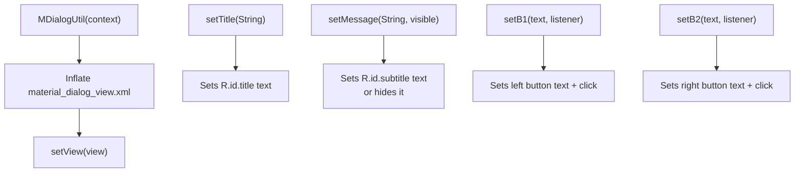

### Usage Example

```java
MDialogUtil dialog = new MDialogUtil(context)
    .setTitle("Log out Threads?")
    .setMessage("Are you sure?", false);  // false = hide subtitle

AlertDialog alertDialog = dialog.create();
dialog.setB1("Logout", v -> logoutUser());
dialog.setB2("Cancel", v -> alertDialog.dismiss());
alertDialog.show();
```

---

## 9.3 AccessToken.java — FCM Token Helper

**File:** `utils/AccessToken.java` (28 lines)

Uses **Google Auth Library** to generate OAuth2 access tokens for Firebase Cloud Messaging server-side API calls.

```java
private static String getAccessToken() throws IOException {
    InputStream inputStream = new ByteArrayInputStream("".getBytes(UTF_8));
    GoogleCredentials credentials = GoogleCredentials
        .fromStream(inputStream)
        .createScoped(Arrays.asList(SCOPES));
    credentials.refresh();
    return credentials.getAccessToken().getTokenValue();
}
```

> **Note:** The input stream is currently empty (`""`), meaning this method isn't fully configured. In production, it would read a service account JSON key file.

---

## 9.4 StorageHelper.java — Appwrite File Storage

**File:** `database/StorageHelper.java` (84 lines)

A **Singleton** class that handles file upload, download, and deletion using the **Appwrite SDK**.

### Singleton Pattern

```java
private static StorageHelper instance;

public static StorageHelper getInstance(Context context) {
    if (instance == null) {
        instance = new StorageHelper(context);
    }
    return instance;
}
```

### Initialization

```java
Client client = new Client(context, "https://cloud.appwrite.io/v1");
client.setProject(Constants.APPWRITE_PROJECT_ID);
storage = new Storage(client);
```

### Methods

| Method                        | Parameters            | Description                               |
| ----------------------------- | --------------------- | ----------------------------------------- |
| `uploadFile(File, String id)` | File object + file ID | Uploads a file to Appwrite storage bucket |
| `deleteFile(String id)`       | File ID               | Deletes a file from storage               |
| `downloadFile(String id)`     | File ID               | Downloads a file from storage             |

**Async Callbacks:**

```java
storage.createFile(
    Constants.APPWRITE_STORAGE_BUCKET_ID,
    id,
    InputFile.Companion.fromPath(file.getPath()),
    new CoroutineCallback<>((result, error) -> {
        if (error != null) {
            Log.e(TAG, "Upload error: ", error);
            return;
        }
        Log.d(TAG, result.toString());
    })
);
```

---

## 9.5 FirebaseMessagingService.java — Push Notifications

**File:** `services/FirebaseMessagingService.java` (118 lines)

Extends `com.google.firebase.messaging.FirebaseMessagingService` to handle incoming **push notifications**.

### Notification Flow

```mermaid
sequenceDiagram
    participant FCM as Firebase Cloud Messaging
    participant SVC as FirebaseMessagingService
    participant NM as NotificationManager
    participant U as User

    FCM->>SVC: onMessageReceived(RemoteMessage)
    SVC->>SVC: Extract notification title, body, data
    SVC->>SVC: Build NotificationCompat.Builder
    SVC->>SVC: Check for image in data("picture")

    alt Has picture
        SVC->>SVC: Download bitmap from URL
        SVC->>SVC: Set BigPictureStyle
    end

    SVC->>NM: Create NotificationChannel (Android 8+)
    SVC->>NM: notificationManager.notify(0, notification)
    NM->>U: Shows notification on device
```

### Key Methods

| Method                                | Description                                                                    |
| ------------------------------------- | ------------------------------------------------------------------------------ |
| `onMessageReceived(RemoteMessage)`    | Called when FCM message arrives — extracts data and calls `sendNotification()` |
| `sendNotification(Notification, Map)` | Builds and shows the Android notification with sound, vibration, lights        |
| `onNewToken(String)`                  | Called when FCM device token changes — updates user's token in Firebase        |

### Notification Features

- **Sound:** Default notification ringtone
- **Vibration:** Pattern `{100, 200, 300, 400, 500}` ms
- **LED lights:** Red color, 1000ms on / 300ms off
- **Big Picture:** Shows image if `picture` is in data payload
- **Auto-cancel:** Dismissed when tapped
- **Opens:** `SplashActivity` when tapped

### Token Refresh

```java
@Override
public void onNewToken(String token) {
    if (BaseActivity.mUser != null) {
        BaseActivity.mUser.setFcmToken(token);
        BaseActivity.updateUserProfile();  // Saves to Firebase
    }
}
```

---

## 9.6 Interfaces — onProfileUpdate

### onProfileUpdate.java (Interface)

```java
public interface onProfileUpdate {
    void setup();
    void onProfileUpdate(UserModel userModel);
}
```

Activities that implement this interface can receive real-time profile updates.

### onProfileUpdateImpl.java (Default Implementation)

Listens to `/users` in Firebase and calls `onProfileUpdate()` when the current user's data changes:

```java
mUsersDatabaseReference.addChildEventListener(new ChildEventListener() {
    @Override
    public void onChildAdded(DataSnapshot snapshot, String previousChildName) {
        for (DataSnapshot ds : snapshot.getChildren()) {
            UserModel user = ds.getValue(UserModel.class);
            if (user.getUid().equals(currentUser.getUid())) {
                onProfileUpdate(user);
            }
        }
    }
});
```

---

## 9.7 ProfileTaskView — Custom Compound View

**File:** `views/ProfileTaskView.java` (58 lines)

A **custom compound view** that displays a profile setup task card (image + title + description + button).

### XML Attributes (Custom Styleable)

| Attribute     | Type       | Description           |
| ------------- | ---------- | --------------------- |
| `imageSrc`    | `Drawable` | Left-side image       |
| `title`       | `String`   | Task title text       |
| `description` | `String`   | Task description text |
| `buttonTitle` | `String`   | Button label text     |

The view inflates `profile_setup_task_view.xml` and binds custom attributes in `init()`.


<div style="page-break-after: always;"></div>


# Chapter 10: Firebase Integration

Firebase provides the backend for this app — handling authentication, database, and push notifications. This chapter explains how each Firebase service is used.

---

## 10.1 Firebase Services Overview

```mermaid
graph TD
    APP["Threads Clone App"]

    subgraph "Firebase Services"
        AUTH["🔐 Firebase Authentication<br/><i>Login / Signup</i>"]
        DB["📦 Firebase Realtime Database<br/><i>Store users, threads, comments</i>"]
        FCM["🔔 Firebase Cloud Messaging<br/><i>Push notifications</i>"]
    end

    APP --> AUTH
    APP --> DB
    APP --> FCM

    AUTH --> A1["Email + Password Login"]
    AUTH --> A2["Google Sign-In"]

    DB --> D1["/users — User profiles"]
    DB --> D2["/threads — Posts/threads"]
    DB --> D3["/gusernames — Username lookup"]

    FCM --> F1["Receive notifications"]
    FCM --> F2["Token management"]
```

---

## 10.2 Firebase Authentication

### Initialization (in BaseActivity.onCreate)

```java
mAuth = FirebaseAuth.getInstance();
```

### Sign-Up (Email + Password)

```java
mAuth.createUserWithEmailAndPassword(email, password)
    .addOnCompleteListener(task -> {
        if (task.isSuccessful()) {
            // Set display name
            UserProfileChangeRequest request = new UserProfileChangeRequest.Builder()
                .setDisplayName(username).build();
            task.getResult().getUser().updateProfile(request);

            // Save user to database
            mUsersDatabaseReference.child(username).setValue(new UserModel(...));
        }
    });
```

### Login (Email + Password)

```java
mAuth.signInWithEmailAndPassword(email, password)
    .addOnCompleteListener(task -> {
        if (task.isSuccessful()) {
            startActivity(new Intent(this, MainActivity.class));
        }
    });
```

### Login via Username

If the user enters text without `@`, it's treated as a username:

```java
// Look up email from /users/{username}
mUsersDatabaseReference.child(username).addValueEventListener(new ValueEventListener() {
    public void onDataChange(DataSnapshot snapshot) {
        UserModel user = snapshot.getValue(UserModel.class);
        mAuth.signInWithEmailAndPassword(user.getEmail(), password);
    }
});
```

### Google Sign-In

```mermaid
sequenceDiagram
    participant U as User
    participant APP as App
    participant GSI as Google Sign-In
    participant FA as Firebase Auth

    U->>APP: Tap "Login with Google"
    APP->>GSI: Launch sign-in intent (requestCode=22)
    GSI->>U: Show Google account picker
    U->>GSI: Select account
    GSI-->>APP: onActivityResult with GoogleSignInAccount
    APP->>APP: Get ID token from account
    APP->>FA: signInWithCredential(GoogleAuthProvider)
    FA-->>APP: AuthResult
    APP->>APP: Check if user exists in DB
    APP->>APP: Navigate to ProfileActivity/MainActivity
```

### Logout

```java
public void logoutUser() {
    mAuth.signOut();                        // Firebase Auth sign-out
    googleSignInClient.signOut();           // Google sign-out
    startActivity(new Intent(this, SplashActivity.class));
    finishAffinity();                       // Close all activities
}
```

### Check Login Status

```java
public boolean isUserLoggedIn() {
    return mAuth != null && mAuth.getCurrentUser() != null;
}
```

---

## 10.3 Firebase Realtime Database

### What is Firebase Realtime Database?

A cloud-hosted **JSON database** where data is stored as JSON and synced in **real-time** to all connected clients. When data changes, all listeners are notified instantly.

### Database References

```java
mDatabase = FirebaseDatabase.getInstance();
mUsersDatabaseReference = mDatabase.getReference("users");      // /users
mThreadsDatabaseReference = mDatabase.getReference("threads");  // /threads
gUsernamesDatabaseReference = mDatabase.getReference("gusernames"); // /gusernames
```

### Reading Data — Two Patterns

#### 1. Single Read (addListenerForSingleValueEvent)

Reads data once, then stops listening:

```java
mUsersDatabaseReference.addListenerForSingleValueEvent(new ValueEventListener() {
    public void onDataChange(DataSnapshot snapshot) {
        // Process data once
    }
});
```

**Used in:** `SplashActivity`, `AuthActivity`

#### 2. Real-Time Listener (addValueEventListener / addChildEventListener)

Continuously listens for changes:

```java
mUsersDatabaseReference.addValueEventListener(new ValueEventListener() {
    public void onDataChange(DataSnapshot snapshot) {
        // Called every time data changes
    }
});
```

**Used in:** `BaseActivity` (user sync), `ProfileFragment` (profile updates)

#### 3. Child Event Listener

Listens for individual child additions, changes, and removals:

```java
mThreadsDatabaseReference.addChildEventListener(new ChildEventListener() {
    public void onChildAdded(DataSnapshot snapshot, String previous) { /* new thread */ }
    public void onChildChanged(DataSnapshot snapshot, String previous) { /* thread updated */ }
    public void onChildRemoved(DataSnapshot snapshot) { /* thread deleted */ }
});
```

**Used in:** `HomeFragment` (real-time feed)

### Writing Data

#### Create (setValue)

```java
mUsersDatabaseReference.child(username).setValue(userModel);
mThreadsDatabaseReference.child(threadId).setValue(threadModel);
```

#### Generate Unique ID (push)

```java
String pid = mThreadsDatabaseReference.push().getKey();
// Creates a unique ID like "-NxxxxxxxxxxxxR"
```

### Data Conversion

Firebase automatically converts between `DataSnapshot` and Java objects:

```java
UserModel user = snapshot.getValue(UserModel.class);    // JSON → Java object
mUsersDatabaseReference.child("id").setValue(user);      // Java object → JSON
```

> **Requirement:** Model classes must have a no-argument constructor and getter/setter pairs matching the JSON field names.

---

## 10.4 Firebase Cloud Messaging (FCM)

### How FCM Works

```mermaid
graph LR
    A["Server / Another Device"] -->|"Send message"| B["Firebase Cloud Messaging"]
    B -->|"Push notification"| C["User's Device"]
    C --> D["FirebaseMessagingService<br/>onMessageReceived()"]
    D --> E["Build Notification"]
    E --> F["Show in status bar"]
```

### Sending Notifications (from BaseActivity)

```java
public void sendPushNotificationInThread(String type, String token) {
    new Thread(() -> pushNotification(type, token)).start();
}

private void pushNotification(String type, String token) {
    // Build JSON payload
    JSONObject payload = new JSONObject();
    payload.put("to", token);
    payload.put("notification", notificationData);

    // Send HTTP POST to FCM endpoint
    URL url = new URL("https://fcm.googleapis.com/fcm/send");
    HttpURLConnection conn = (HttpURLConnection) url.openConnection();
    conn.setRequestMethod("POST");
    conn.setRequestProperty("Authorization", Constants.FCM_AUTH_KEY);
    conn.setRequestProperty("Content-Type", "application/json");
    conn.getOutputStream().write(payload.toString().getBytes());
}
```

### Receiving Notifications (in FirebaseMessagingService)

```java
@Override
public void onMessageReceived(RemoteMessage remoteMessage) {
    RemoteMessage.Notification notification = remoteMessage.getNotification();
    Map<String, String> data = remoteMessage.getData();
    sendNotification(notification, data);
}
```

### Token Management

Each device has a unique FCM token. When it changes:

```java
@Override
public void onNewToken(String token) {
    BaseActivity.mUser.setFcmToken(token);
    BaseActivity.updateUserProfile();  // Save new token to Firebase DB
}
```

---

## 10.5 AndroidManifest.xml — Firebase Registration

```xml
<!-- Firebase Messaging Service -->
<service
    android:name=".services.FirebaseMessagingService"
    android:exported="false">
    <intent-filter>
        <action android:name="com.google.firebase.MESSAGING_EVENT" />
    </intent-filter>
</service>
```

---

## 10.6 google-services.json

This file (not in source control) connects the app to your specific Firebase project. It contains:

- Project ID
- API keys
- Storage bucket
- OAuth client IDs

**It must be placed in the `app/` directory.**


<div style="page-break-after: always;"></div>


# Chapter 11: UI & Layouts

## 11.1 Android UI Basics

In Android, the UI is defined in two ways:

1. **XML Layout files** — Define the structure (what elements exist, where they are)
2. **Java code** — Controls behavior (what happens when you click, dynamic data)

Layout files are stored in `app/src/main/res/layout/`.

---

## 11.2 AndroidManifest.xml — App Configuration

The `AndroidManifest.xml` is the **identity card** of the app. It tells Android:

| Section             | What It Declares                             |
| ------------------- | -------------------------------------------- |
| `<uses-permission>` | Permissions needed (INTERNET, media access)  |
| `<application>`     | App name, icon, theme, base class            |
| `<activity>`        | Every screen in the app                      |
| `<service>`         | Background services (FCM)                    |
| `<intent-filter>`   | Entry points (launcher activity, deep links) |

### Permissions

```xml
<uses-permission android:name="android.permission.INTERNET" />
<uses-permission android:name="android.permission.READ_MEDIA_VISUAL_USER_SELECTED" />
```

### Launcher Activity

```xml
<activity android:name=".activities.SplashActivity" android:exported="true">
    <intent-filter>
        <action android:name="android.intent.action.MAIN" />
        <category android:name="android.intent.category.LAUNCHER" />
    </intent-filter>
</activity>
```

- `MAIN` + `LAUNCHER` = This is the icon on the home screen
- `exported="true"` = Can be launched from outside the app

### Activity Declarations

Each activity must be declared. Key attributes:

- `exported="false"` — Internal only, not accessible from other apps
- `windowSoftInputMode="stateHidden"` — Hides keyboard on activity open (used for `MainActivity`)

### FCM Service

```xml
<service android:name=".services.FirebaseMessagingService" android:exported="false">
    <intent-filter>
        <action android:name="com.google.firebase.MESSAGING_EVENT" />
    </intent-filter>
</service>
```

### Appwrite Callback

```xml
<activity android:name="io.appwrite.views.CallbackActivity" android:exported="true">
    <intent-filter android:label="android_web_auth">
        <data android:scheme="appwrite-callback-65fad68fc6a18820e902" />
    </intent-filter>
</activity>
```

---

## 11.3 View Binding

This project uses **View Binding** (enabled in `build.gradle`):

```groovy
buildFeatures {
    viewBinding true
}
```

### What is View Binding?

Instead of manually finding each UI element:

```java
// OLD way (without View Binding)
TextView name = findViewById(R.id.name);
```

You get an auto-generated class that provides type-safe access:

```java
// With View Binding
ActivityMainBinding binding = ActivityMainBinding.inflate(getLayoutInflater());
setContentView(binding.getRoot());
binding.name.setText("John");  // Direct access, no casting needed
```

### Naming Convention

The binding class name is derived from the layout file name:
| Layout File | Binding Class |
|-------------|---------------|
| `activity_main.xml` | `ActivityMainBinding` |
| `fragment_home.xml` | `FragmentHomeBinding` |
| `home_list_item.xml` | `HomeListItemBinding` |

---

## 11.4 Key Layout Files

| Layout File                                   | Used By                      | Description                     |
| --------------------------------------------- | ---------------------------- | ------------------------------- |
| `activity_splash.xml`                         | SplashActivity               | Logo centered on screen         |
| `activity_auth.xml`                           | AuthActivity                 | Login/register form             |
| `activity_main.xml`                           | MainActivity                 | Bottom nav + fragment container |
| `activity_new_thread.xml`                     | NewThreadActivity            | Thread composer                 |
| `activity_thread_view.xml`                    | ThreadViewActivity           | Thread detail view              |
| `activity_reply_to_thread.xml`                | ReplyToThreadActivity        | Reply form                      |
| `activity_edit_profile.xml`                   | EditProfileActivity          | Profile editor                  |
| `activity_settings.xml`                       | SettingsActivity             | Settings list                   |
| `fragment_home.xml`                           | HomeFragment                 | RecyclerView + SwipeRefresh     |
| `fragment_search.xml`                         | SearchFragment               | Search bar + list               |
| `fragment_profile.xml`                        | ProfileFragment              | Profile header + tabs           |
| `fragment_activity_notification.xml`          | ActivityNotificationFragment | Chips + list                    |
| `home_list_item.xml`                          | HomeFragment.Adapter         | Single thread card              |
| `main_head_layout.xml`                        | HomeFragment (position 0)    | "What's on your mind?" header   |
| `search_frag_list_item.xml`                   | SearchFragment.Adapter       | Search result item              |
| `notification_activity_follow_req_layout.xml` | DataAdapter                  | Notification item               |
| `material_dialog_view.xml`                    | MDialogUtil                  | Custom dialog layout            |
| `profile_setup_task_view.xml`                 | ProfileTaskView              | Profile task card               |

---

## 11.5 Resource Types

### Drawable (`res/drawable/`)

Custom shapes and backgrounds:

- `button_background_filled.xml` — Filled chip background
- `button_background_outlined.xml` — Outlined chip background
- Various icons and shapes

### Values (`res/values/`)

- `colors.xml` — Color palette
- `strings.xml` — Static text strings
- `themes.xml` — App theme (Material3)
- `attrs.xml` — Custom attributes for `ProfileTaskView`

### Animations (`res/anim/`)

- `fadein.xml` — Fade-in animation
- `fadeout.xml` — Fade-out animation
  Used for activity transitions:

```java
overridePendingTransition(R.anim.fadein, R.anim.fadeout);
```

---

## 11.6 RecyclerView Pattern

RecyclerView is the most-used UI component in this app. Here's how it works:

```mermaid
graph TD
    RV["RecyclerView<br/><i>Scrollable list container</i>"]
    LM["LayoutManager<br/><i>Defines arrangement<br/>(Linear, Grid, etc.)</i>"]
    AD["Adapter<br/><i>Binds data to views</i>"]
    VH["ViewHolder<br/><i>Holds references to<br/>individual item views</i>"]
    DATA["Data List<br/><i>ArrayList of models</i>"]

    RV --> LM
    RV --> AD
    AD --> VH
    AD --> DATA

    style RV fill:#e3f2fd
    style AD fill:#fff3e0
    style VH fill:#e8f5e9
```

### 3 Steps to Use RecyclerView:

1. **Create an Adapter** extending `RecyclerView.Adapter<ViewHolder>`
2. **Override 3 methods:**
   - `onCreateViewHolder()` — Inflate the item layout
   - `onBindViewHolder()` — Bind data to views at position
   - `getItemCount()` — Return total items
3. **Set adapter on RecyclerView:**
   ```java
   recyclerView.setLayoutManager(new LinearLayoutManager(getContext()));
   recyclerView.setAdapter(new MyAdapter(dataList));
   ```


<div style="page-break-after: always;"></div>


# Chapter 12: Viva Q&A Reference

A comprehensive list of probable viva questions with concise answers, organized by topic.

---

## 📌 Project Overview

### Q1: What is this project about?

This is a **Threads Clone** — a social media app built for Android that replicates Meta's Threads app. Users can sign up, create text posts (threads), attach images, like/comment on posts, follow users, and receive push notifications.

### Q2: What technologies are used?

- **Language:** Java
- **IDE:** Android Studio
- **Backend:** Firebase (Auth, Realtime Database, Cloud Messaging)
- **File Storage:** Appwrite Cloud Storage
- **Image Loading:** Glide + Picasso
- **UI:** Material Design Components, SwipeRefreshLayout

### Q3: What architecture pattern does this project follow?

It follows an **Activity-Fragment architecture** where a `BaseActivity` serves as the parent for all activities, providing shared functionality (Firebase init, auth, utilities). Fragments are used inside `MainActivity` for tab-based navigation.

### Q4: Why not use MVVM or MVC?

The project uses a simpler architecture suitable for its scope. Activities handle both UI and logic directly. For larger production apps, MVVM (Model-View-ViewModel) with LiveData/ViewModel would be more appropriate for separation of concerns.

---

## 🔐 Authentication

### Q5: How does user login work?

Two methods:

1. **Email + Password** — Uses `FirebaseAuth.signInWithEmailAndPassword()`
2. **Google Sign-In** — Uses Google Sign-In SDK → gets ID token → passes to `FirebaseAuth.signInWithCredential()`

### Q6: Can users log in with a username?

Yes. If the input doesn't contain `@`, it's treated as a username. The app looks up the corresponding email from `/users/{username}` in Firebase DB, then logs in with that email + password.

### Q7: What validation is done on registration?

- **Username:** 6–20 chars, lowercase + numbers only, no special chars (except `.` and `_`), must be unique
- **Email:** Must contain `@`
- **Password:** Minimum 6 characters

### Q8: How is Google Sign-In configured?

- Uses `GoogleSignInOptions` with `requestIdToken(Constants.webApplicationID)`
- The Web Client ID comes from Firebase Console (not the Android client ID)
- Uses `GoogleSignInClient.getSignInIntent()` to launch the account picker

### Q9: Where is user authentication data stored?

Firebase Auth handles the login credentials. User profile data (bio, followers, etc.) is stored in Firebase Realtime Database under `/users/{username}`.

---

## 📦 Firebase & Database

### Q10: What is Firebase Realtime Database?

A cloud-hosted NoSQL JSON database. Data is stored as a JSON tree and synced in **real-time** — when one user posts, all connected clients get the update instantly.

### Q11: How is data structured in Firebase?

Three main nodes:

- `/users/{username}` — User profiles (UserModel)
- `/threads/{threadId}` — Thread posts (ThreadModel)
- `/gusernames` — Username lookup (for uniqueness)

### Q12: What is the difference between `addValueEventListener` and `addListenerForSingleValueEvent`?

- `addValueEventListener` — Listens **continuously** for changes (used for real-time updates)
- `addListenerForSingleValueEvent` — Reads data **once** and stops (used for one-time lookups)

### Q13: What is `ChildEventListener` and why is it used in the feed?

`ChildEventListener` listens for individual child additions, changes, and removals. In the home feed, it's more efficient than `ValueEventListener` because it only sends the specific thread that changed, not the entire list every time.

### Q14: How are threads stored?

Each thread is stored as a child of `/threads` with a unique push key. The `ThreadModel` maps to: text, images, likes (list of UIDs), comments, poll options, etc.

### Q15: How does the like feature work?

Each thread's `likes` field is a `List<String>` of user UIDs. When a user taps like:

- If their UID is in the list → remove it (unlike)
- If not → add it (like)
- Save the updated thread back to Firebase

---

## 📱 Activities & Fragments

### Q16: What is an Activity?

An Activity represents a single screen with a user interface. For example, `AuthActivity` shows the login screen, `SettingsActivity` shows the settings screen.

### Q17: What is a Fragment?

A Fragment is a reusable portion of UI that lives inside an Activity. It has its own lifecycle but exists within a parent Activity. Fragments allow you to build multi-pane UIs and reuse components.

### Q18: What is BaseActivity and why is it used?

`BaseActivity` is the parent class for all activities. It contains shared code like Firebase initialization, Google Sign-In, progress dialogs, keyboard handling, and user data management. All activities **extend** it to inherit this functionality.

### Q19: How does the bottom navigation work?

`MainActivity` has a bottom bar with 5 icons. When an icon is tapped, `setFragment(position)` is called, which uses `FragmentManager` and `FragmentTransaction` to replace the current fragment in the `fragmentContainerView`.

### Q20: How does the home feed load threads in real-time?

`HomeFragment` uses `addChildEventListener()` on the `/threads` reference. When a new thread is added to Firebase, `onChildAdded()` is called and the thread is inserted at position 0 in the adapter. When a thread is updated, `onChildChanged()` updates it in place.

### Q21: What is ViewPager2 and how is it used?

`ViewPager2` is a swipeable container for fragments. In `ProfileFragment`, it's used with a `TabLayout` to show 3 tabs: Threads, Replies, and Reposts. A `FragmentStateAdapter` provides the fragment for each tab.

---

## 🔧 Technical Concepts

### Q22: What is View Binding?

View Binding generates a class for each XML layout that provides direct references to all UI elements. It replaces `findViewById()` with type-safe access like `binding.username.setText()`.

### Q23: What is Parcelable?

`Parcelable` is an Android interface for serializing objects to pass between Activities via Intents. `ThreadModel` and `PollOptions` implement it so they can be passed as `intent.putExtra("key", parcelableObject)`.

### Q24: What is the Singleton pattern and where is it used?

Singleton ensures only one instance of a class exists. Used in:

- `StorageHelper.getInstance()` — Single Appwrite client
- `HomeFragment.getInstance()` — Single fragment instance
- `SearchFragment.getInstance()`

### Q25: What is RecyclerView?

RecyclerView is an efficient scrollable list that **recycles** (reuses) views as you scroll. It requires:

- `Adapter` — Binds data to views
- `ViewHolder` — Holds references to item views
- `LayoutManager` — Controls item arrangement (Linear, Grid)

### Q26: What is SwipeRefreshLayout?

A Material Design component that adds "pull-to-refresh" gesture. When the user swipes down at the top of the list, `onRefresh()` is called to reload data.

### Q27: What is a ChildEventListener vs ValueEventListener?

|                | ChildEventListener                                 | ValueEventListener            |
| -------------- | -------------------------------------------------- | ----------------------------- |
| **Listens to** | Individual child changes                           | Entire node value             |
| **Callbacks**  | `onChildAdded`, `onChildChanged`, `onChildRemoved` | `onDataChange`                |
| **Data sent**  | Only the changed child                             | Entire node + all children    |
| **Best for**   | Lists/feeds (threads, messages)                    | Single objects (user profile) |

### Q28: How is image loading handled?

- **Glide:** Used for post images and GIFs in thread feed. Handles caching, resizing, GIF animation automatically.
- **Picasso:** Used for profile pictures. Simpler API with `Picasso.get().load(url).into(imageView)`.

### Q29: What is ActivityResultLauncher?

A modern replacement for `startActivityForResult()`. Used in `NewThreadActivity` for photo picking:

```java
ActivityResultLauncher<PickVisualMediaRequest> launcher =
    registerForActivityResult(new PickMultipleVisualMedia(5), uris -> {
        // Handle selected images
    });
```

---

## ☁️ Cloud Services

### Q30: What is Appwrite and how is it used?

Appwrite is an open-source backend service. In this project, it's used for **file/image storage** via its SDK. `StorageHelper` handles upload, download, and delete operations through the Appwrite Storage API.

### Q31: How do push notifications work?

1. **Registration:** On first launch, FCM gives the device a unique token
2. **Token stored:** Token is saved to the user's profile in Firebase DB
3. **Sending:** When someone interacts with your content, the app sends an HTTP POST to FCM's endpoint with the target token
4. **Receiving:** `FirebaseMessagingService.onMessageReceived()` builds and shows the notification

### Q32: What is the `google-services.json` file?

A configuration file from Firebase Console that connects the app to the specific Firebase project. It contains project IDs, API keys, and OAuth client settings. It must be placed in the `app/` directory.

---

## 📊 Data Models

### Q33: What are the main models?

| Model                   | Purpose      | Key Fields                                      |
| ----------------------- | ------------ | ----------------------------------------------- |
| `UserModel`             | User profile | uid, username, email, bio, followers, following |
| `ThreadModel`           | Thread/post  | iD, text, images, likes, comments, isPoll       |
| `CommentsModel`         | Comment      | uid, text, images, likes, time                  |
| `PollOptions`           | Poll data    | option1–4 (each a PollOptionsItem)              |
| `NotificationItemModel` | Notification | senderUid, title, description, postId           |

### Q34: Why do models need an empty constructor?

Firebase Realtime Database requires a **no-argument constructor** to deserialize JSON data back into Java objects. Without it, `snapshot.getValue(UserModel.class)` would throw an error.

### Q35: Why does ThreadModel implement Parcelable?

To allow passing `ThreadModel` objects between Activities via `Intent`. For example, when navigating from the home feed to `ThreadViewActivity`, the thread data is passed as a Parcelable extra.

---

## ⚙️ Build & Configuration

### Q36: What is Gradle?

Gradle is the **build system** for Android projects. It compiles code, packages resources, manages dependencies, and creates the APK file.

### Q37: What is the difference between `build.gradle` (root) and `build.gradle` (app)?

- **Root `build.gradle`:** Declares plugins used across the project
- **App `build.gradle`:** Configuration specific to the app module — SDK versions, dependencies, build types

### Q38: What is `libs.versions.toml`?

A **version catalog** file that centralizes dependency version numbers. Instead of hardcoding versions in `build.gradle`, you reference them as `libs.firebase.auth`. This makes updating easier.

### Q39: What SDK versions are used?

- **minSdk: 24** — Lowest Android version supported (Android 7.0, Nougat)
- **targetSdk: 34** — Latest Android version targeted (Android 14)
- **compileSdk: 34** — SDK version used for compilation

### Q40: What is `proguard-rules.pro`?

ProGuard (now R8) is a tool that **obfuscates** (makes code unreadable) and **shrinks** your APK for release builds. The rules file tells it which code to keep untouched.

---

## 🛡️ Android Manifest

### Q41: What permissions are declared?

- `INTERNET` — Required for Firebase, Appwrite, and image loading
- `READ_MEDIA_VISUAL_USER_SELECTED` — Access to selected photos/videos (Android 14+)

### Q42: What is `exported` in activity declarations?

- `exported="true"` — Can be launched from outside the app (e.g., launcher icon, deep links)
- `exported="false"` — Can only be opened from within the app

### Q43: What is the launcher activity?

`SplashActivity` — it has the `MAIN` action and `LAUNCHER` category in its intent filter, making it the entry point when the app icon is tapped.

---

## 🐛 Known Limitations

### Q44: What features are incomplete?

- **SearchFragment** — Static placeholder, no actual search logic
- **Polls** — UI is built but the creation flow is disabled (`if (true) return`)
- **AccountActivity, FollowAndInviteFriendsActivity** — Empty placeholder screens
- **FCM server key** — `Constants.FCM_AUTH_KEY` is empty

### Q45: What is the potential crash issue?

`BaseActivity.mUser` can be `null` in some edge cases (e.g., if `NewThreadActivity` is opened before the user data finishes loading from Firebase). Some activities access `mUser` without null checks.

---

## 🏗️ Design Patterns Used

### Q46: What design patterns are used in this project?

| Pattern               | Where Used                                                  |
| --------------------- | ----------------------------------------------------------- |
| **Singleton**         | `StorageHelper`, Fragment `getInstance()`                   |
| **Inheritance**       | All activities extend `BaseActivity`                        |
| **Observer/Listener** | Firebase `ValueEventListener`, `ChildEventListener`         |
| **Callback**          | `AuthListener` interface, `dataChangeListener`              |
| **Adapter**           | RecyclerView adapters in HomeFragment, SearchFragment       |
| **Builder**           | `MaterialAlertDialogBuilder`, `GoogleSignInOptions.Builder` |
| **Compound View**     | `ProfileTaskView` (custom view with XML layout)             |

### Q47: What is the Observer pattern in this project?

Firebase listeners implement the Observer pattern: the app **registers** a listener on a database reference, and Firebase **notifies** it whenever data changes. The app doesn't need to poll for updates.

### Q48: How does the Singleton pattern work?

```java
private static StorageHelper instance;
public static StorageHelper getInstance(Context context) {
    if (instance == null) {
        instance = new StorageHelper(context);
    }
    return instance;
}
```

The first call creates the instance; all subsequent calls return the same one.

---

## 📋 Lifecycle & Navigation

### Q49: What is the Activity lifecycle?

`onCreate()` → `onStart()` → `onResume()` → **Running** → `onPause()` → `onStop()` → `onDestroy()`

This app primarily uses `onCreate()` (initialization) and `onResume()` (refresh data).

### Q50: How does the app handle back navigation?

- **In fragments:** Uses `FragmentManager.popBackStack()` to return to the previous fragment
- **At root fragment:** Shows an "Are you sure?" exit dialog
- **In activities:** `pressBack()` calls `finish()` with fade-out animation

### Q51: What is `Intent` and how is it used?

An `Intent` is a messaging object used to navigate between activities or pass data:

```java
Intent intent = new Intent(this, ThreadViewActivity.class);
intent.putExtra("thread", threadId);
startActivity(intent);
```

### Q52: How are fragment transitions animated?

```java
FragmentTransaction ft = fm.beginTransaction()
    .setTransition(FragmentTransaction.TRANSIT_FRAGMENT_FADE);
```

This applies a fade effect when switching between fragments.


<div style="page-break-after: always;"></div>
